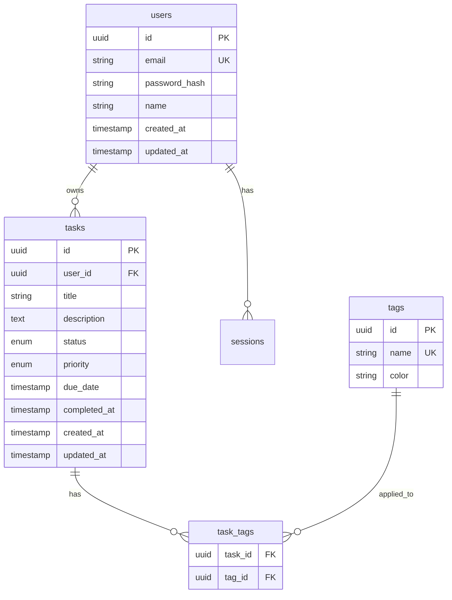

# [ADR-002] Use PostgreSQL for Primary Data Storage

## Status {#adr-002-status}

**Accepted** - 2025-01-15

## Context {#adr-002-context}
<!--
Current situation and why change/decision is needed.
-->

TaskFlow needs a database for persisting user accounts, tasks, and related data. The application requires:

- Relational data model (users have many tasks, tasks have tags)
- ACID transactions for data integrity
- Full-text search for task titles and descriptions
- JSON support for flexible metadata
- Mature tooling and hosting options

**Data Characteristics:**
- Structured, relational data
- Moderate write volume (10-100 writes/second initially)
- Read-heavy workload (80% reads)
- Need for complex queries (filtering, sorting, aggregation)

## Decision {#adr-002-decision}
<!--
High-level approach with reasoning.
-->

We will use **PostgreSQL 15+** as the primary database.

### Why PostgreSQL {#adr-002-why}

- **Relational model**: Perfect fit for users, tasks, tags relationships
- **ACID compliance**: Strong guarantees for data integrity
- **Full-text search**: Built-in `tsvector` and `tsquery` support
- **JSONB**: Flexible storage for task metadata
- **Mature ecosystem**: Excellent tooling, hosting, and community
- **Team familiarity**: Team has strong PostgreSQL experience

### Schema Overview {#adr-002-schema}

## Alternatives Considered {#adr-002-alternatives}
<!--
What else was considered and why rejected.
-->

### MySQL {#adr-002-mysql}

**Pros:**
- Similar relational model
- Wide hosting availability
- Good performance

**Cons:**
- Weaker full-text search
- Less capable JSON support
- Fewer advanced features (CTEs, window functions historically)

**Why rejected:** PostgreSQL has better JSON support and full-text search, which we need for task search.

### MongoDB {#adr-002-mongodb}

**Pros:**
- Flexible schema
- Native JSON documents
- Horizontal scaling

**Cons:**
- Document model doesn't fit relational data well
- Weaker consistency guarantees
- More complex queries for relationships

**Why rejected:** Our data is inherently relational. Document model would require denormalization and complicate queries.

### SQLite {#adr-002-sqlite}

**Pros:**
- Zero configuration
- Embedded, no server needed
- Good for development

**Cons:**
- Single-writer limitation
- Not suitable for production web apps
- Limited concurrent access

**Why rejected:** Not suitable for a multi-user web application.

### Comparison Matrix {#adr-002-comparison}

| Factor | PostgreSQL | MySQL | MongoDB | SQLite |
|--------|------------|-------|---------|--------|
| Relational Model | Excellent | Good | Poor | Good |
| Full-Text Search | Built-in | Extension | Built-in | Extension |
| JSON Support | JSONB | JSON | Native | JSON1 |
| Transactions | ACID | ACID | Multi-doc | ACID |
| Scalability | Vertical/Read | Vertical/Read | Horizontal | Single-user |
| Team Experience | High | Medium | Low | High |

## Consequences {#adr-002-consequences}
<!--
Positive, negative, and mitigation strategies.
-->

### Positive {#adr-002-positive}

- **Strong data integrity**: ACID transactions prevent corruption
- **Flexible querying**: Complex queries without application-level joins
- **Built-in search**: No separate search infrastructure needed initially
- **Mature tooling**: pgAdmin, psql, excellent ORM support
- **Hosting options**: AWS RDS, Supabase, Railway, self-hosted

### Negative {#adr-002-negative}

- **Vertical scaling**: Limited horizontal scaling options
- **Operational overhead**: Requires database administration
- **Connection limits**: Must manage connection pooling

### Mitigation Strategies {#adr-002-mitigation}

| Issue | Mitigation |
|-------|------------|
| Vertical scaling | Use read replicas for read scaling |
| Connection limits | Implement connection pooling ([COM-001-db-pool](../components/backend/COM-001-db-pool.md)) |
| Operational overhead | Use managed PostgreSQL (RDS, Supabase) |
| Search performance | Add dedicated search service if needed later |

## Implementation Notes {#adr-002-implementation}
<!--
Ordered steps for implementation.
-->

1. **Set up PostgreSQL instance**
   - Development: Docker container
   - Production: AWS RDS or Supabase

2. **Configure connection pooling**
   - See [COM-001-db-pool](../components/backend/COM-001-db-pool.md)

3. **Create initial schema**
   - Migration files for users, tasks, tags tables
   - Indexes for common query patterns

4. **Set up ORM**
   - Prisma for type-safe database access
   - Generate types from schema

5. **Enable full-text search**
   - Add `tsvector` column to tasks
   - Create GIN index for search

## Cross-Cutting Concerns {#adr-002-cross-cutting}
<!--
Impacts that span multiple levels.
-->

### Backup Strategy {#adr-002-backup}

- Daily automated backups (pg_dump)
- Point-in-time recovery via WAL archiving
- 30-day retention

### Security {#adr-002-security}

- SSL/TLS connections in production
- Dedicated application user with minimal privileges
- Password stored in secrets manager

### Monitoring {#adr-002-monitoring}

- Connection pool metrics
- Query performance (pg_stat_statements)
- Disk usage and growth

## Revisit Triggers {#adr-002-revisit}

Consider revisiting this decision if:
- Write throughput exceeds vertical scaling limits
- Full-text search latency becomes problematic
- Need for geographic distribution of data
- Schema changes become frequent and disruptive

## Related {#adr-002-related}

- [CTX-001: System Overview](../CTX-001-system-overview.md#ctx-001-database-protocol)
- [CON-001: Backend Container](../containers/CON-001-backend.md#con-001-data)
- [COM-001: Database Pool](../components/backend/COM-001-db-pool.md)
