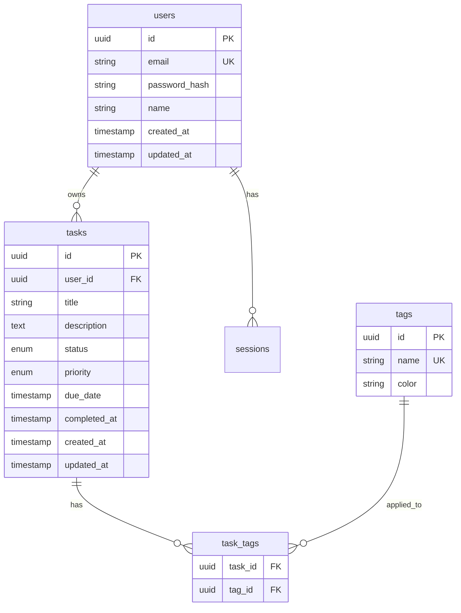

# [ADR-002] Use PostgreSQL for Primary Data Storage

## Status {#adr-002-status}
<!--
Current status of this decision.
-->

**Accepted** - 2025-01-15

## Problem/Requirement {#adr-002-problem}
<!--
Starting point - what user asked for, why change is needed.
-->

TaskFlow needs a database for persisting user accounts, tasks, and related data. The application requires:

- Relational data model (users have many tasks, tasks have tags)
- ACID transactions for data integrity
- Full-text search for task titles and descriptions
- JSON support for flexible metadata
- Mature tooling and hosting options

**Data Characteristics:**
- Structured, relational data
- Moderate write volume (10-100 writes/second initially)
- Read-heavy workload (80% reads)
- Need for complex queries (filtering, sorting, aggregation)

## Exploration Journey {#adr-002-exploration}
<!--
How understanding developed through scoping.
-->

**Initial hypothesis:** This is a Context-level infrastructure decision affecting how all containers persist and query data.

**Explored:**
- **Isolated**: What database best fits relational user-task-tag data model
- **Upstream**: Hosting requirements, operational complexity, team expertise
- **Adjacent**: Connection pooling strategy, backup/recovery needs, search requirements
- **Downstream**: Impact on Backend container's data layer, ORM selection

**Discovered:**
- Data model is inherently relational (users -> tasks -> tags)
- PostgreSQL's JSONB provides flexibility for task metadata without sacrificing relational integrity
- Built-in full-text search avoids need for separate search infrastructure
- Team has strong PostgreSQL experience, reducing ramp-up time

**Confirmed:**
- ACID compliance is required for task state transitions
- Vertical scaling is sufficient for projected load (first 2 years)
- Managed PostgreSQL services (RDS, Supabase) reduce operational burden

## Solution {#adr-002-solution}
<!--
Formed through exploration above.
-->

We will use **PostgreSQL 15+** as the primary database.

### Why PostgreSQL

- **Relational model**: Perfect fit for users, tasks, tags relationships
- **ACID compliance**: Strong guarantees for data integrity
- **Full-text search**: Built-in `tsvector` and `tsquery` support
- **JSONB**: Flexible storage for task metadata
- **Mature ecosystem**: Excellent tooling, hosting, and community
- **Team familiarity**: Team has strong PostgreSQL experience

### Schema Overview

### Alternatives Considered {#adr-002-alternatives}

#### MySQL

**Pros:**
- Similar relational model
- Wide hosting availability
- Good performance

**Cons:**
- Weaker full-text search
- Less capable JSON support
- Fewer advanced features (CTEs, window functions historically)

**Why rejected:** PostgreSQL has better JSON support and full-text search, which we need for task search.

#### MongoDB

**Pros:**
- Flexible schema
- Native JSON documents
- Horizontal scaling

**Cons:**
- Document model doesn't fit relational data well
- Weaker consistency guarantees
- More complex queries for relationships

**Why rejected:** Our data is inherently relational. Document model would require denormalization and complicate queries.

#### SQLite

**Pros:**
- Zero configuration
- Embedded, no server needed
- Good for development

**Cons:**
- Single-writer limitation
- Not suitable for production web apps
- Limited concurrent access

**Why rejected:** Not suitable for a multi-user web application.

#### Comparison Matrix

| Factor | PostgreSQL | MySQL | MongoDB | SQLite |
|--------|------------|-------|---------|--------|
| Relational Model | Excellent | Good | Poor | Good |
| Full-Text Search | Built-in | Extension | Built-in | Extension |
| JSON Support | JSONB | JSON | Native | JSON1 |
| Transactions | ACID | ACID | Multi-doc | ACID |
| Scalability | Vertical/Read | Vertical/Read | Horizontal | Single-user |
| Team Experience | High | Medium | Low | High |

## Changes Across Layers {#adr-002-changes}
<!--
Specific changes to each affected document.
-->

### Context Level
- [CTX-001-system-overview]: Document PostgreSQL as database in Architecture and Protocols sections

### Container Level
- [CON-001-backend]: Configure Prisma ORM for PostgreSQL, implement data layer

### Component Level
- [COM-001-db-pool]: Implement PostgreSQL connection pooling with pg-pool

### Cross-Cutting Concerns

**Backup Strategy:**
- Daily automated backups (pg_dump)
- Point-in-time recovery via WAL archiving
- 30-day retention

**Security:**
- SSL/TLS connections in production
- Dedicated application user with minimal privileges
- Password stored in secrets manager

**Monitoring:**
- Connection pool metrics
- Query performance (pg_stat_statements)
- Disk usage and growth

## Verification {#adr-002-verification}
<!--
Checklist derived from scoping - what to inspect when implementing.
-->

- [ ] Is PostgreSQL correctly configured for the application's data model?
- [ ] Are indexes created for common query patterns?
- [ ] Is connection pooling properly configured (COM-001-db-pool)?
- [ ] Are backup and recovery procedures documented and tested?
- [ ] Is SSL/TLS enabled for production connections?
- [ ] Are database credentials stored securely?
- [ ] Is full-text search index created for task search?

### Revisit Triggers

Consider revisiting this decision if:
- Write throughput exceeds vertical scaling limits
- Full-text search latency becomes problematic
- Need for geographic distribution of data
- Schema changes become frequent and disruptive

## Related {#adr-002-related}

- [CTX-001: System Overview](../CTX-001-system-overview.md#ctx-001-database-protocol)
- [CON-001: Backend Container](../containers/CON-001-backend.md#con-001-data)
- [COM-001: Database Pool](../components/backend/COM-001-db-pool.md)
