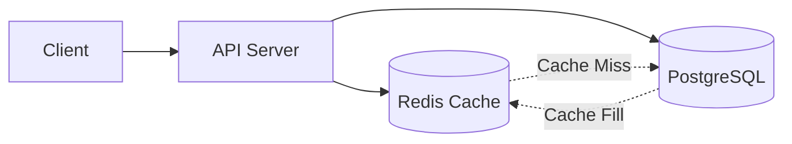
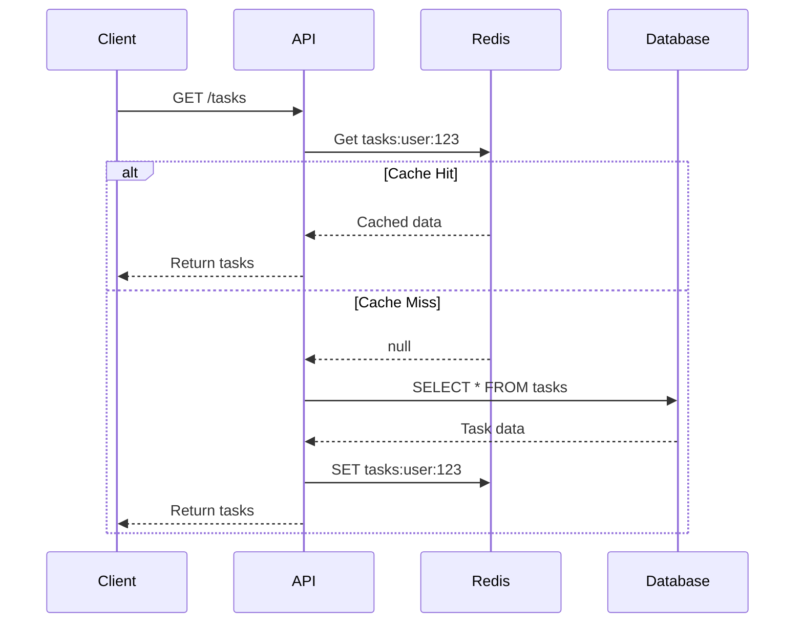

# [ADR-003] Implement Redis Caching for Performance

## Status {#adr-003-status}

**Proposed** - 2025-01-28

## Context {#adr-003-context}
<!--
Current situation and why change/decision is needed.
-->

As TaskFlow usage grows, we're observing increased database load and response times for frequently accessed data:

**Current Metrics (last 30 days):**
- Average API response time: 150ms
- P95 response time: 400ms
- Database queries per request: 3-5
- Task list endpoint called: 50,000/day
- Same user fetches task list: ~20 times/day

**Pain Points:**
- Task list queries hit database on every request
- User profile loaded multiple times per session
- Rate limit counters stored in memory (lost on restart)
- Session validation queries on every authenticated request

**Goal:**
- Reduce P95 response time to <100ms
- Decrease database load by 40%
- Persist rate limit state across restarts

## Decision {#adr-003-decision}
<!--
High-level approach with reasoning.
-->

We propose adding **Redis** as a caching layer with the following caching strategy:

### Cache Architecture {#adr-003-architecture}



### What to Cache {#adr-003-what-to-cache}

| Data | TTL | Invalidation | Rationale |
|------|-----|--------------|-----------|
| Task list (per user) | 5 min | On task change | Frequently accessed |
| User profile | 15 min | On profile update | Rarely changes |
| Rate limit counters | N/A | Time-based expiry | Must persist |
| Session tokens | 15 min | On logout | Reduce DB lookups |

### What NOT to Cache {#adr-003-not-to-cache}

- Individual task details (low hit rate)
- Search results (too variable)
- Write operations (always to DB)

## Cache Patterns {#adr-003-patterns}
<!--
How caching will be implemented.
-->

### Cache-Aside Pattern {#adr-003-cache-aside}



### Cache Key Schema {#adr-003-key-schema}

```
tasks:user:{userId}           # User's task list
tasks:user:{userId}:{status}  # Filtered by status
user:{userId}:profile         # User profile
ratelimit:{userId}:{window}   # Rate limit counter
session:{tokenHash}           # Session validation
```

### Invalidation Strategy {#adr-003-invalidation}

```typescript
// On task change
async function invalidateTaskCache(userId: string): Promise<void> {
  const pattern = `tasks:user:${userId}*`;
  const keys = await redis.keys(pattern);
  if (keys.length > 0) {
    await redis.del(...keys);
  }
}
```

## Alternatives Considered {#adr-003-alternatives}
<!--
What else was considered and why rejected.
-->

### In-Memory Cache (Node.js) {#adr-003-in-memory}

**Pros:**
- No additional infrastructure
- Lowest latency
- Simple implementation

**Cons:**
- Lost on server restart
- Not shared across instances
- Memory pressure on application

**Why rejected:** We run multiple backend instances; need shared cache.

### Memcached {#adr-003-memcached}

**Pros:**
- Simple key-value caching
- Multi-threaded
- Mature

**Cons:**
- No persistence
- Limited data structures
- No pub/sub for invalidation

**Why rejected:** Redis offers more features (persistence, pub/sub) at similar complexity.

### Database Query Cache {#adr-003-db-cache}

**Pros:**
- No additional infrastructure
- Automatic invalidation

**Cons:**
- Limited control over TTL
- Doesn't help with connection overhead
- PostgreSQL query cache is limited

**Why rejected:** Need more control over caching behavior.

## Consequences {#adr-003-consequences}
<!--
Positive, negative, and mitigation strategies.
-->

### Positive {#adr-003-positive}

- **Faster responses**: Cache hits return in <10ms
- **Reduced DB load**: 40%+ fewer database queries
- **Persistent rate limits**: Survives restarts
- **Scalability**: Offloads read traffic from database

### Negative {#adr-003-negative}

- **Operational complexity**: Another service to manage
- **Cache invalidation**: Risk of stale data
- **Memory cost**: Additional infrastructure cost
- **Consistency lag**: Brief window of stale data

### Mitigation Strategies {#adr-003-mitigation}

| Issue | Mitigation |
|-------|------------|
| Operational complexity | Use managed Redis (ElastiCache, Upstash) |
| Stale data | Short TTLs + immediate invalidation on writes |
| Memory cost | Start small (256MB), monitor and scale |
| Single point of failure | Cache misses fall through to database |

## Implementation Plan {#adr-003-implementation}
<!--
Ordered steps for implementation.
-->

### Phase 1: Infrastructure (Week 1)
1. Set up Redis instance (ElastiCache or Upstash)
2. Add Redis client to backend (`ioredis`)
3. Add health check for Redis connection
4. Update deployment configuration

### Phase 2: Rate Limiting (Week 2)
1. Migrate rate limit counters to Redis
2. Test rate limiting across server restarts
3. Monitor rate limit accuracy

### Phase 3: Task List Caching (Week 3)
1. Implement cache-aside for task list
2. Add cache invalidation on task mutations
3. Monitor cache hit rate and latency
4. Tune TTL based on metrics

### Phase 4: Session Caching (Week 4)
1. Cache session token validation
2. Implement cache invalidation on logout
3. Monitor authentication performance

## Success Metrics {#adr-003-metrics}

| Metric | Current | Target |
|--------|---------|--------|
| P95 response time | 400ms | <100ms |
| Database queries/request | 4 | 2 |
| Cache hit rate | N/A | >80% |
| Task list latency | 150ms | <20ms |

## Risk Assessment {#adr-003-risks}

| Risk | Likelihood | Impact | Mitigation |
|------|------------|--------|------------|
| Redis unavailable | Low | Medium | Graceful fallback to DB |
| Cache stampede | Medium | High | Cache warming, mutex locks |
| Memory exhaustion | Low | Medium | Eviction policy, monitoring |
| Data inconsistency | Medium | Low | Short TTLs, immediate invalidation |

## Revisit Triggers {#adr-003-revisit}

Consider revisiting this decision if:
- Cache hit rate drops below 50%
- Redis operational cost exceeds database savings
- Consistency issues cause user complaints
- Need for more sophisticated caching (CDN, edge)

## Related {#adr-003-related}

- [CTX-001: System Overview](../CTX-001-system-overview.md)
- [CON-001: Backend Container](../containers/CON-001-backend.md)
- [ADR-002: PostgreSQL Database](./ADR-002-postgresql.md)
