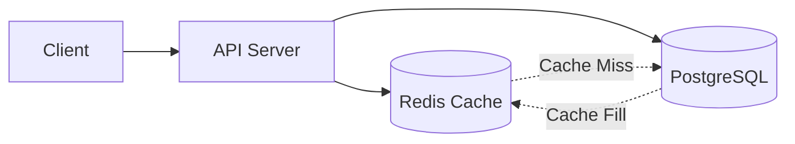
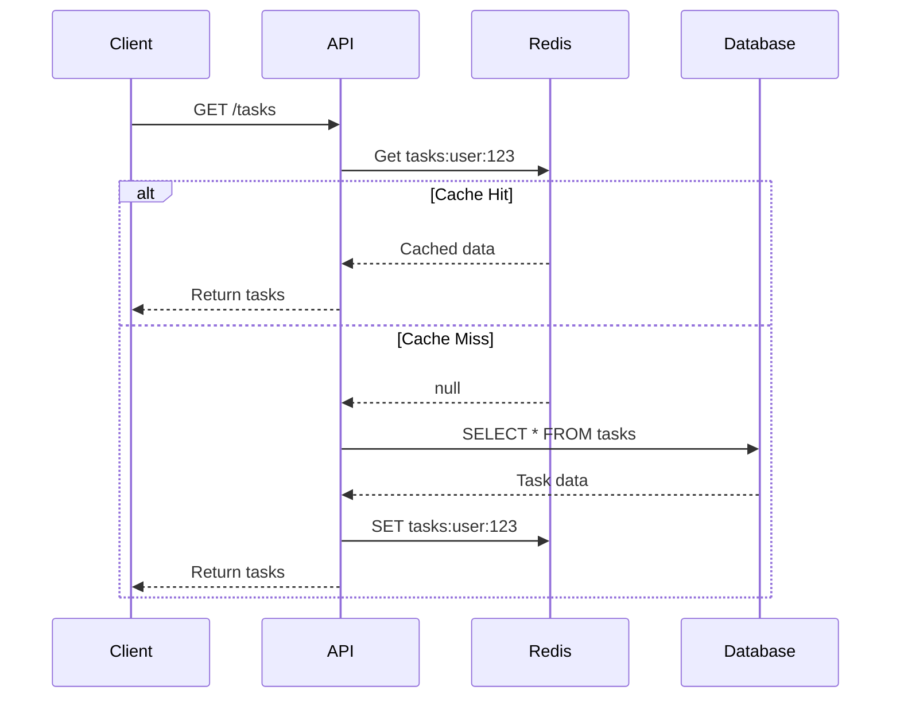

# [ADR-003] Implement Redis Caching for Performance

## Status {#adr-003-status}
<!--
Current status of this decision.
-->

**Proposed** - 2025-01-28

## Problem/Requirement {#adr-003-problem}
<!--
Starting point - what user asked for, why change is needed.
-->

As TaskFlow usage grows, we're observing increased database load and response times for frequently accessed data:

**Current Metrics (last 30 days):**
- Average API response time: 150ms
- P95 response time: 400ms
- Database queries per request: 3-5
- Task list endpoint called: 50,000/day
- Same user fetches task list: ~20 times/day

**Pain Points:**
- Task list queries hit database on every request
- User profile loaded multiple times per session
- Rate limit counters stored in memory (lost on restart)
- Session validation queries on every authenticated request

**Goal:**
- Reduce P95 response time to <100ms
- Decrease database load by 40%
- Persist rate limit state across restarts

## Exploration Journey {#adr-003-exploration}
<!--
How understanding developed through scoping.
-->

**Initial hypothesis:** This is primarily a Container-level change to CON-001-backend, adding a caching layer between services and database.

**Explored:**
- **Isolated**: What caching strategy best reduces database load without consistency issues
- **Upstream**: Infrastructure requirements, operational complexity, cost implications
- **Adjacent**: Impact on rate limiting (currently in-memory), session handling
- **Downstream**: Changes needed in service layer, cache invalidation on writes

**Discovered:**
- Task list is fetched ~20 times/day per user but changes infrequently
- Rate limiting needs persistence across server restarts
- In-memory cache won't work with multiple backend instances
- Redis provides both caching and rate limiting primitives

**Confirmed:**
- Short TTLs (5 min for tasks) acceptable for eventual consistency
- Cache-aside pattern is simplest to implement correctly
- Managed Redis reduces operational burden
- Graceful degradation to database on cache failure is acceptable

## Solution {#adr-003-solution}
<!--
Formed through exploration above.
-->

We propose adding **Redis** as a caching layer with cache-aside pattern.

### Cache Architecture



### What to Cache

| Data | TTL | Invalidation | Rationale |
|------|-----|--------------|-----------|
| Task list (per user) | 5 min | On task change | Frequently accessed |
| User profile | 15 min | On profile update | Rarely changes |
| Rate limit counters | N/A | Time-based expiry | Must persist |
| Session tokens | 15 min | On logout | Reduce DB lookups |

### What NOT to Cache

- Individual task details (low hit rate)
- Search results (too variable)
- Write operations (always to DB)

### Cache-Aside Pattern



### Cache Key Schema

```
tasks:user:{userId}           # User's task list
tasks:user:{userId}:{status}  # Filtered by status
user:{userId}:profile         # User profile
ratelimit:{userId}:{window}   # Rate limit counter
session:{tokenHash}           # Session validation
```

### Alternatives Considered {#adr-003-alternatives}

#### In-Memory Cache (Node.js)

**Pros:**
- No additional infrastructure
- Lowest latency
- Simple implementation

**Cons:**
- Lost on server restart
- Not shared across instances
- Memory pressure on application

**Why rejected:** We run multiple backend instances; need shared cache.

#### Memcached

**Pros:**
- Simple key-value caching
- Multi-threaded
- Mature

**Cons:**
- No persistence
- Limited data structures
- No pub/sub for invalidation

**Why rejected:** Redis offers more features (persistence, pub/sub) at similar complexity.

#### Database Query Cache

**Pros:**
- No additional infrastructure
- Automatic invalidation

**Cons:**
- Limited control over TTL
- Doesn't help with connection overhead
- PostgreSQL query cache is limited

**Why rejected:** Need more control over caching behavior.

## Changes Across Layers {#adr-003-changes}
<!--
Specific changes to each affected document.
-->

### Context Level
- [CTX-001-system-overview]: Add Redis to Architecture diagram as caching layer

### Container Level
- [CON-001-backend]: Add Redis client configuration, update middleware pipeline for cached auth

### Component Level
- New component needed: COM-005-cache-service for cache operations
- [COM-001-db-pool]: No changes, cache is additive
- [COM-003-task-service]: Add cache read/write/invalidation calls

### Implementation Plan

**Phase 1: Infrastructure (Week 1)**
1. Set up Redis instance (ElastiCache or Upstash)
2. Add Redis client to backend (`ioredis`)
3. Add health check for Redis connection
4. Update deployment configuration

**Phase 2: Rate Limiting (Week 2)**
1. Migrate rate limit counters to Redis
2. Test rate limiting across server restarts
3. Monitor rate limit accuracy

**Phase 3: Task List Caching (Week 3)**
1. Implement cache-aside for task list
2. Add cache invalidation on task mutations
3. Monitor cache hit rate and latency
4. Tune TTL based on metrics

**Phase 4: Session Caching (Week 4)**
1. Cache session token validation
2. Implement cache invalidation on logout
3. Monitor authentication performance

## Verification {#adr-003-verification}
<!--
Checklist derived from scoping - what to inspect when implementing.
-->

- [ ] Is Redis correctly configured with appropriate memory limits?
- [ ] Does cache-aside pattern handle cache misses gracefully?
- [ ] Are cache invalidation points identified for all write operations?
- [ ] Is graceful degradation to database working on Redis failure?
- [ ] Are rate limits correctly persisted across restarts?
- [ ] Is cache hit rate being monitored?

### Success Metrics

| Metric | Current | Target |
|--------|---------|--------|
| P95 response time | 400ms | <100ms |
| Database queries/request | 4 | 2 |
| Cache hit rate | N/A | >80% |
| Task list latency | 150ms | <20ms |

### Risk Assessment

| Risk | Likelihood | Impact | Mitigation |
|------|------------|--------|------------|
| Redis unavailable | Low | Medium | Graceful fallback to DB |
| Cache stampede | Medium | High | Cache warming, mutex locks |
| Memory exhaustion | Low | Medium | Eviction policy, monitoring |
| Data inconsistency | Medium | Low | Short TTLs, immediate invalidation |

### Revisit Triggers

Consider revisiting this decision if:
- Cache hit rate drops below 50%
- Redis operational cost exceeds database savings
- Consistency issues cause user complaints
- Need for more sophisticated caching (CDN, edge)

## Related {#adr-003-related}

- [CTX-001: System Overview](../CTX-001-system-overview.md)
- [CON-001: Backend Container](../containers/CON-001-backend.md)
- [ADR-002: PostgreSQL Database](./ADR-002-postgresql.md)
