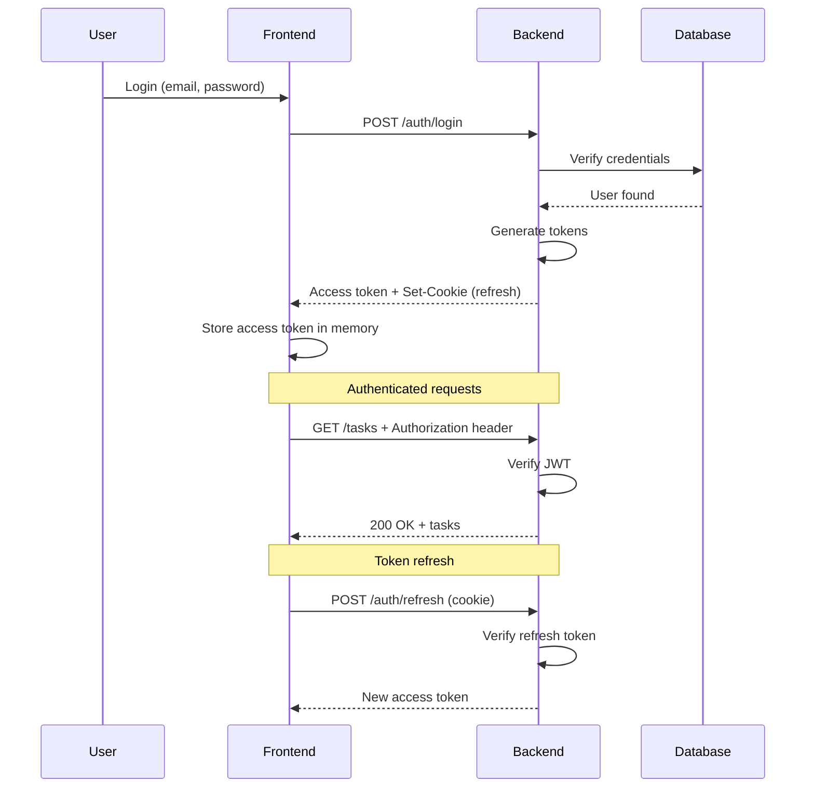
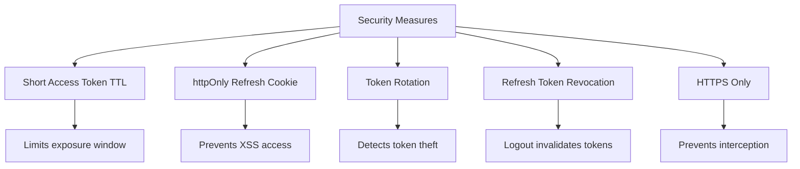

# [ADR-004] Use JWT for API Authentication

## Status {#adr-004-status}

**Accepted** - 2025-01-18

## Context {#adr-004-context}
<!--
Current situation and why change/decision is needed.
-->

TaskFlow needs an authentication mechanism for the REST API. The system must:

- Authenticate users across web frontend
- Support stateless API servers (horizontal scaling)
- Secure endpoints against unauthorized access
- Handle token expiration and refresh
- Work with modern frontend frameworks

**Constraints:**
- Multiple backend instances (no shared session state)
- REST API consumed by React frontend
- Need for offline-capable future mobile apps

## Decision {#adr-004-decision}
<!--
High-level approach with reasoning.
-->

We will use **JWT (JSON Web Tokens)** with a dual-token approach:

- **Access Token**: Short-lived (15 minutes), sent in Authorization header
- **Refresh Token**: Long-lived (7 days), stored in httpOnly cookie

### Token Flow {#adr-004-token-flow}



### Token Structure {#adr-004-token-structure}

**Access Token Payload:**
```json
{
  "sub": "user-uuid",
  "email": "user@example.com",
  "role": "user",
  "type": "access",
  "iat": 1705590000,
  "exp": 1705590900
}
```

**Refresh Token Payload:**
```json
{
  "sub": "user-uuid",
  "type": "refresh",
  "jti": "unique-token-id",
  "iat": 1705590000,
  "exp": 1706194800
}
```

## Alternatives Considered {#adr-004-alternatives}
<!--
What else was considered and why rejected.
-->

### Session-Based Auth {#adr-004-sessions}

**Pros:**
- Simple to implement
- Easy to invalidate (delete session)
- Server controls session lifetime

**Cons:**
- Requires shared session store
- Not stateless (complicates scaling)
- CSRF protection needed

**Why rejected:** Our multi-instance backend needs stateless authentication.

### OAuth 2.0 / OpenID Connect {#adr-004-oauth}

**Pros:**
- Industry standard
- Supports social login
- Delegated authentication

**Cons:**
- Complex for first-party auth
- Requires authorization server
- Overkill for single application

**Why rejected:** We only need first-party authentication. JWT gives us what we need without OAuth complexity. Can add OAuth later for social login.

### API Keys {#adr-004-api-keys}

**Pros:**
- Simple to implement
- Good for service-to-service auth

**Cons:**
- Not suitable for user authentication
- No built-in expiration
- Can't encode user information

**Why rejected:** API keys are for services, not users.

## Token Security {#adr-004-security}
<!--
Security measures for token handling.
-->

### Access Token {#adr-004-access-security}

| Aspect | Implementation |
|--------|----------------|
| Storage | Memory only (never localStorage) |
| Transport | Authorization header |
| Lifetime | 15 minutes |
| Signature | HS256 (dev) / RS256 (prod) |

### Refresh Token {#adr-004-refresh-security}

| Aspect | Implementation |
|--------|----------------|
| Storage | httpOnly, Secure, SameSite cookie |
| Transport | Cookie (automatic) |
| Lifetime | 7 days |
| Rotation | New refresh token on use |
| Revocation | Stored in DB, can be invalidated |

### Security Measures {#adr-004-measures}



## Implementation Details {#adr-004-implementation-details}
<!--
Technical implementation specifics.
-->

### Token Generation {#adr-004-generation}

```typescript
// src/services/auth/tokens.ts
import jwt from 'jsonwebtoken';
import { config } from '../../config';

export function generateAccessToken(user: User): string {
  return jwt.sign(
    {
      sub: user.id,
      email: user.email,
      role: user.role,
      type: 'access',
    },
    config.jwt.accessSecret,
    {
      expiresIn: '15m',
      issuer: config.jwt.issuer,
    }
  );
}

export function generateRefreshToken(user: User): string {
  const jti = generateTokenId(); // Unique ID for revocation

  return jwt.sign(
    {
      sub: user.id,
      type: 'refresh',
      jti,
    },
    config.jwt.refreshSecret,
    {
      expiresIn: '7d',
      issuer: config.jwt.issuer,
    }
  );
}
```

### Refresh Flow {#adr-004-refresh-flow}

```typescript
// src/routes/auth.ts
router.post('/auth/refresh', async (req, res) => {
  const refreshToken = req.cookies.refresh_token;

  if (!refreshToken) {
    return res.status(401).json({ error: 'No refresh token' });
  }

  try {
    // Verify refresh token
    const payload = jwt.verify(refreshToken, config.jwt.refreshSecret);

    // Check if token is revoked
    const isRevoked = await tokenService.isRevoked(payload.jti);
    if (isRevoked) {
      return res.status(401).json({ error: 'Token revoked' });
    }

    // Get user
    const user = await userService.findById(payload.sub);
    if (!user) {
      return res.status(401).json({ error: 'User not found' });
    }

    // Rotate refresh token (revoke old, issue new)
    await tokenService.revoke(payload.jti);
    const newRefreshToken = generateRefreshToken(user);
    await tokenService.store(newRefreshToken);

    // Issue new access token
    const accessToken = generateAccessToken(user);

    // Set new refresh token cookie
    res.cookie('refresh_token', newRefreshToken, {
      httpOnly: true,
      secure: process.env.NODE_ENV === 'production',
      sameSite: 'strict',
      maxAge: 7 * 24 * 60 * 60 * 1000, // 7 days
    });

    res.json({ accessToken });
  } catch (error) {
    res.status(401).json({ error: 'Invalid refresh token' });
  }
});
```

### Logout {#adr-004-logout}

```typescript
router.post('/auth/logout', authenticate, async (req, res) => {
  // Revoke refresh token
  const refreshToken = req.cookies.refresh_token;
  if (refreshToken) {
    const payload = jwt.decode(refreshToken);
    if (payload?.jti) {
      await tokenService.revoke(payload.jti);
    }
  }

  // Clear cookie
  res.clearCookie('refresh_token');

  res.json({ message: 'Logged out' });
});
```

## Consequences {#adr-004-consequences}
<!--
Positive, negative, and mitigation strategies.
-->

### Positive {#adr-004-positive}

- **Stateless**: No session store needed, easy scaling
- **Self-contained**: User info in token, fewer DB lookups
- **Portable**: Works across services and mobile apps
- **Standard**: Well-understood, library support

### Negative {#adr-004-negative}

- **No immediate revocation**: Access tokens valid until expiry
- **Token size**: Larger than session IDs
- **Complexity**: Two tokens, refresh flow
- **Secret management**: Must secure signing keys

### Mitigation Strategies {#adr-004-mitigation}

| Issue | Mitigation |
|-------|------------|
| No immediate revocation | Short TTL (15 min), refresh token revocation |
| Token theft | httpOnly cookies, HTTPS, short TTL |
| Secret exposure | Rotate secrets, use RS256 in production |
| Complexity | Well-documented implementation |

## Cross-Cutting Concerns {#adr-004-cross-cutting}
<!--
Impacts that span multiple levels.
-->

### Frontend Integration {#adr-004-frontend}

- Store access token in memory (React state/context)
- Refresh token handled automatically via cookies
- Use interceptors for automatic refresh
- See [COM-004-api-client](../components/frontend/COM-004-api-client.md)

### Backend Middleware {#adr-004-backend}

- Validate JWT on every authenticated request
- Extract user context from token
- Handle expired tokens gracefully
- See [COM-002-auth-middleware](../components/backend/COM-002-auth-middleware.md)

## Revisit Triggers {#adr-004-revisit}

Consider revisiting this decision if:
- Need for real-time token revocation (consider token blacklist)
- Adding third-party OAuth providers (may need full OAuth server)
- Token size becomes problematic (consider opaque tokens)
- Mobile app needs different auth flow

## Related {#adr-004-related}

- [CTX-001: Cross-Cutting Concerns](../CTX-001-system-overview.md#ctx-001-authentication)
- [CON-001: Backend Middleware](../containers/CON-001-backend.md#con-001-auth-middleware)
- [COM-002: Auth Middleware](../components/backend/COM-002-auth-middleware.md)
- [COM-004: API Client](../components/frontend/COM-004-api-client.md)
