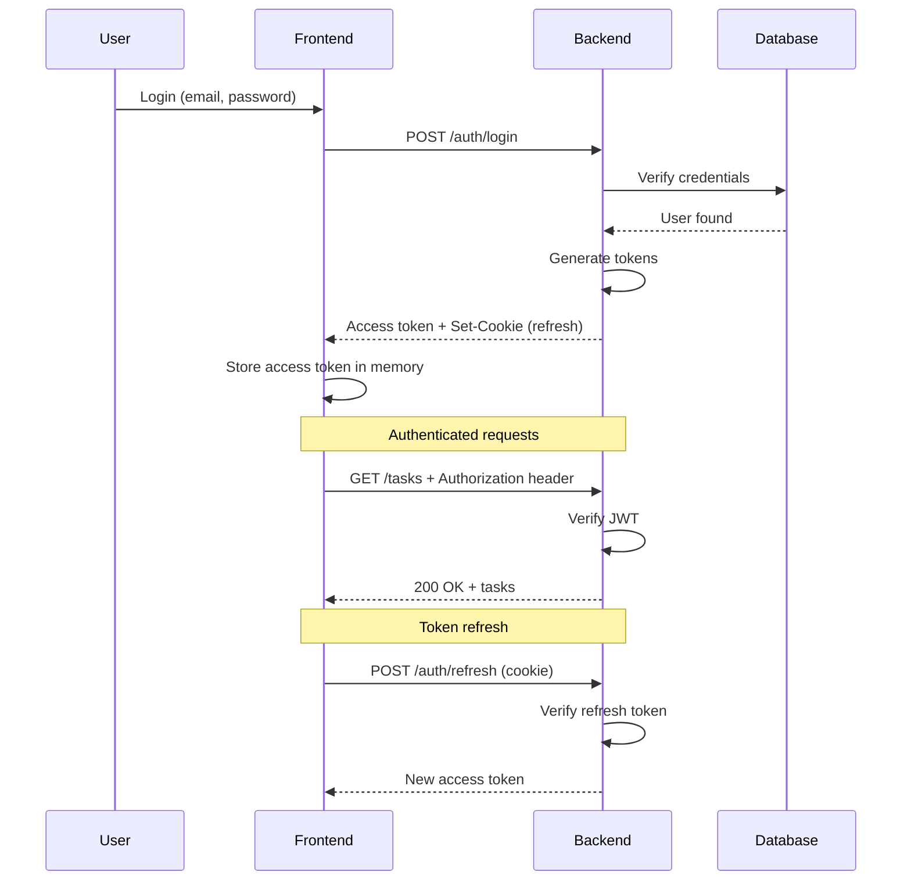
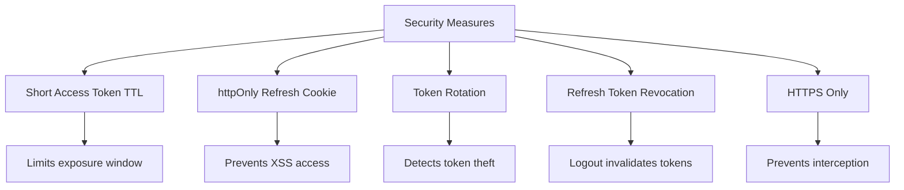

# [ADR-004] Use JWT for API Authentication

## Status {#adr-004-status}
<!--
Current status of this decision.
-->

**Accepted** - 2025-01-18

## Problem/Requirement {#adr-004-problem}
<!--
Starting point - what user asked for, why change is needed.
-->

TaskFlow needs an authentication mechanism for the REST API. The system must:

- Authenticate users across web frontend
- Support stateless API servers (horizontal scaling)
- Secure endpoints against unauthorized access
- Handle token expiration and refresh
- Work with modern frontend frameworks

**Constraints:**
- Multiple backend instances (no shared session state)
- REST API consumed by React frontend
- Need for offline-capable future mobile apps

## Exploration Journey {#adr-004-exploration}
<!--
How understanding developed through scoping.
-->

**Initial hypothesis:** This is a cross-cutting Context-level decision affecting authentication across all containers.

**Explored:**
- **Isolated**: What authentication mechanism works without shared session state
- **Upstream**: Security requirements, compliance needs, user experience expectations
- **Adjacent**: Integration with REST API (ADR-001), rate limiting, authorization patterns
- **Downstream**: Impact on Backend middleware (COM-002), Frontend API client (COM-004)

**Discovered:**
- Stateless authentication required for horizontal scaling of backend
- JWT's self-contained nature reduces database lookups per request
- Dual-token pattern (access + refresh) balances security and UX
- httpOnly cookies for refresh token prevent XSS access

**Confirmed:**
- Short access token TTL (15 min) acceptable for security posture
- Token refresh flow transparent to users
- Team comfortable with JWT implementation patterns

## Solution {#adr-004-solution}
<!--
Formed through exploration above.
-->

We will use **JWT (JSON Web Tokens)** with a dual-token approach:

- **Access Token**: Short-lived (15 minutes), sent in Authorization header
- **Refresh Token**: Long-lived (7 days), stored in httpOnly cookie

### Token Flow



### Token Structure

**Access Token Payload:**
```json
{
  "sub": "user-uuid",
  "email": "user@example.com",
  "role": "user",
  "type": "access",
  "iat": 1705590000,
  "exp": 1705590900
}
```

**Refresh Token Payload:**
```json
{
  "sub": "user-uuid",
  "type": "refresh",
  "jti": "unique-token-id",
  "iat": 1705590000,
  "exp": 1706194800
}
```

### Alternatives Considered {#adr-004-alternatives}

#### Session-Based Auth

**Pros:**
- Simple to implement
- Easy to invalidate (delete session)
- Server controls session lifetime

**Cons:**
- Requires shared session store
- Not stateless (complicates scaling)
- CSRF protection needed

**Why rejected:** Our multi-instance backend needs stateless authentication.

#### OAuth 2.0 / OpenID Connect

**Pros:**
- Industry standard
- Supports social login
- Delegated authentication

**Cons:**
- Complex for first-party auth
- Requires authorization server
- Overkill for single application

**Why rejected:** We only need first-party authentication. JWT gives us what we need without OAuth complexity. Can add OAuth later for social login.

#### API Keys

**Pros:**
- Simple to implement
- Good for service-to-service auth

**Cons:**
- Not suitable for user authentication
- No built-in expiration
- Can't encode user information

**Why rejected:** API keys are for services, not users.

### Token Security

#### Access Token Security

| Aspect | Implementation |
|--------|----------------|
| Storage | Memory only (never localStorage) |
| Transport | Authorization header |
| Lifetime | 15 minutes |
| Signature | HS256 (dev) / RS256 (prod) |

#### Refresh Token Security

| Aspect | Implementation |
|--------|----------------|
| Storage | httpOnly, Secure, SameSite cookie |
| Transport | Cookie (automatic) |
| Lifetime | 7 days |
| Rotation | New refresh token on use |
| Revocation | Stored in DB, can be invalidated |

### Security Measures



## Changes Across Layers {#adr-004-changes}
<!--
Specific changes to each affected document.
-->

### Context Level
- [CTX-001-system-overview]: Document JWT in Cross-Cutting Concerns authentication section

### Container Level
- [CON-001-backend]: Add auth middleware to pipeline, implement auth endpoints
- [CON-002-frontend]: Store access token in memory, handle refresh flow

### Component Level
- [COM-002-auth-middleware]: Implement JWT validation, user context injection
- [COM-004-api-client]: Add Authorization header interceptor, handle 401 with refresh

### Implementation Details

**Token Generation:**

```typescript
// src/services/auth/tokens.ts
import jwt from 'jsonwebtoken';
import { config } from '../../config';

export function generateAccessToken(user: User): string {
  return jwt.sign(
    {
      sub: user.id,
      email: user.email,
      role: user.role,
      type: 'access',
    },
    config.jwt.accessSecret,
    {
      expiresIn: '15m',
      issuer: config.jwt.issuer,
    }
  );
}

export function generateRefreshToken(user: User): string {
  const jti = generateTokenId(); // Unique ID for revocation

  return jwt.sign(
    {
      sub: user.id,
      type: 'refresh',
      jti,
    },
    config.jwt.refreshSecret,
    {
      expiresIn: '7d',
      issuer: config.jwt.issuer,
    }
  );
}
```

## Verification {#adr-004-verification}
<!--
Checklist derived from scoping - what to inspect when implementing.
-->

- [ ] Are access tokens stored only in memory (not localStorage)?
- [ ] Are refresh tokens stored in httpOnly, Secure, SameSite cookies?
- [ ] Is token refresh flow transparent to users?
- [ ] Does logout invalidate refresh tokens in database?
- [ ] Is HTTPS enforced in production?
- [ ] Does the frontend handle 401 responses with automatic refresh?
- [ ] Are JWT secrets stored securely and rotatable?

### Revisit Triggers

Consider revisiting this decision if:
- Need for real-time token revocation (consider token blacklist)
- Adding third-party OAuth providers (may need full OAuth server)
- Token size becomes problematic (consider opaque tokens)
- Mobile app needs different auth flow

## Related {#adr-004-related}

- [CTX-001: Cross-Cutting Concerns](../CTX-001-system-overview.md#ctx-001-authentication)
- [CON-001: Backend Middleware](../containers/CON-001-backend.md#con-001-auth-middleware)
- [COM-002: Auth Middleware](../components/backend/COM-002-auth-middleware.md)
- [COM-004: API Client](../components/frontend/COM-004-api-client.md)
