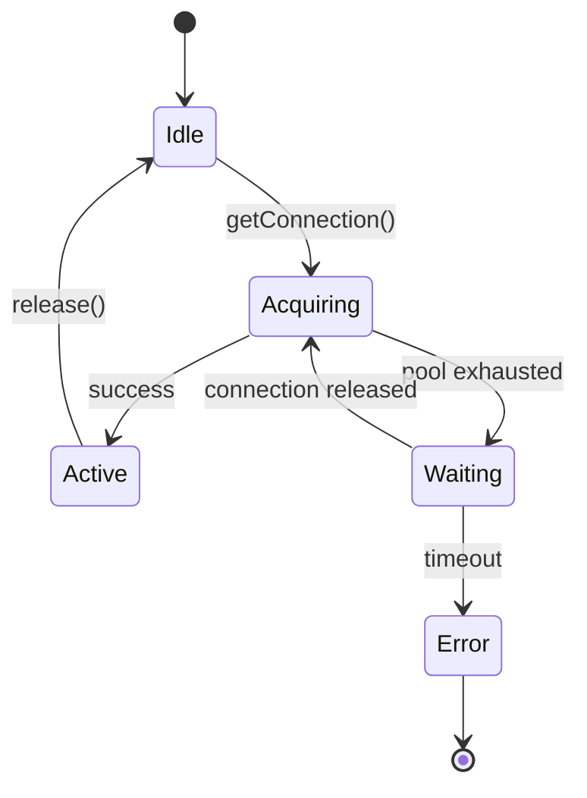

id: C3-101-db-pool
title: Database Connection Pool Component
summary: >
  Explains PostgreSQL connection pooling strategy, configuration by environment,
  and retry behavior. Resource nature component focused on connection management.
nature: Resource
---

# [C3-101-db-pool] Database Connection Pool (Resource Nature)

## Overview

The Database Connection Pool component manages PostgreSQL connections using a pool pattern. It provides efficient connection reuse, prevents connection exhaustion, and implements resilient connection handling with automatic retry.

## Stack {#c3-101-stack}

- Library: `pg` 8.11.x
- Why: Native PostgreSQL driver, proven stability, supports LISTEN/NOTIFY, excellent TypeScript support

**Alternatives considered:**
- `pg-promise` - More abstraction than needed
- `knex` - Query builder overhead unnecessary with Prisma
- `typeorm` - Full ORM, we use Prisma instead

## Configuration {#c3-101-config}

| Env Var | Dev | Prod | Why |
|---------|-----|------|-----|
| `DB_HOST` | `localhost` | `db.prod.internal` | Network isolation in prod |
| `DB_PORT` | `5432` | `5432` | Standard PostgreSQL port |
| `DB_NAME` | `taskflow_dev` | `taskflow` | Separate databases |
| `DB_USER` | `postgres` | `taskflow_app` | Least privilege in prod |
| `DB_PASSWORD` | `postgres` | (from secret) | Secret management |
| `DB_POOL_MIN` | `2` | `10` | Baseline connections |
| `DB_POOL_MAX` | `10` | `50` | Scale with load |
| `DB_IDLE_TIMEOUT` | `10000` | `30000` | Release faster in dev |
| `DB_CONNECTION_TIMEOUT` | `5000` | `10000` | More patience in prod |

### Configuration Loading {#c3-101-config-loading}

```typescript
// src/db/config.ts
import { z } from 'zod';

const dbConfigSchema = z.object({
  host: z.string().default('localhost'),
  port: z.coerce.number().default(5432),
  database: z.string(),
  user: z.string(),
  password: z.string(),
  min: z.coerce.number().default(2),
  max: z.coerce.number().default(10),
  idleTimeoutMillis: z.coerce.number().default(10000),
  connectionTimeoutMillis: z.coerce.number().default(5000),
});

export const dbConfig = dbConfigSchema.parse({
  host: process.env.DB_HOST,
  port: process.env.DB_PORT,
  database: process.env.DB_NAME,
  user: process.env.DB_USER,
  password: process.env.DB_PASSWORD,
  min: process.env.DB_POOL_MIN,
  max: process.env.DB_POOL_MAX,
  idleTimeoutMillis: process.env.DB_IDLE_TIMEOUT,
  connectionTimeoutMillis: process.env.DB_CONNECTION_TIMEOUT,
});
```

## Behavior {#c3-101-behavior}



### Pool Sizing Formula

```
max_connections = (available_db_connections / app_instances) * 0.8
```

Example: 100 DB connections, 2 app instances = 40 max per instance

## Error Handling {#c3-101-errors}

| Error | Retriable | Action |
|-------|-----------|--------|
| `ECONNREFUSED` | Yes | Retry with exponential backoff (1s, 2s, 4s) |
| `ETIMEDOUT` | Yes | Retry up to 3 times |
| `POOL_EXHAUSTED` | Yes | Wait up to 5s in queue |
| `28P01` (auth failure) | No | Fail immediately, log error |
| `3D000` (db not exist) | No | Fail immediately |
| `57014` (query timeout) | No | Propagate to caller |

### Retry Implementation

```typescript
async function withRetry<T>(
  operation: () => Promise<T>,
  maxRetries = 3
): Promise<T> {
  for (let attempt = 1; attempt <= maxRetries; attempt++) {
    try {
      return await operation();
    } catch (error) {
      if (!isRetriable(error) || attempt === maxRetries) {
        throw error;
      }
      const delay = Math.pow(2, attempt - 1) * 1000;
      await sleep(delay * (0.9 + Math.random() * 0.2)); // jitter
    }
  }
  throw new Error('Unreachable');
}
```

## Health Check {#c3-101-health}

```typescript
export async function checkDatabaseHealth(): Promise<HealthStatus> {
  const start = Date.now();
  try {
    const client = await pool.connect();
    try {
      await client.query('SELECT 1');
      const latency = Date.now() - start;
      return {
        status: latency < 100 ? 'healthy' : 'degraded',
        latency,
        poolSize: pool.totalCount,
        idleConnections: pool.idleCount,
      };
    } finally {
      client.release();
    }
  } catch (error) {
    return { status: 'unhealthy', error: error.message };
  }
}
```

## Usage {#c3-101-usage}

```typescript
// src/repositories/taskRepository.ts
import { pool } from '../db';

export async function createTask(task: NewTask): Promise<Task> {
  const client = await pool.connect();
  try {
    const result = await client.query(
      `INSERT INTO tasks (title, user_id, due_date)
       VALUES ($1, $2, $3)
       RETURNING *`,
      [task.title, task.userId, task.dueDate]
    );
    return result.rows[0];
  } finally {
    client.release();
  }
}
```

## Metrics {#c3-101-metrics}

| Metric | Type | Description |
|--------|------|-------------|
| `db_pool_size` | Gauge | Current pool size |
| `db_pool_idle` | Gauge | Idle connections |
| `db_pool_waiting` | Gauge | Queued requests |
| `db_pool_acquire_time` | Histogram | Time to get connection |
| `db_query_duration` | Histogram | Query execution time |

## Dependencies {#c3-101-deps}

- **Upstream:** None (this is a foundational resource)
- **Downstream:** Used by [C3-103-task-service](./C3-103-task-service.md) for persistence
- **Infra features consumed:** [C3-3-postgres#c3-3-features](../../containers/C3-3-postgres.md#c3-3-features) - SQL data store, connection pooling support
