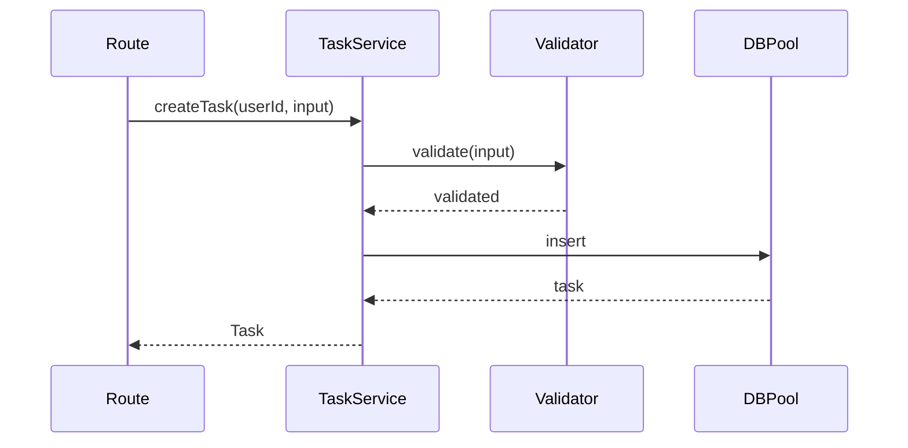

id: C3-103-task-service
title: Task Service (Business Logic)
summary: >
  Core task operations - CRUD, validation, and business rules for task management.
nature: Business Logic
---

# [C3-103-task-service] Task Service (Business Logic)

## Overview {#c3-103-overview}

Handles task creation, retrieval, updates, and deletion with business rule enforcement.

## Stack {#c3-103-stack}

- Library: None (plain TypeScript)
- ORM: Uses Prisma client from container

## Configuration {#c3-103-config}

| Env Var | Dev | Prod | Why |
|---------|-----|------|-----|
| MAX_TASKS_PER_USER | 100 | 1000 | Limit per user |
| TASK_TITLE_MAX_LEN | 200 | 200 | Title length limit |
| TASK_DESC_MAX_LEN | 2000 | 2000 | Description length limit |

### Config Loading {#c3-103-config-loading}

```typescript
import { z } from 'zod';

const taskConfigSchema = z.object({
  maxTasksPerUser: z.coerce.number().default(100),
  titleMaxLen: z.coerce.number().default(200),
  descMaxLen: z.coerce.number().default(2000),
});

export const taskConfig = taskConfigSchema.parse({
  maxTasksPerUser: process.env.MAX_TASKS_PER_USER,
  titleMaxLen: process.env.TASK_TITLE_MAX_LEN,
  descMaxLen: process.env.TASK_DESC_MAX_LEN,
});
```

## Interfaces & Types {#c3-103-interfaces}

```typescript
interface Task {
  id: string;
  userId: string;
  title: string;
  description?: string;
  status: 'pending' | 'in_progress' | 'completed';
  dueDate?: Date;
  createdAt: Date;
  updatedAt: Date;
}

interface CreateTaskInput {
  title: string;
  description?: string;
  dueDate?: Date;
}
```

## Behavior {#c3-103-behavior}



## Domain Rules {#c3-103-rules}

| Rule | Condition | Action |
|------|-----------|--------|
| Task limit | User exceeds MAX_TASKS | Reject with `task_limit_exceeded` |
| Title required | Empty title | Reject with `validation_error` |
| Owner only | User != task.userId | Reject with `forbidden` |

## Error Handling {#c3-103-errors}

| Error | Retriable | Action/Code |
|-------|-----------|-------------|
| Task not found | No | 404 `task_not_found` |
| Validation failed | No | 400 `validation_error` |
| Limit exceeded | No | 403 `task_limit_exceeded` |

## Usage {#c3-103-usage}

```typescript
const taskService = new TaskService(dbPool);
const task = await taskService.create(userId, {
  title: 'My task',
  dueDate: new Date('2024-12-31'),
});
```

## Health Checks {#c3-103-health}

| Check | Probe | Expectation |
|-------|-------|-------------|
| Config loaded | Verify limits are positive | maxTasksPerUser > 0 |
| DB accessible | Delegate to db-pool health | Healthy |

## Metrics & Observability {#c3-103-metrics}

| Metric | Type | Description |
|--------|------|-------------|
| `tasks_created_total` | Counter | Tasks created |
| `tasks_by_status` | Gauge | Tasks per status |
| `task_operation_latency_ms` | Histogram | CRUD operation time |
| `task_limit_exceeded_total` | Counter | Limit rejections |

## Dependencies {#c3-103-deps}

- **Upstream:** [C3-101-db-pool](./C3-101-db-pool.md) for persistence
- **Downstream:** Used by route handlers
- **Infra features consumed:** [C3-3-postgres#c3-3-features](../../containers/C3-3-postgres.md#c3-3-features)
