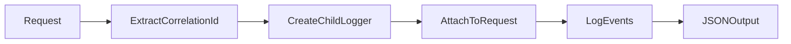

id: C3-104-logger
title: Logger (Cross-cutting)
summary: >
  Structured JSON logging with correlation IDs for request tracing across the backend.
nature: Cross-cutting
---

# [C3-104-logger] Logger (Cross-cutting)

## Overview {#c3-104-overview}

Provides structured JSON logging with correlation ID propagation for distributed tracing.

## Stack {#c3-104-stack}

- Library: `pino` 8.x
- Why: Fast JSON logging, low overhead, good TypeScript support

## Configuration {#c3-104-config}

| Env Var | Dev | Prod | Why |
|---------|-----|------|-----|
| LOG_LEVEL | `debug` | `info` | Verbosity control |
| LOG_PRETTY | `true` | `false` | Human-readable in dev |
| SERVICE_NAME | `backend-dev` | `backend` | Service identifier in logs |

### Config Loading {#c3-104-config-loading}

```typescript
import { z } from 'zod';

const logConfigSchema = z.object({
  level: z.enum(['debug', 'info', 'warn', 'error']).default('info'),
  pretty: z.coerce.boolean().default(false),
  serviceName: z.string().default('backend'),
});

export const logConfig = logConfigSchema.parse({
  level: process.env.LOG_LEVEL,
  pretty: process.env.LOG_PRETTY,
  serviceName: process.env.SERVICE_NAME,
});
```

## Interfaces & Types {#c3-104-interfaces}

```typescript
interface Logger {
  info(msg: string, context?: object): void;
  warn(msg: string, context?: object): void;
  error(msg: string, error?: Error, context?: object): void;
  child(bindings: object): Logger;
}
```

## Behavior {#c3-104-behavior}



## Error Handling {#c3-104-errors}

| Error | Retriable | Action/Code |
|-------|-----------|-------------|
| Missing correlation ID | Yes | Generate new UUID |
| Log write failure | No | Fallback to stderr |

## Usage {#c3-104-usage}

```typescript
import { createLogger } from './logger';

const logger = createLogger({ service: 'backend' });

// In middleware
app.use((req, res, next) => {
  req.logger = logger.child({
    correlationId: req.headers['x-correlation-id'] || uuid()
  });
  next();
});

// In handler
req.logger.info('Task created', { taskId: task.id });
```

## Health Checks {#c3-104-health}

| Check | Probe | Expectation |
|-------|-------|-------------|
| Logger initialized | Check logger instance | Non-null |
| Output writable | Test log to stdout | No throw |

## Metrics & Observability {#c3-104-metrics}

| Metric | Type | Description |
|--------|------|-------------|
| `logs_total` | Counter | Logs emitted by level |
| `log_errors_total` | Counter | Log write failures |

## Dependencies {#c3-104-deps}

- **Upstream:** None
- **Downstream:** Used by all components for logging
- **Infra features consumed:** None
