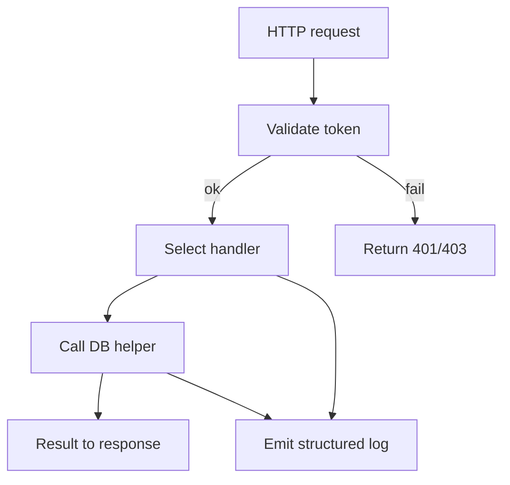

# [C3-106-rest-routes] REST Routes (Entrypoint)

## Overview {#c3-106-overview}
- Entry point for HTTP requests; handles routing and hands off auth + persistence.
- Implements CTX protocol by delegating SQL operations to [C3-101-db-pool](./C3-101-db-pool.md#c3-101-behavior) via container [C3-1-backend#c3-1-protocols](../../containers/C3-1-backend.md#c3-1-protocols).

## Stack {#c3-106-stack}
- Framework: Express 4.18
- Language: TypeScript 5.x
- Why: Minimal routing, middleware support, strong ecosystem

## Configuration {#c3-106-config}
| Env Var | Dev | Prod | Why |
|---------|-----|------|-----|
| PORT | 3000 | 8080 | Bind port |
| API_PREFIX | /api | /api | Stable routing prefix |
| AUTH_PUBLIC_KEY_PATH | ./keys/dev.pub | /etc/keys/auth.pub | Token verification |

## Interfaces & Types {#c3-106-interfaces}
- `POST /tasks` → `createTask(body, userContext): Task`
- `GET /tasks/:id` → `getTask(id, userContext): Task`
- Middleware: `(req, res, next) => void` with attached `req.user`

## Behavior {#c3-106-behavior}
- Validates auth token, injects `user` into request.
- Routes call DB pool through lightweight service helpers.
- Errors normalized before response.


## Error Handling {#c3-106-errors}
| Error | Retriable | Action/Code |
|-------|-----------|-------------|
| Missing/invalid token | No | 401/403 with code `auth_invalid` |
| DB query rejected | Yes | 503 with code `db_unavailable`, logged |
| Validation failed | No | 400 with code `validation_error` |

## Usage {#c3-106-usage}
```typescript
import { createApp } from './app';

const app = createApp({ logger, dbPool });
app.listen(process.env.PORT || 8080);
```

## Dependencies {#c3-106-deps}
- [C3-101-db-pool](./C3-101-db-pool.md#c3-101-behavior) for persistence
- [C3-104-logger](./C3-104-logger.md#c3-104-behavior) for request/error logging
