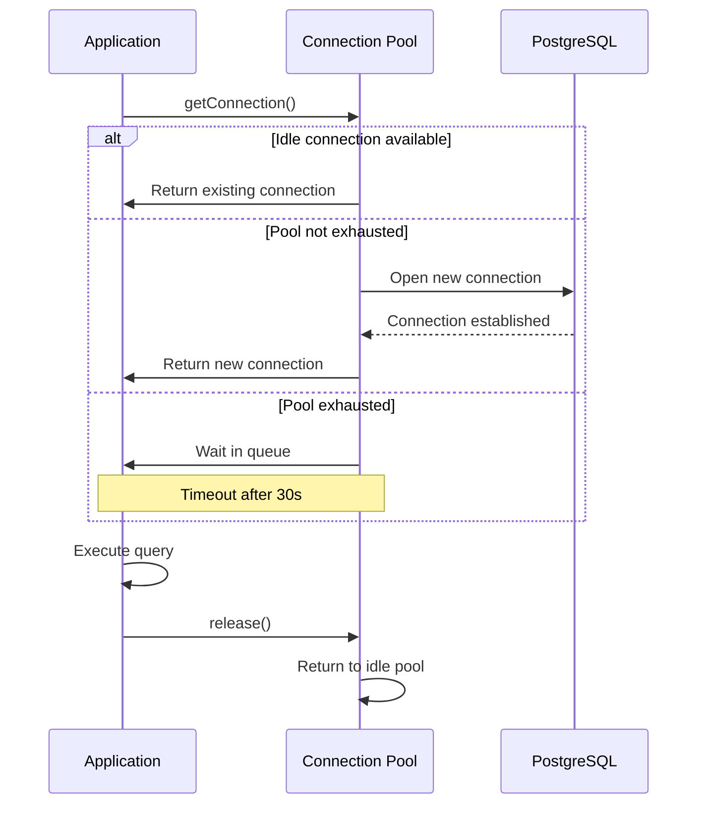
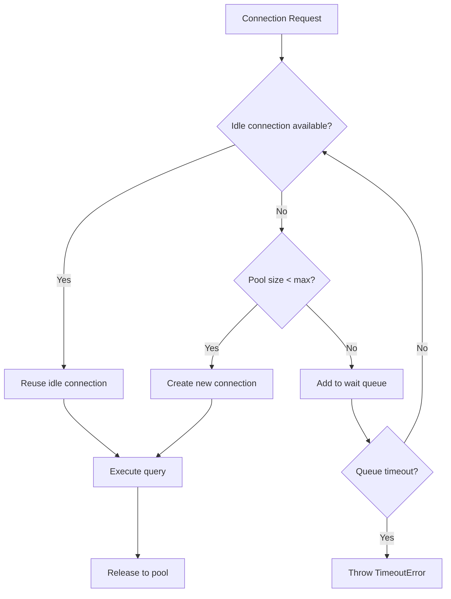
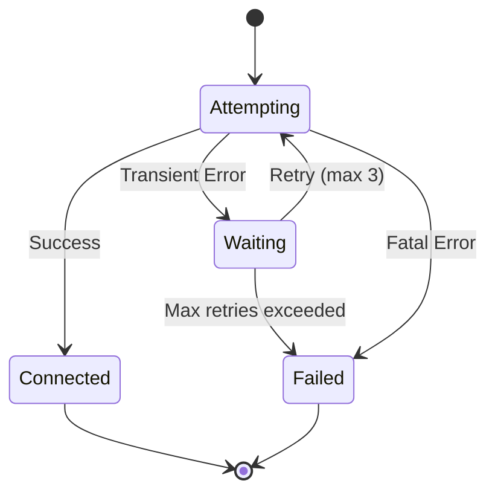

# [COM-001-db-pool] Database Connection Pool Component

::: info Container
Belongs to [CON-001-backend: Backend Container](../../containers/CON-001-backend.md#con-001-components)
:::

## Overview {#com-001-overview}
<!--
What this component does and why it exists.
-->

The Database Connection Pool component manages PostgreSQL connections using a pool pattern. It provides efficient connection reuse, prevents connection exhaustion, and implements resilient connection handling with automatic retry.

## Purpose {#com-001-purpose}
<!--
Specific responsibilities and goals.
-->

- **Connection Reuse**: Maintain pool of reusable connections
- **Resource Protection**: Prevent database connection exhaustion
- **Resilience**: Handle transient failures with retry logic
- **Health Monitoring**: Provide connection health checks
- **Performance**: Reduce connection overhead latency

## Technical Implementation {#com-001-implementation}
<!--
How it's built - libraries, patterns, architecture.
-->

### Libraries {#com-001-libraries}

| Library | Version | Purpose |
|---------|---------|---------|
| `pg` | 8.11.x | PostgreSQL client |
| `pg-pool` | (bundled) | Connection pooling |

### Architecture {#com-001-architecture}



### Code Structure {#com-001-code-structure}

```
src/db/
├── pool.ts         # Pool initialization and management
├── types.ts        # TypeScript interfaces
├── health.ts       # Health check implementation
└── index.ts        # Public exports
```

## Configuration {#com-001-configuration}
<!--
Explains environment variables, configuration loading strategy, and
differences between development and production. Read this section to
understand how to configure the connection pool for different environments.
-->

### Environment Variables {#com-001-env-vars}

| Variable | Dev Default | Production | Description |
|----------|-------------|------------|-------------|
| `DB_HOST` | `localhost` | `db.prod.internal` | Database hostname |
| `DB_PORT` | `5432` | `5432` | Database port |
| `DB_NAME` | `taskflow_dev` | `taskflow` | Database name |
| `DB_USER` | `postgres` | `taskflow_app` | Database user |
| `DB_PASSWORD` | `postgres` | (from secret) | Database password |
| `DB_POOL_MIN` | `2` | `10` | Minimum connections |
| `DB_POOL_MAX` | `10` | `50` | Maximum connections |
| `DB_IDLE_TIMEOUT` | `10000` | `30000` | Idle timeout (ms) |
| `DB_CONNECTION_TIMEOUT` | `5000` | `10000` | Connect timeout (ms) |

### Configuration Loading {#com-001-config-loading}

Configuration is loaded from environment variables with validation:

```typescript
// src/db/config.ts
import { z } from 'zod';

const dbConfigSchema = z.object({
  host: z.string().default('localhost'),
  port: z.coerce.number().default(5432),
  database: z.string(),
  user: z.string(),
  password: z.string(),
  min: z.coerce.number().default(2),
  max: z.coerce.number().default(10),
  idleTimeoutMillis: z.coerce.number().default(10000),
  connectionTimeoutMillis: z.coerce.number().default(5000),
});

export const dbConfig = dbConfigSchema.parse({
  host: process.env.DB_HOST,
  port: process.env.DB_PORT,
  database: process.env.DB_NAME,
  user: process.env.DB_USER,
  password: process.env.DB_PASSWORD,
  min: process.env.DB_POOL_MIN,
  max: process.env.DB_POOL_MAX,
  idleTimeoutMillis: process.env.DB_IDLE_TIMEOUT,
  connectionTimeoutMillis: process.env.DB_CONNECTION_TIMEOUT,
});
```

## Connection Pool Behavior {#com-001-pool-behavior}
<!--
How the pool manages connections, sizing strategy, lifecycle.
-->

### Pool Sizing Strategy {#com-001-pool-sizing}



**Sizing Guidelines:**

| Environment | Min | Max | Rationale |
|-------------|-----|-----|-----------|
| Development | 2 | 10 | Low resource, fast feedback |
| Production | 10 | 50 | Handle concurrent load |
| Testing | 1 | 5 | Isolation, fast teardown |

**Formula for max connections:**
```
max_connections = (available_db_connections / app_instances) * 0.8
```

### Connection Lifecycle {#com-001-lifecycle}

1. **Initialization**: Pool starts with `min` connections
2. **Acquisition**: Request checks idle pool, creates if needed
3. **Usage**: Connection bound to request context
4. **Release**: Returns to idle pool after query
5. **Idle Timeout**: Connections closed after `idleTimeoutMillis`
6. **Eviction**: Unhealthy connections removed automatically

## Error Handling {#com-001-error-handling}
<!--
How errors are handled, retry strategy, error types.
-->

### Retry Strategy {#com-001-retry-strategy}



**Configuration:**
- Max attempts: 3
- Backoff: Exponential (1s, 2s, 4s)
- Jitter: +/- 10% random

**Retriable Errors:**
- `ECONNREFUSED` - Database not ready
- `ETIMEDOUT` - Network timeout
- `connection_refused` - Pool exhausted

**Non-Retriable Errors:**
- `28P01` - Authentication failure
- `3D000` - Database does not exist
- `42P01` - Relation does not exist

### Error Types {#com-001-error-types}

| Error | Code | Cause | Action |
|-------|------|-------|--------|
| Connection timeout | `ETIMEDOUT` | DB unreachable | Retry with backoff |
| Pool exhausted | `POOL_EXHAUSTED` | Too many requests | Queue or reject |
| Auth failure | `28P01` | Bad credentials | Fail immediately |
| Query timeout | `57014` | Slow query | Log and fail |

### Error Response {#com-001-error-response}

```typescript
// Error wrapping for consistent handling
class DatabaseError extends Error {
  constructor(
    message: string,
    public readonly code: string,
    public readonly isRetriable: boolean,
    public readonly cause?: Error
  ) {
    super(message);
    this.name = 'DatabaseError';
  }
}
```

## Performance {#com-001-performance}
<!--
Performance characteristics, benefits, monitoring.
-->

### Pooling Benefits {#com-001-pooling-benefits}

| Metric | Without Pool | With Pool | Improvement |
|--------|-------------|-----------|-------------|
| Connection time | ~50ms | ~1ms | 50x faster |
| Max throughput | ~20 req/s | ~500 req/s | 25x higher |
| Memory per conn | ~10MB | Shared | 90% reduction |

### Metrics to Monitor {#com-001-metrics}

| Metric | Type | Description |
|--------|------|-------------|
| `db_pool_size` | Gauge | Current pool size |
| `db_pool_idle` | Gauge | Idle connections |
| `db_pool_waiting` | Gauge | Queued requests |
| `db_pool_acquire_time` | Histogram | Time to get connection |
| `db_query_duration` | Histogram | Query execution time |
| `db_errors_total` | Counter | Error count by type |

### Prometheus Example {#com-001-prometheus}

```typescript
// Expose metrics endpoint
app.get('/metrics', async (req, res) => {
  const poolStats = pool.totalCount;
  res.send(`
# HELP db_pool_size Current number of connections
# TYPE db_pool_size gauge
db_pool_size ${pool.totalCount}

# HELP db_pool_idle Idle connections in pool
# TYPE db_pool_idle gauge
db_pool_idle ${pool.idleCount}

# HELP db_pool_waiting Clients waiting for connection
# TYPE db_pool_waiting gauge
db_pool_waiting ${pool.waitingCount}
  `);
});
```

## Health Checks {#com-001-health-checks}
<!--
Health check implementation and frequency.
-->

### Implementation {#com-001-health-implementation}

```typescript
// src/db/health.ts
export async function checkDatabaseHealth(): Promise<HealthStatus> {
  const start = Date.now();

  try {
    const client = await pool.connect();
    try {
      await client.query('SELECT 1');
      const latency = Date.now() - start;

      return {
        status: latency < 100 ? 'healthy' : 'degraded',
        latency,
        poolSize: pool.totalCount,
        idleConnections: pool.idleCount,
      };
    } finally {
      client.release();
    }
  } catch (error) {
    return {
      status: 'unhealthy',
      error: error.message,
    };
  }
}
```

### Health Endpoint {#com-001-health-endpoint}

```
GET /health/db

Response (healthy):
{
  "status": "healthy",
  "latency": 5,
  "poolSize": 10,
  "idleConnections": 8
}

Response (unhealthy):
{
  "status": "unhealthy",
  "error": "Connection refused"
}
```

**Check Frequency:** Every 30 seconds via Kubernetes liveness probe.

## Usage Example {#com-001-usage}
<!--
How to use this component in application code.
-->

```typescript
// src/repositories/taskRepository.ts
import { pool } from '../db';

export async function createTask(task: NewTask): Promise<Task> {
  const client = await pool.connect();
  try {
    const result = await client.query(
      `INSERT INTO tasks (title, user_id, due_date)
       VALUES ($1, $2, $3)
       RETURNING *`,
      [task.title, task.userId, task.dueDate]
    );
    return result.rows[0];
  } finally {
    client.release();
  }
}
```

## Related {#com-001-related}

- [CON-001-backend: Backend Container](../../containers/CON-001-backend.md)
- [CTX-001: System Overview](../../CTX-001-system-overview.md#ctx-001-protocols)
