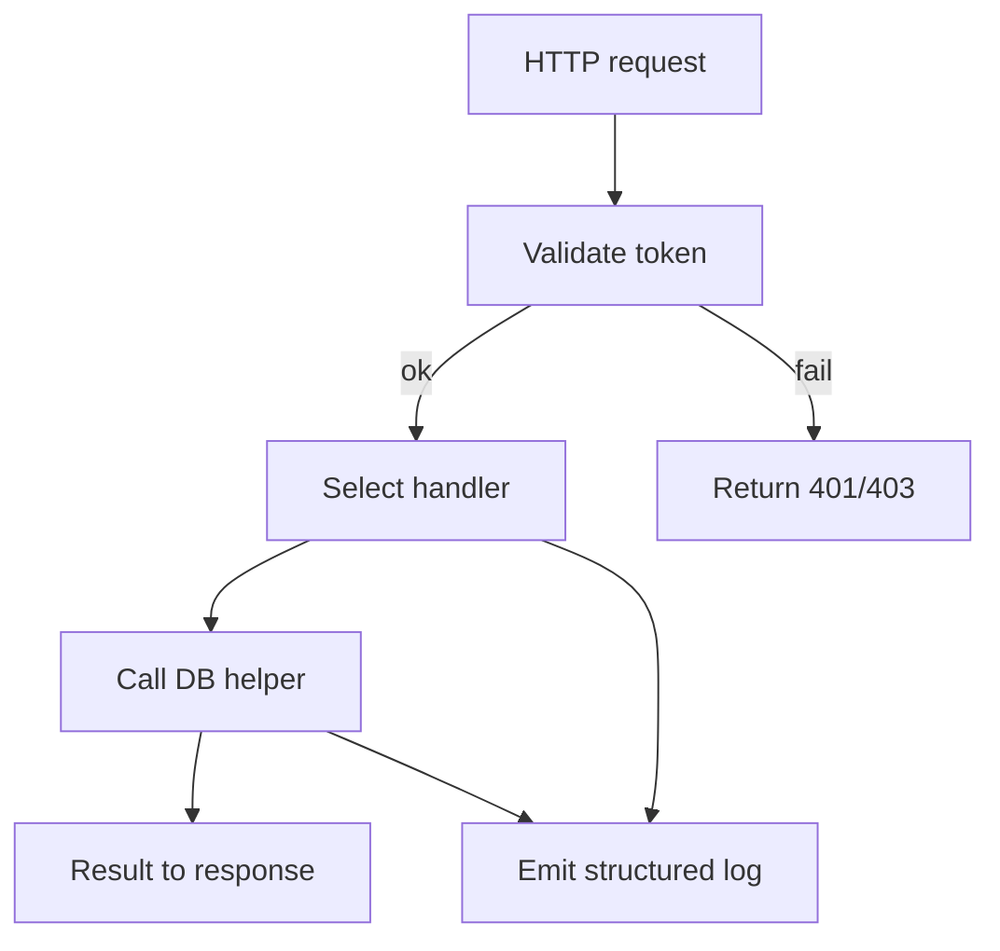

# COM-001 REST Routes (Entrypoint)

## Overview {#com-001-overview}
- Entry point for HTTP requests; handles routing and hands off auth + persistence.
- Implements CTX protocol by delegating SQL operations to [COM-002-db-pool](./COM-002-db-pool.md#com-002-behavior) via container [CON-001-backend#con-001-protocols](../../containers/CON-001-backend.md#con-001-protocols).

## Stack {#com-001-stack}
- Framework: Express 4.18
- Language: TypeScript 5.x
- Why: Minimal routing, middleware support, strong ecosystem

## Configuration {#com-001-config}
| Env Var | Dev | Prod | Why |
|---------|-----|------|-----|
| PORT | 3000 | 8080 | Bind port |
| API_PREFIX | /api | /api | Stable routing prefix |
| AUTH_PUBLIC_KEY_PATH | ./keys/dev.pub | /etc/keys/auth.pub | Token verification |

## Interfaces & Types {#com-001-interfaces}
- `POST /tasks` → `createTask(body, userContext): Task`
- `GET /tasks/:id` → `getTask(id, userContext): Task`
- Middleware: `(req, res, next) => void` with attached `req.user`

## Behavior {#com-001-behavior}
- Validates auth token, injects `user` into request.
- Routes call DB pool through lightweight service helpers.
- Errors normalized before response.


## Error Handling {#com-001-errors}
| Error | Retriable | Action/Code |
|-------|-----------|-------------|
| Missing/invalid token | No | 401/403 with code `auth_invalid` |
| DB query rejected | Yes | 503 with code `db_unavailable`, logged |
| Validation failed | No | 400 with code `validation_error` |

## Usage {#com-001-usage}
```typescript
import { createApp } from './app';

const app = createApp({ logger, dbPool });
app.listen(process.env.PORT || 8080);
```

## Dependencies {#com-001-deps}
- [COM-002-db-pool](./COM-002-db-pool.md#com-002-behavior) for persistence
- [COM-003-logger](./COM-003-logger.md#com-003-behavior) for request/error logging
