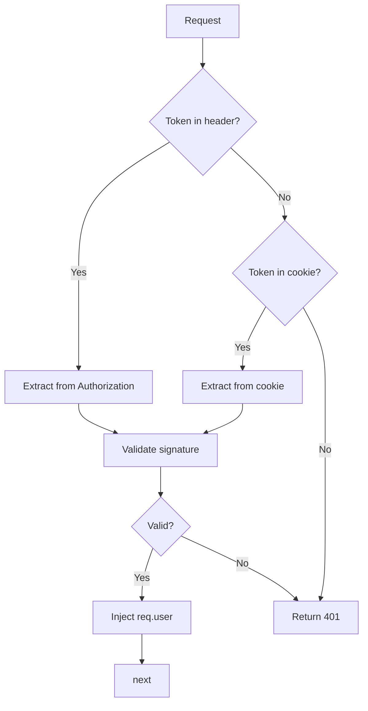

# [COM-002-auth-middleware] Auth Middleware (Cross-cutting)

## Overview {#com-002-overview}

Validates JWT tokens from Authorization header or cookies, injects user context into request for downstream handlers.

## Stack {#com-002-stack}

- Library: `jsonwebtoken` 9.x
- Why: Standard JWT implementation, well-maintained, supports RS256/ES256

## Configuration {#com-002-config}

| Env Var | Dev | Prod | Why |
|---------|-----|------|-----|
| JWT_SECRET | `dev-secret` | (from secret) | Token signing key |
| JWT_ISSUER | `taskflow-dev` | `taskflow` | Token issuer validation |
| JWT_AUDIENCE | `taskflow-api` | `taskflow-api` | Token audience validation |

## Interfaces & Types {#com-002-interfaces}

```typescript
interface UserContext {
  userId: string;
  email: string;
  roles: string[];
}

// Extends Express Request
declare global {
  namespace Express {
    interface Request {
      user?: UserContext;
    }
  }
}
```

## Behavior {#com-002-behavior}



## Error Handling {#com-002-errors}

| Error | Retriable | Action/Code |
|-------|-----------|-------------|
| Missing token | No | 401 `auth_missing` |
| Invalid signature | No | 401 `auth_invalid` |
| Token expired | No | 401 `auth_expired` |

## Usage {#com-002-usage}

```typescript
import { authMiddleware } from './middleware/auth';

app.use('/api/v1', authMiddleware);

// In route handler
app.get('/api/v1/tasks', (req, res) => {
  const userId = req.user!.userId;
  // ...
});
```

## Dependencies {#com-002-deps}

- **Upstream:** None
- **Downstream:** Used by all protected routes in [COM-001-rest-routes](./COM-001-rest-routes.md)
- **Infra features consumed:** None
