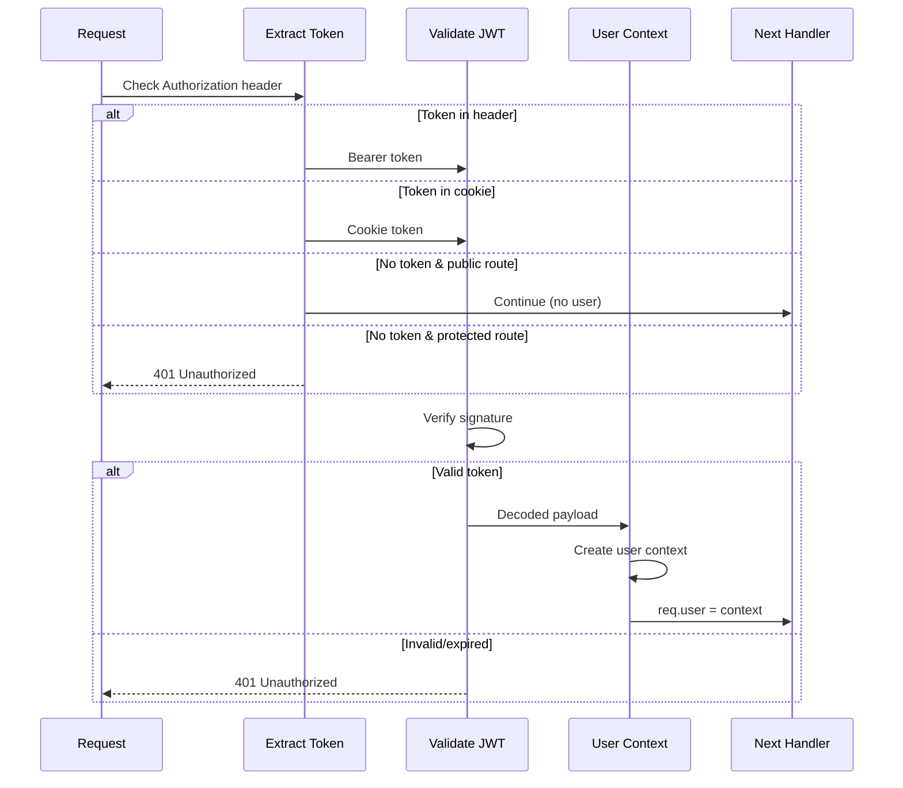

# [COM-002-auth-middleware] Authentication Middleware Component

::: info Container
Belongs to [CON-001-backend: Backend Container](../../containers/CON-001-backend.md#con-001-middleware)
:::

## Overview {#com-002-overview}
<!--
What this component does and why it exists.
-->

The Authentication Middleware validates JWT tokens on incoming requests, extracts user identity, and injects user context for downstream handlers. It protects authenticated endpoints while allowing public routes to pass through.

## Purpose {#com-002-purpose}
<!--
Specific responsibilities and goals.
-->

- **Token Validation**: Verify JWT signature and expiration
- **User Extraction**: Decode user information from token
- **Context Injection**: Add user to request object
- **Route Protection**: Block unauthenticated access to protected endpoints
- **Token Refresh**: Handle token refresh flow

## Technical Implementation {#com-002-implementation}
<!--
How it's built - libraries, patterns, architecture.
-->

### Libraries {#com-002-libraries}

| Library | Version | Purpose |
|---------|---------|---------|
| `jsonwebtoken` | 9.x | JWT signing and verification |
| `cookie-parser` | 1.4.x | Cookie extraction |

### Code Structure {#com-002-code-structure}

```
src/middleware/
  auth/
    index.ts           # Main middleware export
    validateToken.ts   # JWT validation logic
    extractToken.ts    # Token extraction from header/cookie
    userContext.ts     # User context creation
    publicRoutes.ts    # Public route allowlist
```

### Request Flow {#com-002-request-flow}



## Configuration {#com-002-configuration}
<!--
Environment variables and configuration options.
-->

| Variable | Dev Default | Production | Description |
|----------|-------------|------------|-------------|
| `JWT_SECRET` | `dev-secret-key` | (from secret store) | Secret for signing |
| `JWT_EXPIRES_IN` | `15m` | `15m` | Access token expiry |
| `JWT_REFRESH_EXPIRES` | `7d` | `7d` | Refresh token expiry |
| `JWT_ALGORITHM` | `HS256` | `RS256` | Signing algorithm |
| `JWT_ISSUER` | `taskflow-dev` | `taskflow` | Token issuer claim |

## Token Extraction {#com-002-token-extraction}
<!--
How tokens are extracted from requests.
-->

### Priority Order {#com-002-extraction-order}

1. `Authorization: Bearer <token>` header (preferred)
2. `access_token` cookie (for browser requests)
3. `token` query parameter (for SSE/WebSocket connections)

### Implementation {#com-002-extraction-impl}

```typescript
// src/middleware/auth/extractToken.ts
export function extractToken(req: Request): string | null {
  // 1. Check Authorization header
  const authHeader = req.headers.authorization;
  if (authHeader?.startsWith('Bearer ')) {
    return authHeader.substring(7);
  }

  // 2. Check cookies
  if (req.cookies?.access_token) {
    return req.cookies.access_token;
  }

  // 3. Check query parameter (for SSE)
  if (req.query.token && typeof req.query.token === 'string') {
    return req.query.token;
  }

  return null;
}
```

## Token Validation {#com-002-token-validation}
<!--
JWT verification process.
-->

### Validation Steps {#com-002-validation-steps}

1. Verify signature against secret/public key
2. Check expiration (`exp` claim)
3. Check issuer (`iss` claim)
4. Check audience (`aud` claim) if configured
5. Validate token type (access vs refresh)

### Implementation {#com-002-validation-impl}

```typescript
// src/middleware/auth/validateToken.ts
import jwt from 'jsonwebtoken';
import { config } from '../../config';

export interface TokenPayload {
  sub: string;       // User ID
  email: string;
  role: string;
  type: 'access' | 'refresh';
  iat: number;
  exp: number;
}

export function validateToken(token: string): TokenPayload {
  try {
    const payload = jwt.verify(token, config.jwt.secret, {
      issuer: config.jwt.issuer,
      algorithms: [config.jwt.algorithm],
    }) as TokenPayload;

    if (payload.type !== 'access') {
      throw new AuthError('Invalid token type');
    }

    return payload;
  } catch (error) {
    if (error instanceof jwt.TokenExpiredError) {
      throw new AuthError('Token expired', 'TOKEN_EXPIRED');
    }
    if (error instanceof jwt.JsonWebTokenError) {
      throw new AuthError('Invalid token', 'INVALID_TOKEN');
    }
    throw error;
  }
}
```

## User Context {#com-002-user-context}
<!--
How user information is injected into request.
-->

### Context Structure {#com-002-context-structure}

```typescript
// src/middleware/auth/userContext.ts
export interface UserContext {
  id: string;
  email: string;
  role: 'user' | 'admin';
  permissions: string[];
}

// Extends Express Request
declare global {
  namespace Express {
    interface Request {
      user?: UserContext;
    }
  }
}
```

### Context Creation {#com-002-context-creation}

```typescript
export function createUserContext(payload: TokenPayload): UserContext {
  return {
    id: payload.sub,
    email: payload.email,
    role: payload.role as 'user' | 'admin',
    permissions: getPermissionsForRole(payload.role),
  };
}

function getPermissionsForRole(role: string): string[] {
  const permissions: Record<string, string[]> = {
    user: ['tasks:read', 'tasks:write', 'profile:read', 'profile:write'],
    admin: ['tasks:*', 'users:*', 'admin:*'],
  };
  return permissions[role] || [];
}
```

## Public Routes {#com-002-public-routes}
<!--
Routes that bypass authentication.
-->

### Allowlist Configuration {#com-002-allowlist}

```typescript
// src/middleware/auth/publicRoutes.ts
export const publicRoutes = [
  { method: 'POST', path: '/api/v1/auth/login' },
  { method: 'POST', path: '/api/v1/auth/register' },
  { method: 'POST', path: '/api/v1/auth/refresh' },
  { method: 'GET', path: '/health' },
  { method: 'GET', path: '/metrics' },
];

export function isPublicRoute(method: string, path: string): boolean {
  return publicRoutes.some(
    route => route.method === method && path.startsWith(route.path)
  );
}
```

## Main Middleware {#com-002-main-middleware}
<!--
The assembled middleware function.
-->

```typescript
// src/middleware/auth/index.ts
import { Request, Response, NextFunction } from 'express';
import { extractToken } from './extractToken';
import { validateToken } from './validateToken';
import { createUserContext } from './userContext';
import { isPublicRoute } from './publicRoutes';

export function authMiddleware(
  req: Request,
  res: Response,
  next: NextFunction
): void {
  // Skip for public routes
  if (isPublicRoute(req.method, req.path)) {
    return next();
  }

  const token = extractToken(req);

  if (!token) {
    res.status(401).json({
      error: {
        code: 'UNAUTHORIZED',
        message: 'Authentication required',
      },
    });
    return;
  }

  try {
    const payload = validateToken(token);
    req.user = createUserContext(payload);
    next();
  } catch (error) {
    if (error instanceof AuthError) {
      res.status(401).json({
        error: {
          code: error.code,
          message: error.message,
        },
      });
      return;
    }
    next(error);
  }
}
```

## Error Handling {#com-002-error-handling}
<!--
Authentication-specific errors.
-->

### Error Types {#com-002-error-types}

| Code | HTTP Status | Cause | Client Action |
|------|-------------|-------|---------------|
| `UNAUTHORIZED` | 401 | No token provided | Redirect to login |
| `TOKEN_EXPIRED` | 401 | Token past expiry | Attempt token refresh |
| `INVALID_TOKEN` | 401 | Bad signature/format | Redirect to login |
| `FORBIDDEN` | 403 | Valid token, no permission | Show error message |

### Custom Error Class {#com-002-error-class}

```typescript
// src/errors/AuthError.ts
export class AuthError extends Error {
  constructor(
    message: string,
    public readonly code: string = 'UNAUTHORIZED'
  ) {
    super(message);
    this.name = 'AuthError';
  }
}
```

## Testing {#com-002-testing}
<!--
How to test this component.
-->

### Unit Tests {#com-002-unit-tests}

```typescript
// src/middleware/auth/__tests__/authMiddleware.test.ts
describe('authMiddleware', () => {
  it('allows public routes without token', async () => {
    const req = mockRequest({ method: 'POST', path: '/api/v1/auth/login' });
    const res = mockResponse();
    const next = vi.fn();

    authMiddleware(req, res, next);

    expect(next).toHaveBeenCalled();
    expect(res.status).not.toHaveBeenCalled();
  });

  it('rejects protected routes without token', async () => {
    const req = mockRequest({ method: 'GET', path: '/api/v1/tasks' });
    const res = mockResponse();
    const next = vi.fn();

    authMiddleware(req, res, next);

    expect(res.status).toHaveBeenCalledWith(401);
    expect(next).not.toHaveBeenCalled();
  });

  it('injects user context with valid token', async () => {
    const token = createTestToken({ sub: 'user-123', role: 'user' });
    const req = mockRequest({
      method: 'GET',
      path: '/api/v1/tasks',
      headers: { authorization: `Bearer ${token}` },
    });
    const res = mockResponse();
    const next = vi.fn();

    authMiddleware(req, res, next);

    expect(req.user).toEqual(expect.objectContaining({ id: 'user-123' }));
    expect(next).toHaveBeenCalled();
  });
});
```

## Related {#com-002-related}

- [CON-001-backend: Backend Container](../../containers/CON-001-backend.md#con-001-middleware)
- [ADR-004: JWT Authentication](../../adr/ADR-004-jwt-auth.md)
- [CTX-001: Cross-Cutting Concerns](../../CTX-001-system-overview.md#ctx-001-authentication)
