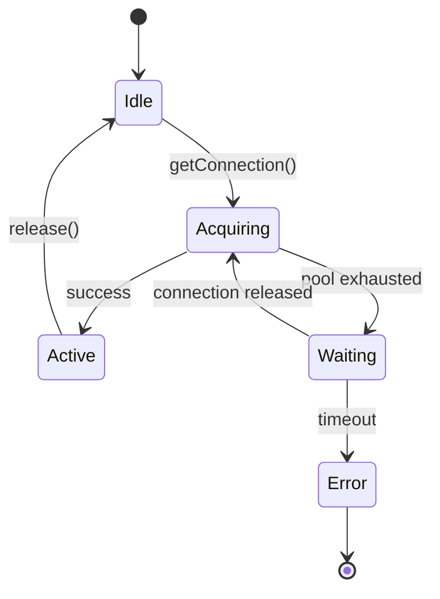

# [COM-002-db-pool] DB Pool (Resource)

## Overview {#com-002-overview}
- Manages pooled PostgreSQL connections for the backend container.
- Implements CTX SQL protocol from [CON-001-backend#con-001-protocols](../../containers/CON-001-backend.md#con-001-protocols).

## Stack {#com-002-stack}
- Library: `pg` 8.11.x
- Why: Native driver, stable, supports pooling and async/await

## Configuration {#com-002-config}
| Env Var | Dev | Prod | Why |
|---------|-----|------|-----|
| DB_URL | postgres://localhost/tasks | ${DB_URL} | Connection target |
| DB_POOL_MIN | 2 | 10 | Baseline connections |
| DB_POOL_MAX | 10 | 50 | Handle higher load |
| DB_IDLE_TIMEOUT | 30s | 10s | Release idle connections |
| DB_CONNECTION_TIMEOUT | 5s | 10s | Tolerate slower prod networks |

### Config Loading {#com-002-config-loading}
```typescript
import { z } from 'zod';

const schema = z.object({
  url: z.string().url(),
  min: z.coerce.number().default(2),
  max: z.coerce.number().default(10),
  idleTimeoutMillis: z.coerce.number().default(30000),
  connectionTimeoutMillis: z.coerce.number().default(5000),
});

export const dbConfig = schema.parse({
  url: process.env.DB_URL,
  min: process.env.DB_POOL_MIN,
  max: process.env.DB_POOL_MAX,
  idleTimeoutMillis: process.env.DB_IDLE_TIMEOUT,
  connectionTimeoutMillis: process.env.DB_CONNECTION_TIMEOUT,
});
```

## Interfaces & Types {#com-002-interfaces}
- `query<T>(text: string, params?: any[]): Promise<QueryResult<T>>`
- `withTransaction<T>(fn: (client) => Promise<T>): Promise<T>`

## Behavior {#com-002-behavior}
- Opens pool on startup; acquires connections per request.
- Retries transient connection errors with backoff up to 5 seconds.


## Error Handling {#com-002-errors}
| Error | Retriable | Action/Code |
|-------|-----------|-------------|
| Connection refused | Yes | Retry with backoff, bubble if exceeds |
| Pool exhausted | Yes | Wait up to 5s then 503 |
| Query timeout | No | Throw typed `QueryTimeoutError` |

## Health Checks {#com-002-health}
| Check | Probe | Expectation |
|-------|-------|-------------|
| Liveness | `SELECT 1` | < 500ms |
| Readiness | `SELECT 1` with acquire timeout | Respects `DB_CONNECTION_TIMEOUT` |

## Metrics & Observability {#com-002-metrics}
- Pool size / idle / waiting clients
- Acquire latency (p50/p95) and query duration
- Error rate by code (connection refused, timeout)

## Usage {#com-002-usage}
```typescript
const pool = createPool(dbConfig);
const result = await pool.query('SELECT * FROM tasks WHERE id = $1', [taskId]);
```

## Dependencies {#com-002-deps}
- Consumes features from [CON-003-postgres#con-003-features](../../containers/CON-003-postgres.md#con-003-features)
- Used by [COM-001-rest-routes#com-001-behavior](./COM-001-rest-routes.md#com-001-behavior)
