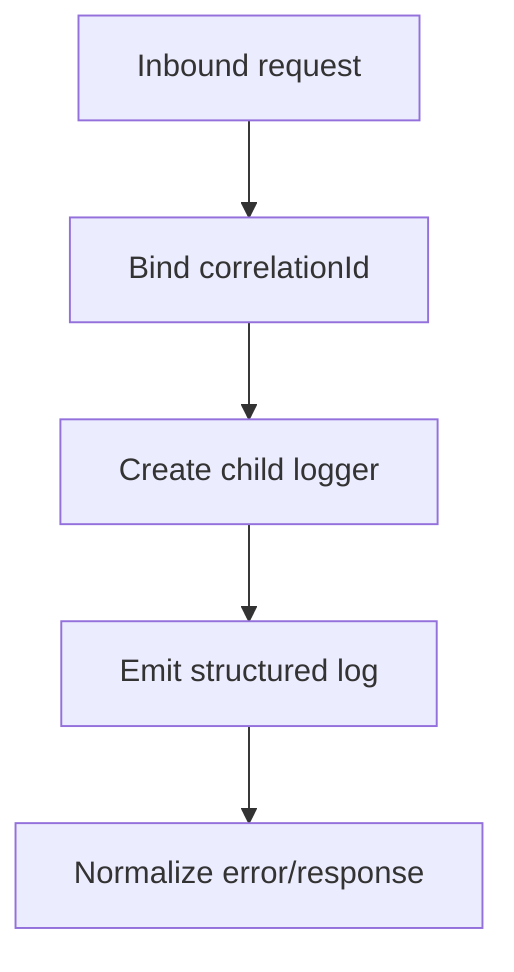

# [COM-003-logger] Logger (Cross-cutting)

## Overview {#com-003-overview}
- Provides structured JSON logging with correlation IDs across container components.
- Supports error normalization for HTTP responses referenced by [CON-001-backend#con-001-cross-cutting](../../containers/CON-001-backend.md#con-001-cross-cutting).

## Stack {#com-003-stack}
- Library: `pino` 8.x
- Why: Fast JSON logging, request bindings, ecosystem support

## Configuration {#com-003-config}
| Env Var | Dev | Prod | Why |
|---------|-----|------|-----|
| LOG_LEVEL | debug | info | Control verbosity |
| LOG_PRETTY | true | false | Human-readable in dev |
| LOG_SAMPLING | off | 1/100 | Sample noisy logs under load |

## Interfaces & Types {#com-003-interfaces}
- `createLogger(context): Logger`
- `logger.child(bindings): Logger`
- `logger.error(err, context?)`
- `formatter.toHttpError(err): { status: number; code: string; message: string }`

## Behavior {#com-003-behavior}
- Attaches `correlationId` per request (generated or propagated).
- Formats errors into HTTP-safe payloads and logs with stack traces.


## Error Handling {#com-003-errors}
| Error | Retriable | Action/Code |
|-------|-----------|-------------|
| Missing correlation ID | Yes | Generate new ID, warn |
| Formatting failure | No | Fallback to generic 500, log raw error |

## Usage {#com-003-usage}
```typescript
const logger = createLogger({ service: 'backend-api' });
const child = logger.child({ correlationId });
child.info({ route: req.path }, 'request received');
```

## Dependencies {#com-003-deps}
- Consumed by [COM-001-rest-routes#com-001-behavior](./COM-001-rest-routes.md#com-001-behavior) and [COM-002-db-pool#com-002-behavior](./COM-002-db-pool.md#com-002-behavior)
