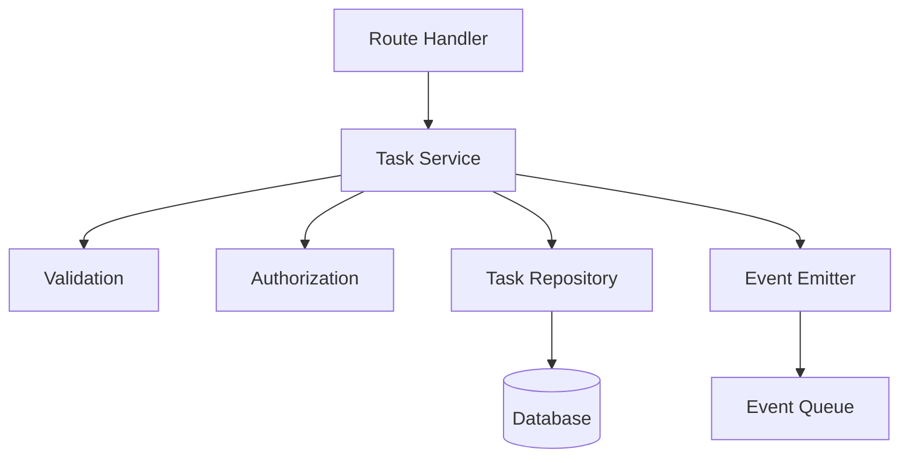

# [COM-003-task-service] Task Service Component

::: info Container
Belongs to [CON-001-backend: Backend Container](../../containers/CON-001-backend.md#con-001-components)
:::

## Overview {#com-003-overview}
<!--
What this component does and why it exists.
-->

The Task Service handles all business logic for task operations. It sits between the API routes and the data layer, enforcing business rules, performing validation, and orchestrating complex operations.

## Purpose {#com-003-purpose}
<!--
Specific responsibilities and goals.
-->

- **Business Rules**: Enforce task-related domain rules
- **Validation**: Validate task data beyond schema validation
- **Authorization**: Check user permissions for operations
- **Orchestration**: Coordinate multi-step operations
- **Events**: Emit events for task state changes

## Technical Implementation {#com-003-implementation}
<!--
How it's built - libraries, patterns, architecture.
-->

### Code Structure {#com-003-code-structure}

```
src/services/
  task/
    index.ts           # Public exports
    taskService.ts     # Main service class
    validation.ts      # Business validation
    authorization.ts   # Permission checks
    events.ts          # Event emission
    types.ts           # Service-specific types
```

### Service Pattern {#com-003-pattern}



## Service Interface {#com-003-interface}
<!--
Public API of the service.
-->

```typescript
// src/services/task/types.ts
export interface TaskService {
  // CRUD operations
  createTask(userId: string, data: CreateTaskInput): Promise<Task>;
  getTask(userId: string, taskId: string): Promise<Task>;
  listTasks(userId: string, filters: TaskFilters): Promise<PaginatedTasks>;
  updateTask(userId: string, taskId: string, data: UpdateTaskInput): Promise<Task>;
  deleteTask(userId: string, taskId: string): Promise<void>;

  // Actions
  completeTask(userId: string, taskId: string): Promise<Task>;
  reopenTask(userId: string, taskId: string): Promise<Task>;
  assignTask(userId: string, taskId: string, assigneeId: string): Promise<Task>;
}

export interface CreateTaskInput {
  title: string;
  description?: string;
  dueDate?: Date;
  priority?: 'low' | 'medium' | 'high';
  tags?: string[];
}

export interface TaskFilters {
  status?: 'pending' | 'completed';
  priority?: 'low' | 'medium' | 'high';
  dueBefore?: Date;
  dueAfter?: Date;
  search?: string;
  page?: number;
  limit?: number;
}
```

## Business Rules {#com-003-business-rules}
<!--
Domain rules enforced by the service.
-->

### Task Rules {#com-003-task-rules}

| Rule | Description | Enforcement |
|------|-------------|-------------|
| Title required | Tasks must have a non-empty title | Validation |
| Title length | Title must be 1-200 characters | Validation |
| Due date future | Due date must be in future (on create) | Validation |
| Own tasks only | Users can only access their own tasks | Authorization |
| Complete once | Completed tasks can be reopened | State check |
| No delete completed | Completed tasks cannot be deleted | Authorization |

### Validation Implementation {#com-003-validation-impl}

```typescript
// src/services/task/validation.ts
import { z } from 'zod';

export const createTaskSchema = z.object({
  title: z.string().min(1).max(200),
  description: z.string().max(5000).optional(),
  dueDate: z.date().refine(
    date => date > new Date(),
    { message: 'Due date must be in the future' }
  ).optional(),
  priority: z.enum(['low', 'medium', 'high']).default('medium'),
  tags: z.array(z.string().max(50)).max(10).optional(),
});

export function validateCreateTask(data: unknown): CreateTaskInput {
  return createTaskSchema.parse(data);
}
```

## Authorization {#com-003-authorization}
<!--
How permissions are checked.
-->

### Permission Checks {#com-003-permissions}

```typescript
// src/services/task/authorization.ts
export class TaskAuthorization {
  async canRead(userId: string, task: Task): Promise<boolean> {
    // Users can read their own tasks
    return task.userId === userId;
  }

  async canUpdate(userId: string, task: Task): Promise<boolean> {
    // Users can update their own tasks
    return task.userId === userId;
  }

  async canDelete(userId: string, task: Task): Promise<boolean> {
    // Users can delete their own non-completed tasks
    return task.userId === userId && task.status !== 'completed';
  }

  async canAssign(userId: string, task: Task): Promise<boolean> {
    // Only task owner can assign (future: managers)
    return task.userId === userId;
  }
}
```

## Service Implementation {#com-003-service-impl}
<!--
Core service logic.
-->

```typescript
// src/services/task/taskService.ts
import { TaskRepository } from '../../repositories/taskRepository';
import { TaskAuthorization } from './authorization';
import { validateCreateTask, validateUpdateTask } from './validation';
import { TaskEventEmitter } from './events';
import { NotFoundError, ForbiddenError, ValidationError } from '../../errors';

export class TaskServiceImpl implements TaskService {
  constructor(
    private readonly repository: TaskRepository,
    private readonly auth: TaskAuthorization,
    private readonly events: TaskEventEmitter
  ) {}

  async createTask(userId: string, data: CreateTaskInput): Promise<Task> {
    // Validate input
    const validated = validateCreateTask(data);

    // Create task
    const task = await this.repository.create({
      ...validated,
      userId,
      status: 'pending',
      createdAt: new Date(),
    });

    // Emit event
    await this.events.emit('task.created', { task, userId });

    return task;
  }

  async getTask(userId: string, taskId: string): Promise<Task> {
    const task = await this.repository.findById(taskId);

    if (!task) {
      throw new NotFoundError('Task', taskId);
    }

    if (!await this.auth.canRead(userId, task)) {
      throw new ForbiddenError('Cannot access this task');
    }

    return task;
  }

  async listTasks(userId: string, filters: TaskFilters): Promise<PaginatedTasks> {
    // Always filter by user ID (users see only their tasks)
    const results = await this.repository.findMany({
      ...filters,
      userId,
    });

    return results;
  }

  async updateTask(
    userId: string,
    taskId: string,
    data: UpdateTaskInput
  ): Promise<Task> {
    const task = await this.getTask(userId, taskId);

    if (!await this.auth.canUpdate(userId, task)) {
      throw new ForbiddenError('Cannot update this task');
    }

    const validated = validateUpdateTask(data);
    const updated = await this.repository.update(taskId, validated);

    await this.events.emit('task.updated', {
      task: updated,
      changes: data,
      userId,
    });

    return updated;
  }

  async deleteTask(userId: string, taskId: string): Promise<void> {
    const task = await this.getTask(userId, taskId);

    if (!await this.auth.canDelete(userId, task)) {
      throw new ForbiddenError('Cannot delete completed tasks');
    }

    await this.repository.delete(taskId);
    await this.events.emit('task.deleted', { taskId, userId });
  }

  async completeTask(userId: string, taskId: string): Promise<Task> {
    const task = await this.getTask(userId, taskId);

    if (task.status === 'completed') {
      throw new ValidationError('Task is already completed');
    }

    const updated = await this.repository.update(taskId, {
      status: 'completed',
      completedAt: new Date(),
    });

    await this.events.emit('task.completed', { task: updated, userId });

    return updated;
  }

  async reopenTask(userId: string, taskId: string): Promise<Task> {
    const task = await this.getTask(userId, taskId);

    if (task.status !== 'completed') {
      throw new ValidationError('Task is not completed');
    }

    const updated = await this.repository.update(taskId, {
      status: 'pending',
      completedAt: null,
    });

    await this.events.emit('task.reopened', { task: updated, userId });

    return updated;
  }
}
```

## Events {#com-003-events}
<!--
Events emitted by the service.
-->

### Event Types {#com-003-event-types}

| Event | Payload | Triggered When |
|-------|---------|----------------|
| `task.created` | `{ task, userId }` | New task created |
| `task.updated` | `{ task, changes, userId }` | Task modified |
| `task.deleted` | `{ taskId, userId }` | Task deleted |
| `task.completed` | `{ task, userId }` | Task marked done |
| `task.reopened` | `{ task, userId }` | Completed task reopened |

### Event Emitter {#com-003-event-emitter}

```typescript
// src/services/task/events.ts
import { EventEmitter } from 'events';

export class TaskEventEmitter {
  constructor(private readonly emitter: EventEmitter) {}

  async emit(event: string, payload: unknown): Promise<void> {
    this.emitter.emit(event, {
      type: event,
      timestamp: new Date().toISOString(),
      payload,
    });
  }
}
```

## Error Handling {#com-003-error-handling}
<!--
Service-specific error scenarios.
-->

### Error Types {#com-003-error-types}

| Error | HTTP Code | When |
|-------|-----------|------|
| `NotFoundError` | 404 | Task doesn't exist |
| `ForbiddenError` | 403 | User lacks permission |
| `ValidationError` | 400 | Invalid input data |

## Testing {#com-003-testing}
<!--
How to test this service.
-->

### Unit Tests {#com-003-unit-tests}

```typescript
// src/services/task/__tests__/taskService.test.ts
describe('TaskService', () => {
  let service: TaskServiceImpl;
  let mockRepo: MockTaskRepository;
  let mockAuth: MockTaskAuthorization;
  let mockEvents: MockTaskEventEmitter;

  beforeEach(() => {
    mockRepo = new MockTaskRepository();
    mockAuth = new MockTaskAuthorization();
    mockEvents = new MockTaskEventEmitter();
    service = new TaskServiceImpl(mockRepo, mockAuth, mockEvents);
  });

  describe('createTask', () => {
    it('creates task with valid data', async () => {
      const task = await service.createTask('user-1', {
        title: 'Test Task',
        priority: 'high',
      });

      expect(task.title).toBe('Test Task');
      expect(task.userId).toBe('user-1');
      expect(task.status).toBe('pending');
    });

    it('emits task.created event', async () => {
      await service.createTask('user-1', { title: 'Test' });

      expect(mockEvents.emit).toHaveBeenCalledWith(
        'task.created',
        expect.objectContaining({ userId: 'user-1' })
      );
    });
  });

  describe('deleteTask', () => {
    it('prevents deleting completed tasks', async () => {
      mockRepo.findById.mockResolvedValue({
        id: 'task-1',
        userId: 'user-1',
        status: 'completed',
      });

      await expect(
        service.deleteTask('user-1', 'task-1')
      ).rejects.toThrow(ForbiddenError);
    });
  });
});
```

## Related {#com-003-related}

- [CON-001-backend: Backend Container](../../containers/CON-001-backend.md#con-001-components)
- [COM-001-db-pool: Database Pool](./COM-001-db-pool.md)
- [ADR-001: REST API](../../adr/ADR-001-rest-api.md)
