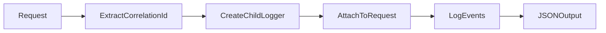

# [COM-004-logger] Logger (Cross-cutting)

## Overview {#com-004-overview}

Provides structured JSON logging with correlation ID propagation for distributed tracing.

## Stack {#com-004-stack}

- Library: `pino` 8.x
- Why: Fast JSON logging, low overhead, good TypeScript support

## Configuration {#com-004-config}

| Env Var | Dev | Prod | Why |
|---------|-----|------|-----|
| LOG_LEVEL | `debug` | `info` | Verbosity control |
| LOG_PRETTY | `true` | `false` | Human-readable in dev |

## Interfaces & Types {#com-004-interfaces}

```typescript
interface Logger {
  info(msg: string, context?: object): void;
  warn(msg: string, context?: object): void;
  error(msg: string, error?: Error, context?: object): void;
  child(bindings: object): Logger;
}
```

## Behavior {#com-004-behavior}



## Error Handling {#com-004-errors}

| Error | Retriable | Action/Code |
|-------|-----------|-------------|
| Missing correlation ID | Yes | Generate new UUID |
| Log write failure | No | Fallback to stderr |

## Usage {#com-004-usage}

```typescript
import { createLogger } from './logger';

const logger = createLogger({ service: 'backend' });

// In middleware
app.use((req, res, next) => {
  req.logger = logger.child({
    correlationId: req.headers['x-correlation-id'] || uuid()
  });
  next();
});

// In handler
req.logger.info('Task created', { taskId: task.id });
```

## Dependencies {#com-004-deps}

- **Upstream:** None
- **Downstream:** Used by all components for logging
- **Infra features consumed:** None
