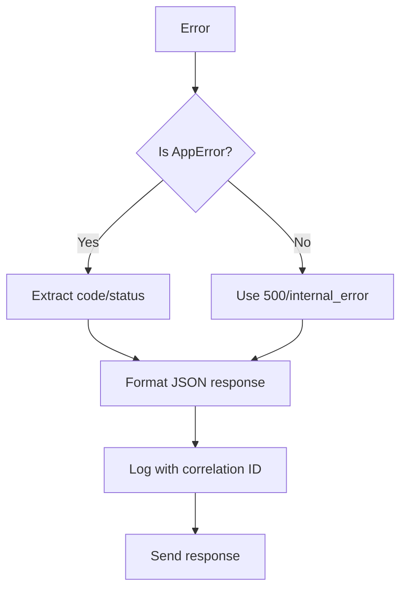

# [COM-005-error-handler] Error Handler (Cross-cutting)

## Overview {#com-005-overview}

Express error middleware that catches all errors and formats them into consistent JSON responses with correlation IDs.

## Stack {#com-005-stack}

- Library: None (Express middleware)
- Why: Native Express error handling pattern

## Configuration {#com-005-config}

| Env Var | Dev | Prod | Why |
|---------|-----|------|-----|
| EXPOSE_STACK | `true` | `false` | Include stack trace in dev |
| NODE_ENV | `development` | `production` | Environment detection |

### Config Loading {#com-005-config-loading}

```typescript
import { z } from 'zod';

const errorConfigSchema = z.object({
  exposeStack: z.coerce.boolean().default(false),
  nodeEnv: z.enum(['development', 'production', 'test']).default('production'),
});

export const errorConfig = errorConfigSchema.parse({
  exposeStack: process.env.EXPOSE_STACK,
  nodeEnv: process.env.NODE_ENV,
});
```

## Interfaces & Types {#com-005-interfaces}

```typescript
interface ErrorResponse {
  error: {
    code: string;
    message: string;
    correlationId: string;
    stack?: string; // Dev only
  };
}

interface AppError extends Error {
  code: string;
  statusCode: number;
  isOperational: boolean;
}
```

## Behavior {#com-005-behavior}



## Error Handling {#com-005-errors}

| Error Type | Status | Code |
|------------|--------|------|
| ValidationError | 400 | `validation_error` |
| AuthError | 401 | `auth_*` |
| ForbiddenError | 403 | `forbidden` |
| NotFoundError | 404 | `not_found` |
| Unknown | 500 | `internal_error` |

## Usage {#com-005-usage}

```typescript
import { errorHandler } from './middleware/errorHandler';

// Must be last middleware
app.use(errorHandler);

// Throwing errors
throw new AppError('Task not found', 'task_not_found', 404);
```

## Health Checks {#com-005-health}

| Check | Probe | Expectation |
|-------|-------|-------------|
| Middleware registered | Check app middleware stack | Handler present |

## Metrics & Observability {#com-005-metrics}

| Metric | Type | Description |
|--------|------|-------------|
| `errors_total` | Counter | Errors by code |
| `errors_by_status` | Counter | Errors by HTTP status |
| `unhandled_errors_total` | Counter | Non-operational errors |

## Dependencies {#com-005-deps}

- **Upstream:** [COM-004-logger](./COM-004-logger.md) for error logging
- **Downstream:** None (terminal middleware)
- **Infra features consumed:** None
