id: C3-201-api-client
title: API Client (Resource)
summary: >
  Frontend HTTP client for TaskFlow. Wraps fetch with auth header injection, JSON parsing,
  retries, and error normalization for UI consumers.
nature: Resource
---

# [C3-201-api-client] API Client (Resource)

## Overview {#c3-201-overview}
- Implements the CTX REST protocol to the backend from [C3-2-frontend#c3-2-api-calls](../../containers/C3-2-frontend.md#c3-2-api-calls).
- Centralized HTTP client for all backend API calls. Handles auth token injection, JSON parsing, retries, and consistent error formatting.

## Stack {#c3-201-stack}
- Library: Native `fetch` API with small wrapper
- Language: TypeScript 5.x

## Configuration {#c3-201-config}
| Env Var | Dev | Prod | Why |
|---------|-----|------|-----|
| VITE_API_URL | http://localhost:3000/api | /api | Backend base URL |
| VITE_API_TIMEOUT_MS | 10000 | 30000 | Request timeout ms |
| VITE_RETRY_COUNT | 1 | 3 | Max retries for retriable errors |

### Config Loading {#c3-201-config-loading}

```typescript
const apiConfig = {
  baseUrl: import.meta.env.VITE_API_URL || '/api',
  timeoutMs: Number(import.meta.env.VITE_API_TIMEOUT_MS) || 30000,
  retryCount: Number(import.meta.env.VITE_RETRY_COUNT) || 3,
};
```

## Interfaces & Types {#c3-201-interfaces}

```typescript
interface ApiClient {
  get<T>(path: string): Promise<T>;
  post<T>(path: string, body: unknown): Promise<T>;
  put<T>(path: string, body: unknown): Promise<T>;
  delete(path: string): Promise<void>;
}

interface ApiError {
  code: string;
  message: string;
  correlationId?: string;
}
```

## Behavior {#c3-201-behavior}

```mermaid
sequenceDiagram
    participant Component
    participant ApiClient
    participant Backend

    Component->>ApiClient: get('/tasks')
    ApiClient->>ApiClient: Attach auth header
    ApiClient->>Backend: GET /api/v1/tasks
    Backend-->>ApiClient: 200 + JSON (or 401/5xx)
    ApiClient->>ApiClient: Parse/normalize error
    ApiClient-->>Component: Data or ApiError

    Note over ApiClient,Backend: On 401 → refresh then retry once
```



### Behavior Notes
- Injects `Authorization: Bearer <token>` when available.
- Retries idempotent requests on network/5xx up to `VITE_RETRY_COUNT`.
- Maps HTTP errors into UI-friendly objects with correlation IDs when provided by backend.

## Error Handling {#c3-201-errors}
| Error | Retriable | Action/Code |
|-------|-----------|-------------|
| Network error | Yes | Retry with backoff up to `VITE_RETRY_COUNT` |
| 401 unauthorized | Yes | Trigger refresh flow, retry once |
| 4xx validation | No | Surface normalized error |
| 5xx | Yes | Retry up to retry count, then surface |

## Usage {#c3-201-usage}

```typescript
import { apiClient } from './api';

const tasks = await apiClient.get<Task[]>('/tasks');
await apiClient.post('/tasks', { title: 'Demo' });
```

## Health Checks {#c3-201-health}
| Check | Probe | Expectation |
|-------|-------|-------------|
| Backend reachable | `GET /health` | 200 OK |
| Config valid | `baseUrl` non-empty | Non-empty string |

## Metrics & Observability {#c3-201-metrics}
| Metric | Type | Description |
|--------|------|-------------|
| `api_requests_total` | Counter | Requests by method |
| `api_errors_total` | Counter | Errors by status code |
| `api_latency_ms` | Histogram | Request duration |
| `api_retries_total` | Counter | Retry attempts |

## Dependencies {#c3-201-deps}
- Consumes backend REST API at [C3-1-backend](../../containers/C3-1-backend.md)
- Used by frontend data-fetching hooks and pages
