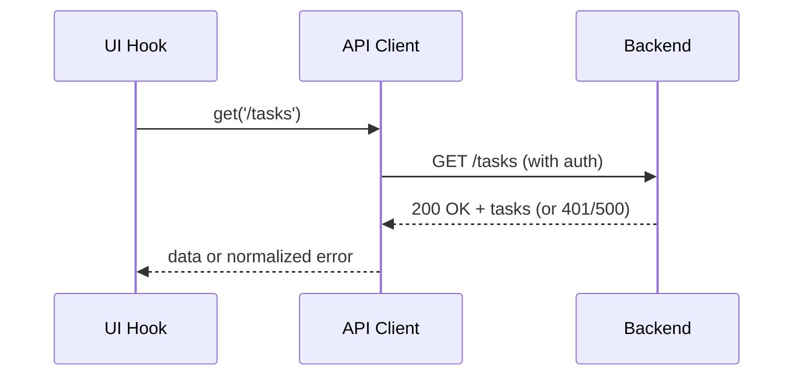

# [COM-004-api-client] API Client (Resource)

## Overview {#com-004-overview}
- Implements CTX REST protocol to backend from [CON-002-frontend#con-002-protocols](../../containers/CON-002-frontend.md#con-002-protocols).
- Handles auth token injection, JSON parsing, and error normalization for UI consumers.

## Stack {#com-004-stack}
- Native `fetch` with small wrapper
- TypeScript 5.x

## Configuration {#com-004-config}
| Env Var | Dev | Prod | Why |
|---------|-----|------|-----|
| VITE_API_BASE_URL | http://localhost:3000/api | https://api.taskflow.app/api | Target backend base URL |
| VITE_API_TIMEOUT_MS | 5000 | 8000 | Network tolerance |

## Interfaces & Types {#com-004-interfaces}
- `api.get<T>(path: string, opts?)`
- `api.post<T>(path: string, body: unknown, opts?)`
- Errors normalized to `{ code: string; message: string; correlationId?: string }`

## Behavior {#com-004-behavior}
- Injects `Authorization: Bearer <token>` when available.
- Retries idempotent GETs once on network failure; propagates others.
- Maps HTTP errors into UI-friendly objects with correlation IDs when provided by backend.


## Error Handling {#com-004-errors}
| Error | Retriable | Action |
|-------|-----------|--------|
| 401 unauthorized | No | Trigger refresh flow/sign-out |
| Network error | Yes (GET) | Single retry, then surface |
| 5xx | No | Surface normalized error with correlationId |

## Usage {#com-004-usage}
```typescript
import { api } from './apiClient';

const tasks = await api.get('/tasks');
await api.post('/tasks', { title: 'Demo' });
```

## Dependencies {#com-004-deps}
- Consumes backend REST API at [CON-001-backend](../../containers/CON-001-backend.md)
