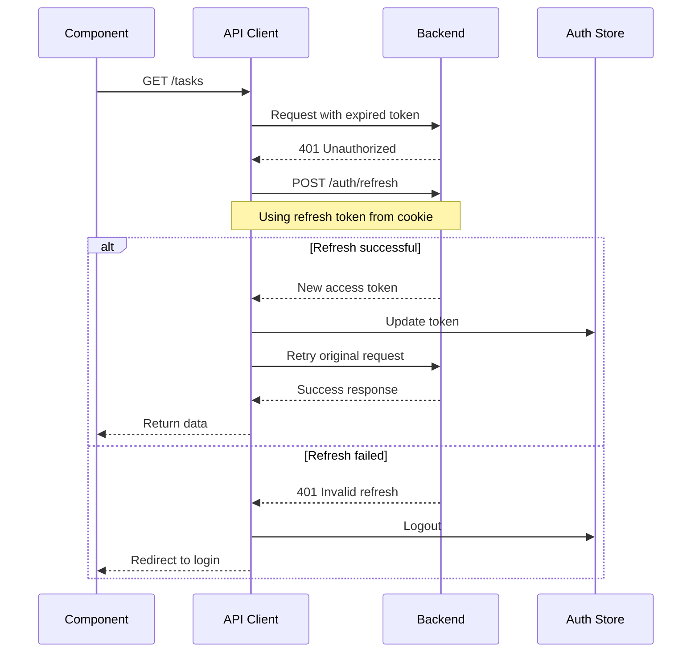

# [COM-004-api-client] API Client Component

::: info Container
Belongs to [CON-002-frontend: Frontend Container](../../containers/CON-002-frontend.md#con-002-components)
:::

## Overview {#com-004-overview}
<!--
What this component does and why it exists.
-->

The API Client provides a centralized HTTP client for all backend communication. It handles authentication headers, request/response transformations, error handling, and token refresh flows.

## Purpose {#com-004-purpose}
<!--
Specific responsibilities and goals.
-->

- **Centralized HTTP**: Single point for all API requests
- **Authentication**: Automatic JWT header injection
- **Token Refresh**: Handle expired tokens transparently
- **Error Handling**: Transform API errors to consistent format
- **Type Safety**: TypeScript interfaces for all requests/responses

## Technical Implementation {#com-004-implementation}
<!--
How it's built - libraries, patterns, architecture.
-->

### Libraries {#com-004-libraries}

| Library | Version | Purpose |
|---------|---------|---------|
| `axios` | 1.6.x | HTTP client |
| `axios-retry` | 4.x | Retry failed requests |

### Code Structure {#com-004-code-structure}

```
src/api/
  client.ts          # Axios instance and interceptors
  auth.ts            # Auth-specific endpoints
  tasks.ts           # Task endpoints
  users.ts           # User endpoints
  types.ts           # Shared API types
  errors.ts          # Error handling utilities
```

## Client Configuration {#com-004-configuration}
<!--
How the Axios client is configured.
-->

### Base Configuration {#com-004-base-config}

```typescript
// src/api/client.ts
import axios from 'axios';
import axiosRetry from 'axios-retry';

const API_URL = import.meta.env.VITE_API_URL || 'http://localhost:3000';

export const apiClient = axios.create({
  baseURL: `${API_URL}/api/v1`,
  timeout: 30000,
  headers: {
    'Content-Type': 'application/json',
  },
  withCredentials: true, // Include cookies for refresh token
});

// Configure retry for transient failures
axiosRetry(apiClient, {
  retries: 3,
  retryDelay: axiosRetry.exponentialDelay,
  retryCondition: (error) => {
    return axiosRetry.isNetworkOrIdempotentRequestError(error)
      || error.response?.status === 503;
  },
});
```

## Request Interceptor {#com-004-request-interceptor}
<!--
How outgoing requests are modified.
-->

```typescript
// src/api/client.ts
import { useAuthStore } from '../stores/authStore';

apiClient.interceptors.request.use(
  (config) => {
    // Add auth token to requests
    const token = useAuthStore.getState().accessToken;
    if (token) {
      config.headers.Authorization = `Bearer ${token}`;
    }

    // Add correlation ID for tracing
    config.headers['X-Correlation-ID'] = generateCorrelationId();

    return config;
  },
  (error) => {
    return Promise.reject(error);
  }
);

function generateCorrelationId(): string {
  return `${Date.now()}-${Math.random().toString(36).substring(2, 9)}`;
}
```

## Response Interceptor {#com-004-response-interceptor}
<!--
How responses are processed.
-->

```typescript
// src/api/client.ts
apiClient.interceptors.response.use(
  (response) => {
    // Unwrap data from standard envelope
    return response.data?.data !== undefined
      ? { ...response, data: response.data.data }
      : response;
  },
  async (error) => {
    const originalRequest = error.config;

    // Handle 401 - attempt token refresh
    if (error.response?.status === 401 && !originalRequest._retry) {
      originalRequest._retry = true;

      try {
        await refreshTokens();
        return apiClient(originalRequest);
      } catch (refreshError) {
        // Refresh failed - logout user
        useAuthStore.getState().logout();
        window.location.href = '/login';
        return Promise.reject(refreshError);
      }
    }

    // Transform error to consistent format
    return Promise.reject(transformError(error));
  }
);
```

## Token Refresh {#com-004-token-refresh}
<!--
How expired tokens are refreshed.
-->

### Refresh Flow {#com-004-refresh-flow}



### Implementation {#com-004-refresh-impl}

```typescript
// src/api/client.ts
let isRefreshing = false;
let refreshSubscribers: ((token: string) => void)[] = [];

async function refreshTokens(): Promise<void> {
  if (isRefreshing) {
    // Wait for ongoing refresh
    return new Promise((resolve) => {
      refreshSubscribers.push((token) => {
        resolve();
      });
    });
  }

  isRefreshing = true;

  try {
    const response = await axios.post(
      `${API_URL}/api/v1/auth/refresh`,
      {},
      { withCredentials: true }
    );

    const { accessToken } = response.data.data;
    useAuthStore.getState().setAccessToken(accessToken);

    // Notify waiting requests
    refreshSubscribers.forEach((callback) => callback(accessToken));
    refreshSubscribers = [];
  } finally {
    isRefreshing = false;
  }
}
```

## Error Handling {#com-004-error-handling}
<!--
How API errors are processed.
-->

### Error Transformation {#com-004-error-transform}

```typescript
// src/api/errors.ts
export interface ApiError {
  code: string;
  message: string;
  details?: Record<string, string[]>;
  correlationId?: string;
}

export function transformError(error: AxiosError): ApiError {
  if (error.response?.data?.error) {
    // Server returned structured error
    return error.response.data.error;
  }

  if (error.code === 'ECONNABORTED') {
    return {
      code: 'TIMEOUT',
      message: 'Request timed out. Please try again.',
    };
  }

  if (!error.response) {
    return {
      code: 'NETWORK_ERROR',
      message: 'Unable to connect to server. Check your internet connection.',
    };
  }

  // Generic error
  return {
    code: 'UNKNOWN_ERROR',
    message: 'An unexpected error occurred.',
  };
}
```

### Error Hook {#com-004-error-hook}

```typescript
// src/hooks/useApiError.ts
import { useState, useCallback } from 'react';
import { ApiError } from '../api/errors';

export function useApiError() {
  const [error, setError] = useState<ApiError | null>(null);

  const handleError = useCallback((err: unknown) => {
    if (isApiError(err)) {
      setError(err);
    } else {
      setError({
        code: 'UNKNOWN_ERROR',
        message: 'An unexpected error occurred',
      });
    }
  }, []);

  const clearError = useCallback(() => {
    setError(null);
  }, []);

  return { error, handleError, clearError };
}
```

## API Methods {#com-004-api-methods}
<!--
Typed methods for specific endpoints.
-->

### Tasks API {#com-004-tasks-api}

```typescript
// src/api/tasks.ts
import { apiClient } from './client';
import { Task, CreateTaskInput, UpdateTaskInput, TaskFilters } from './types';

export const tasksApi = {
  list: (filters?: TaskFilters) =>
    apiClient.get<Task[]>('/tasks', { params: filters }),

  get: (id: string) =>
    apiClient.get<Task>(`/tasks/${id}`),

  create: (data: CreateTaskInput) =>
    apiClient.post<Task>('/tasks', data),

  update: (id: string, data: UpdateTaskInput) =>
    apiClient.put<Task>(`/tasks/${id}`, data),

  delete: (id: string) =>
    apiClient.delete(`/tasks/${id}`),

  complete: (id: string) =>
    apiClient.post<Task>(`/tasks/${id}/complete`),

  reopen: (id: string) =>
    apiClient.post<Task>(`/tasks/${id}/reopen`),
};
```

### Auth API {#com-004-auth-api}

```typescript
// src/api/auth.ts
import { apiClient } from './client';
import { User, LoginInput, RegisterInput } from './types';

export const authApi = {
  login: (data: LoginInput) =>
    apiClient.post<{ user: User; accessToken: string }>('/auth/login', data),

  register: (data: RegisterInput) =>
    apiClient.post<{ user: User; accessToken: string }>('/auth/register', data),

  logout: () =>
    apiClient.post('/auth/logout'),

  me: () =>
    apiClient.get<User>('/auth/me'),
};
```

## Usage Examples {#com-004-usage}
<!--
How to use the API client in components.
-->

### In Custom Hook {#com-004-hook-usage}

```typescript
// src/hooks/useTasks.ts
import { useQuery, useMutation, useQueryClient } from '@tanstack/react-query';
import { tasksApi } from '../api/tasks';

export function useTasks(filters?: TaskFilters) {
  return useQuery({
    queryKey: ['tasks', filters],
    queryFn: () => tasksApi.list(filters).then(res => res.data),
  });
}

export function useCreateTask() {
  const queryClient = useQueryClient();

  return useMutation({
    mutationFn: (data: CreateTaskInput) =>
      tasksApi.create(data).then(res => res.data),
    onSuccess: () => {
      queryClient.invalidateQueries({ queryKey: ['tasks'] });
    },
  });
}
```

### In Component {#com-004-component-usage}

```typescript
// src/pages/TaskList.tsx
function TaskList() {
  const { data: tasks, isLoading, error } = useTasks();
  const createTask = useCreateTask();

  const handleCreate = async (data: CreateTaskInput) => {
    try {
      await createTask.mutateAsync(data);
      toast.success('Task created');
    } catch (error) {
      toast.error(error.message);
    }
  };

  if (isLoading) return <LoadingSpinner />;
  if (error) return <ErrorMessage error={error} />;

  return (
    <div>
      <TaskForm onSubmit={handleCreate} />
      {tasks?.map(task => <TaskCard key={task.id} task={task} />)}
    </div>
  );
}
```

## Testing {#com-004-testing}
<!--
How to test API client usage.
-->

### Mocking in Tests {#com-004-mocking}

```typescript
// src/api/__mocks__/client.ts
import { vi } from 'vitest';

export const apiClient = {
  get: vi.fn(),
  post: vi.fn(),
  put: vi.fn(),
  delete: vi.fn(),
  interceptors: {
    request: { use: vi.fn() },
    response: { use: vi.fn() },
  },
};

// src/hooks/__tests__/useTasks.test.tsx
vi.mock('../api/client');

describe('useTasks', () => {
  it('fetches tasks on mount', async () => {
    apiClient.get.mockResolvedValue({
      data: [{ id: '1', title: 'Test Task' }],
    });

    const { result } = renderHook(() => useTasks());

    await waitFor(() => {
      expect(result.current.data).toHaveLength(1);
    });
  });
});
```

## Related {#com-004-related}

- [CON-002-frontend: Frontend Container](../../containers/CON-002-frontend.md)
- [CON-001-backend: Backend API](../../containers/CON-001-backend.md#con-001-api-endpoints)
- [ADR-001: REST API](../../adr/ADR-001-rest-api.md)
