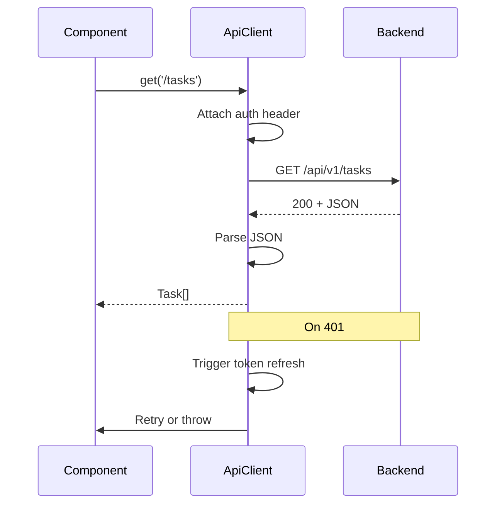

# [COM-004-api-client] API Client (Resource)

## Overview {#com-004-overview}

Centralized HTTP client for all backend API calls. Wraps fetch with auth handling, JSON parsing, and consistent error formatting.

## Stack {#com-004-stack}

- Library: Native `fetch` API
- Why: No external dependencies, sufficient for REST calls

## Configuration {#com-004-config}

| Env Var | Dev | Prod | Why |
|---------|-----|------|-----|
| VITE_API_URL | `http://localhost:3000` | `/api` | Backend URL |
| VITE_API_TIMEOUT | `10000` | `30000` | Request timeout ms |

## Interfaces & Types {#com-004-interfaces}

```typescript
interface ApiClient {
  get<T>(path: string): Promise<T>;
  post<T>(path: string, body: unknown): Promise<T>;
  put<T>(path: string, body: unknown): Promise<T>;
  delete(path: string): Promise<void>;
}

interface ApiError {
  code: string;
  message: string;
  correlationId?: string;
}
```

## Behavior {#com-004-behavior}



## Error Handling {#com-004-errors}

| Error | Retriable | Action/Code |
|-------|-----------|-------------|
| Network error | Yes | Retry with backoff |
| 401 Unauthorized | Yes | Refresh token, retry once |
| 4xx Client error | No | Throw ApiError |
| 5xx Server error | Yes | Retry up to 3 times |

## Usage {#com-004-usage}

```typescript
import { apiClient } from './api';

// In component or hook
const tasks = await apiClient.get<Task[]>('/tasks');

const newTask = await apiClient.post<Task>('/tasks', {
  title: 'New task',
});
```

## Dependencies {#com-004-deps}

- **Upstream:** None
- **Downstream:** Used by all data-fetching hooks
- **Infra features consumed:** None (calls [CON-001-backend](../../containers/CON-001-backend.md))
