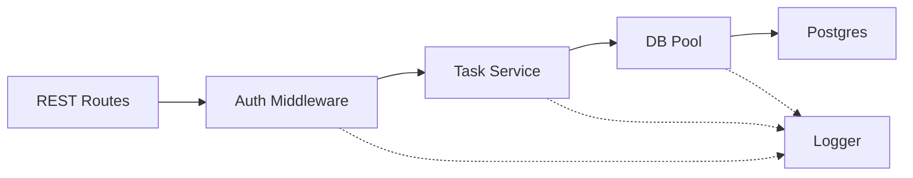
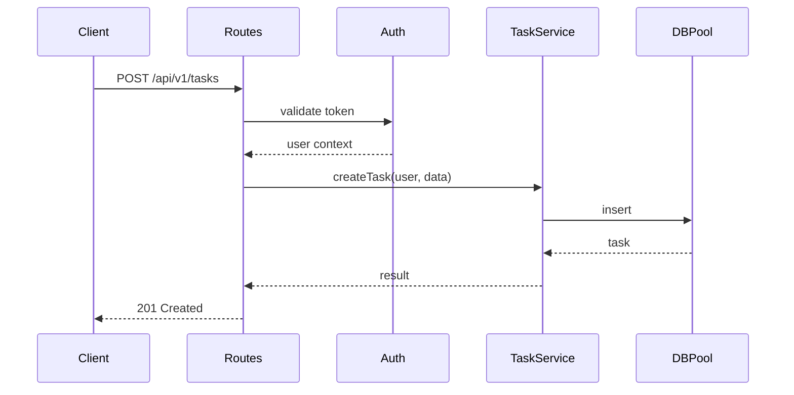

id: C3-1-backend
title: Backend API Container (Code)
summary: >
  REST API for TaskFlow. Implements CTX protocols to Postgres and email, handles
  auth/logging/error cross-cutting, and orchestrates backend components.
---

# [C3-1-backend] Backend API Container (Code)

## Overview {#c3-1-overview}

The Backend API container provides the REST API for TaskFlow. It handles business logic, authentication, notifications, and data persistence through a layered architecture that implements the CTX protocols.

**Responsibilities:**
- User authentication and session management
- Task CRUD operations and business rules
- Database interaction via connection pool
- Outbound email notifications

## Technology Stack {#c3-1-stack}

- Runtime: Node.js 20 LTS
- Framework: Express.js 4.18
- Language: TypeScript 5.3
- ORM: Prisma 5.x
- Validation: Zod 3.x

## Protocol Implementations {#c3-1-protocols}

| Protocol (from CTX) | Implemented In |
|---------------------|----------------|
| REST/HTTPS from Frontend | [C3-102-auth-middleware#c3-102-behavior](../components/backend/C3-102-auth-middleware.md#c3-102-behavior), [REST Endpoints](#c3-1-rest-endpoints), [C3-106-rest-routes#c3-106-behavior](../components/backend/C3-106-rest-routes.md#c3-106-behavior) |
| SQL to Postgres | [C3-101-db-pool#c3-101-behavior](../components/backend/C3-101-db-pool.md#c3-101-behavior) |
| SMTP/TLS to Email Service | [Email Integration](#c3-1-email-integration) |

## Component Relationships {#c3-1-relationships}

## Data Flow {#c3-1-data-flow}

## Container Cross-Cutting {#c3-1-cross-cutting}

### Logging {#c3-1-logging}

- Structured JSON with correlation IDs
- Log levels: DEBUG (dev), INFO (prod)
- Implemented by: [C3-104-logger](../components/backend/C3-104-logger.md)

### Error Handling {#c3-1-error-handling}

- Unified error format with error codes catalog
- Correlation IDs in all error responses
- Implemented by: [C3-105-error-handler](../components/backend/C3-105-error-handler.md)

### Authentication Middleware {#c3-1-auth-middleware}

- JWT token validation from header or cookies
- Injects `req.user` context
- Implemented by: [C3-102-auth-middleware](../components/backend/C3-102-auth-middleware.md) with routing handoff in [C3-106-rest-routes#c3-106-behavior](../components/backend/C3-106-rest-routes.md#c3-106-behavior)

## Components {#c3-1-components}

| Component | Nature | Responsibility |
|-----------|--------|----------------|
| [C3-101-db-pool](../components/backend/C3-101-db-pool.md) | Resource | Connection pooling |
| [C3-102-auth-middleware](../components/backend/C3-102-auth-middleware.md) | Cross-cutting | Token validation |
| [C3-103-task-service](../components/backend/C3-103-task-service.md) | Business Logic | Task operations |
| [C3-104-logger](../components/backend/C3-104-logger.md) | Cross-cutting | Structured logging |
| [C3-105-error-handler](../components/backend/C3-105-error-handler.md) | Cross-cutting | Error formatting |
| [C3-106-rest-routes](../components/backend/C3-106-rest-routes.md) | Entrypoint | HTTP routing and auth handoff |

## REST Endpoints {#c3-1-rest-endpoints}

### Tasks API {#c3-1-tasks-api}

| Method | Endpoint | Description |
|--------|----------|-------------|
| GET | `/api/v1/tasks` | List user's tasks |
| POST | `/api/v1/tasks` | Create new task |
| GET | `/api/v1/tasks/:id` | Get task by ID |
| PUT | `/api/v1/tasks/:id` | Update task |
| DELETE | `/api/v1/tasks/:id` | Delete task |

### Auth API {#c3-1-auth-api}

| Method | Endpoint | Description |
|--------|----------|-------------|
| POST | `/api/v1/auth/register` | User registration |
| POST | `/api/v1/auth/login` | User login |
| POST | `/api/v1/auth/refresh` | Refresh tokens |
| POST | `/api/v1/auth/logout` | User logout |

## Database Access {#c3-1-db-access}

- **Protocol**: PostgreSQL wire protocol
- **Connection**: Pooled via [C3-101-db-pool](../components/backend/C3-101-db-pool.md)
- **Security**: SSL/TLS in production, plaintext in development

## Email Integration {#c3-1-email-integration}

- **Protocol**: SMTP/TLS to external email provider
- **Use cases**: Due date notifications and account confirmations
- **Implemented By**: Task service triggers notifications; delivery handled via shared mailer utility in the routing layer

## Configuration {#c3-1-configuration}

| Variable | Dev Default | Production | Description |
|----------|-------------|------------|-------------|
| `PORT` | `3000` | `3000` | HTTP listen port |
| `DATABASE_URL` | `postgresql://localhost/taskflow` | (secret) | PostgreSQL connection |
| `JWT_SECRET` | `dev-secret` | (secret) | JWT signing key |
| `LOG_LEVEL` | `debug` | `info` | Logging verbosity |

## Deployment {#c3-1-deployment}

**Characteristics:**
- Stateless (scales horizontally)
- Health check: `GET /health`
- Graceful shutdown: 30-second drain
- Resource limits: 512MB RAM, 0.5 CPU

## Related {#c3-1-related}

- [CTX-001: System Overview](../CTX-001-system-overview.md)
- [C3-3: Postgres](./C3-3-postgres.md) - Database this container uses
