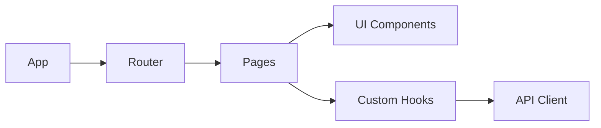

id: C3-2-frontend
title: Frontend Container (Code)
summary: >
  React SPA for TaskFlow. Implements CTX REST protocol to the backend and handles
  client-side auth, logging, and error display.
---

# [C3-2-frontend] Frontend Container (Code)

## Overview {#c3-2-overview}

The Frontend container provides the web user interface for TaskFlow. It's a React-based single-page application that communicates with the backend API.

## Technology Stack {#c3-2-stack}

- Runtime: Browser
- Framework: React 18
- Language: TypeScript 5.x
- Build: Vite

## Protocol Implementations {#c3-2-protocols}

| Protocol (from CTX) | Implemented In |
|---------------------|----------------|
| REST/HTTPS to Backend | [C3-201-api-client#c3-201-behavior](../components/frontend/C3-201-api-client.md#c3-201-behavior) |

## Component Relationships {#c3-2-relationships}

## Container Cross-Cutting {#c3-2-cross-cutting}

### Auth Handling {#c3-2-auth-handling}

- JWT token storage in httpOnly cookies
- Automatic token refresh on 401
- Auth context provider for components

### Logging {#c3-2-logging}

- Console logging in development
- Correlation ID forwarding to backend
- Error boundary for uncaught errors

### Error Handling {#c3-2-error-handling}

- Toast notifications for user errors
- Error boundaries for component failures
- Retry UI for network errors

## API Calls {#c3-2-api-calls}

Uses a fetch wrapper to:
- Inject auth headers when available
- Parse JSON bodies
- Normalize errors with correlation IDs
- Retry idempotent reads when configured

## Components {#c3-2-components}

| Component | Nature | Responsibility |
|-----------|--------|----------------|
| [C3-201-api-client](../components/frontend/C3-201-api-client.md) | Resource | Backend communication with auth + error normalization |

## Related {#c3-2-related}

- [CTX-001: System Overview](../CTX-001-system-overview.md)
- [C3-1: Backend](./C3-1-backend.md) - API provider
