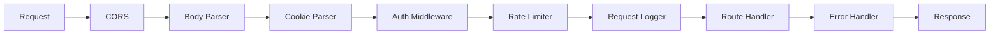
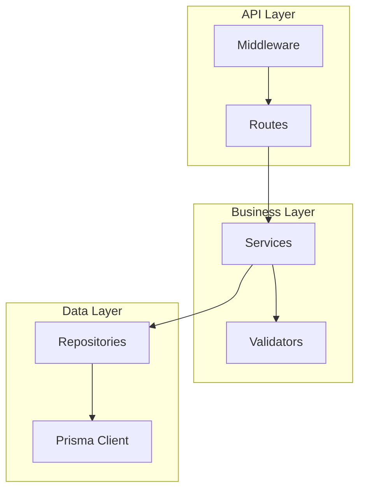
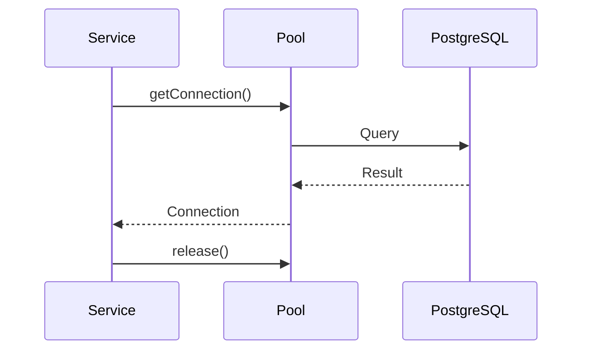

# [CON-001-backend] Backend API Container

::: info Context
This container is part of [CTX-001: System Overview](../CTX-001-system-overview.md).
:::

## Overview {#con-001-overview}
<!--
High-level description of container purpose and responsibilities.
-->

The Backend API container provides the REST API for TaskFlow. It handles all business logic, authentication, and data persistence through a layered architecture.

**Responsibilities:**
- User authentication and session management
- Task CRUD operations
- Business rule enforcement
- Database interaction via connection pool

## Technology Stack {#con-001-technology-stack}
<!--
Lists languages, frameworks, and key libraries used. Read to understand
the technical foundation.
-->

| Category | Technology | Version | Purpose |
|----------|-----------|---------|---------|
| Language | TypeScript | 5.3 | Type-safe development |
| Runtime | Node.js | 20 LTS | Server runtime |
| Framework | Express.js | 4.18 | HTTP routing |
| ORM | Prisma | 5.x | Database access |
| Validation | Zod | 3.x | Schema validation |
| Testing | Vitest | 1.x | Unit/integration tests |

## Middleware Pipeline {#con-001-middleware}
<!--
Describes the request processing pipeline through authentication, cookie
handling, and rate limiting layers. Read this to understand how requests
flow through the backend before reaching business logic.
-->



### Request Flow {#con-001-request-flow}

1. **CORS**: Validates origin, allows configured domains
2. **Body Parser**: Parses JSON/URL-encoded bodies (limit: 1MB)
3. **Cookie Parser**: Extracts cookies for auth
4. **Auth Middleware**: Validates JWT, injects user context
5. **Rate Limiter**: Enforces request quotas
6. **Request Logger**: Logs request details with correlation ID
7. **Route Handler**: Business logic execution
8. **Error Handler**: Catches errors, formats responses

### Authentication Middleware {#con-001-auth-middleware}

JWT token validation:
- Extracts token from `Authorization` header or cookies
- Validates signature and expiry
- Injects `req.user` context
- Supports public routes via allowlist

**Component**: See [COM-002-auth-middleware](../components/backend/COM-002-auth-middleware.md) for implementation details.

## Component Organization {#con-001-components}
<!--
Shows how components are structured inside the container.
-->



**Layers:**
- **API Layer**: HTTP routing, middleware, request/response handling
- **Business Layer**: Domain logic, validation, orchestration
- **Data Layer**: Database queries, connection management

### Key Components

| Component | Location | Description |
|-----------|----------|-------------|
| [COM-001-db-pool](../components/backend/COM-001-db-pool.md) | `src/db/pool.ts` | Database connection pooling |
| [COM-002-auth-middleware](../components/backend/COM-002-auth-middleware.md) | `src/middleware/auth/` | JWT authentication middleware |
| [COM-003-task-service](../components/backend/COM-003-task-service.md) | `src/services/task/` | Task business logic |
| Routes | `src/routes/` | Express route definitions |
| Repositories | `src/repositories/` | Data access patterns |

## API Endpoints {#con-001-api-endpoints}
<!--
Documents the main API endpoints exposed by this container.
-->

### Tasks API {#con-001-tasks-api}

| Method | Endpoint | Description |
|--------|----------|-------------|
| GET | `/api/v1/tasks` | List user's tasks |
| POST | `/api/v1/tasks` | Create new task |
| GET | `/api/v1/tasks/:id` | Get task by ID |
| PUT | `/api/v1/tasks/:id` | Update task |
| DELETE | `/api/v1/tasks/:id` | Delete task |

### Auth API {#con-001-auth-api}

| Method | Endpoint | Description |
|--------|----------|-------------|
| POST | `/api/v1/auth/register` | User registration |
| POST | `/api/v1/auth/login` | User login |
| POST | `/api/v1/auth/refresh` | Refresh tokens |
| POST | `/api/v1/auth/logout` | User logout |

## Communication Patterns {#con-001-communication}
<!--
Explains how this container talks to other containers.
-->

### To Database {#con-001-to-database}

- **Protocol**: PostgreSQL wire protocol
- **Connection**: Pooled via [COM-001-db-pool](../components/backend/COM-001-db-pool.md)
- **Security**: SSL/TLS in production, plaintext in development



### To External Email Service {#con-001-to-email}

- **Protocol**: SMTP over TLS
- **Provider**: SendGrid or similar
- **Pattern**: Fire-and-forget with retry queue

## Data Responsibilities {#con-001-data}
<!--
What data this container owns and manages.
-->

**Owns:**
- User accounts and profiles
- Tasks and task metadata
- Authentication tokens

**Manages (transient):**
- Session state (JWT tokens)
- Rate limit counters (in-memory or Redis)
- Request correlation IDs

## Configuration {#con-001-configuration}
<!--
Environment-based configuration for this container.
-->

| Variable | Dev Default | Production | Description |
|----------|-------------|------------|-------------|
| `PORT` | `3000` | `3000` | HTTP listen port |
| `DATABASE_URL` | `postgresql://localhost/taskflow` | (secret) | PostgreSQL connection |
| `JWT_SECRET` | `dev-secret` | (secret) | JWT signing key |
| `LOG_LEVEL` | `debug` | `info` | Logging verbosity |

## Deployment {#con-001-deployment}
<!--
Container-specific deployment characteristics.
-->

**Docker Image:**
```dockerfile
FROM node:20-alpine
WORKDIR /app
COPY package*.json ./
RUN npm ci --production
COPY dist ./dist
CMD ["node", "dist/index.js"]
```

**Characteristics:**
- Stateless (scales horizontally)
- Health check: `GET /health`
- Graceful shutdown: 30-second drain
- Resource limits: 512MB RAM, 0.5 CPU

## Related {#con-001-related}

- [CTX-001: System Overview](../CTX-001-system-overview.md)
- [COM-001: DB Connection Pool](../components/backend/COM-001-db-pool.md)
- [COM-002: Auth Middleware](../components/backend/COM-002-auth-middleware.md)
- [COM-003: Task Service](../components/backend/COM-003-task-service.md)
- [ADR-001: REST API Choice](../adr/ADR-001-rest-api.md)
- [ADR-002: PostgreSQL Database](../adr/ADR-002-postgresql.md)
- [ADR-004: JWT Authentication](../adr/ADR-004-jwt-auth.md)
