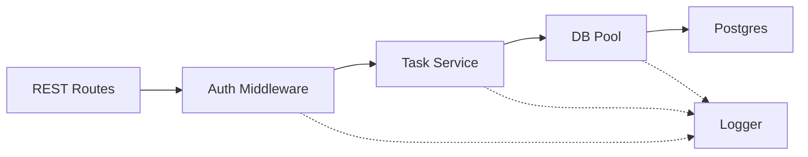
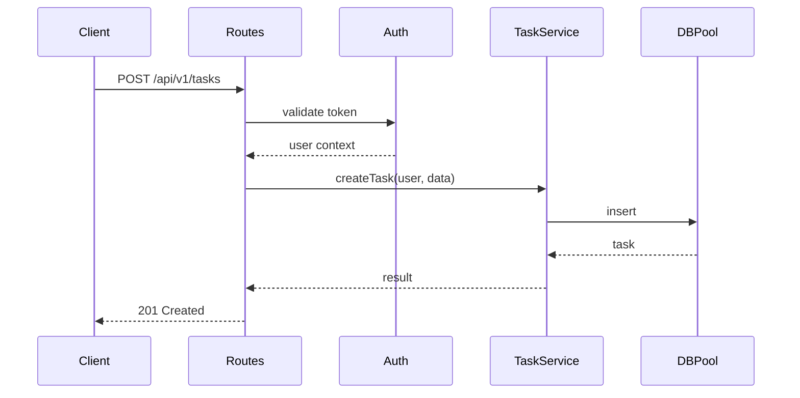

# [CON-001-backend] Backend API Container (Code)

## Overview {#con-001-overview}

The Backend API container provides the REST API for TaskFlow. It handles all business logic, authentication, and data persistence through a layered architecture.

**Responsibilities:**
- User authentication and session management
- Task CRUD operations
- Business rule enforcement
- Database interaction via connection pool

## Technology Stack {#con-001-stack}

- Runtime: Node.js 20 LTS
- Framework: Express.js 4.18
- Language: TypeScript 5.3
- ORM: Prisma 5.x
- Validation: Zod 3.x

## Protocol Implementations {#con-001-protocols}

| Protocol (from CTX) | Implemented In |
|---------------------|----------------|
| REST/HTTPS from Frontend | [COM-002-auth-middleware#com-002-behavior](../components/backend/COM-002-auth-middleware.md#com-002-behavior), [REST Endpoints](#con-001-rest-endpoints) |
| SQL to Postgres | [COM-001-db-pool#com-001-behavior](../components/backend/COM-001-db-pool.md#com-001-behavior) |

## Component Relationships {#con-001-relationships}

## Data Flow {#con-001-data-flow}

## Container Cross-Cutting {#con-001-cross-cutting}

### Logging {#con-001-logging}

- Structured JSON, correlation IDs passed through
- Log levels: DEBUG (dev), INFO (prod)
- Implemented by: [COM-004-logger](../components/backend/COM-004-logger.md)

### Error Handling {#con-001-error-handling}

- Unified error format with error codes catalog
- Correlation IDs in all error responses
- Implemented by: [COM-005-error-handler](../components/backend/COM-005-error-handler.md)

### Authentication Middleware {#con-001-auth-middleware}

- JWT token validation from header or cookies
- Injects `req.user` context
- Implemented by: [COM-002-auth-middleware](../components/backend/COM-002-auth-middleware.md)

## Components {#con-001-components}

| Component | Nature | Responsibility |
|-----------|--------|----------------|
| [COM-001-db-pool](../components/backend/COM-001-db-pool.md) | Resource | Connection pooling |
| [COM-002-auth-middleware](../components/backend/COM-002-auth-middleware.md) | Cross-cutting | Token validation |
| [COM-003-task-service](../components/backend/COM-003-task-service.md) | Business Logic | Task operations |
| [COM-004-logger](../components/backend/COM-004-logger.md) | Cross-cutting | Structured logging |
| [COM-005-error-handler](../components/backend/COM-005-error-handler.md) | Cross-cutting | Error formatting |

## REST Endpoints {#con-001-rest-endpoints}

### Tasks API {#con-001-tasks-api}

| Method | Endpoint | Description |
|--------|----------|-------------|
| GET | `/api/v1/tasks` | List user's tasks |
| POST | `/api/v1/tasks` | Create new task |
| GET | `/api/v1/tasks/:id` | Get task by ID |
| PUT | `/api/v1/tasks/:id` | Update task |
| DELETE | `/api/v1/tasks/:id` | Delete task |

### Auth API {#con-001-auth-api}

| Method | Endpoint | Description |
|--------|----------|-------------|
| POST | `/api/v1/auth/register` | User registration |
| POST | `/api/v1/auth/login` | User login |
| POST | `/api/v1/auth/refresh` | Refresh tokens |
| POST | `/api/v1/auth/logout` | User logout |

## Database Access {#con-001-db-access}

- **Protocol**: PostgreSQL wire protocol
- **Connection**: Pooled via [COM-001-db-pool](../components/backend/COM-001-db-pool.md)
- **Security**: SSL/TLS in production, plaintext in development

## Configuration {#con-001-configuration}

| Variable | Dev Default | Production | Description |
|----------|-------------|------------|-------------|
| `PORT` | `3000` | `3000` | HTTP listen port |
| `DATABASE_URL` | `postgresql://localhost/taskflow` | (secret) | PostgreSQL connection |
| `JWT_SECRET` | `dev-secret` | (secret) | JWT signing key |
| `LOG_LEVEL` | `debug` | `info` | Logging verbosity |

## Deployment {#con-001-deployment}

**Characteristics:**
- Stateless (scales horizontally)
- Health check: `GET /health`
- Graceful shutdown: 30-second drain
- Resource limits: 512MB RAM, 0.5 CPU

## Related {#con-001-related}

- [CTX-001: System Overview](../CTX-001-system-overview.md)
- [CON-003: Postgres](./CON-003-postgres.md) - Database this container uses
