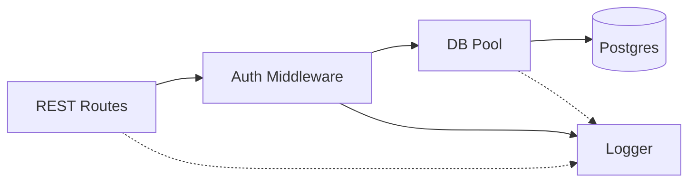
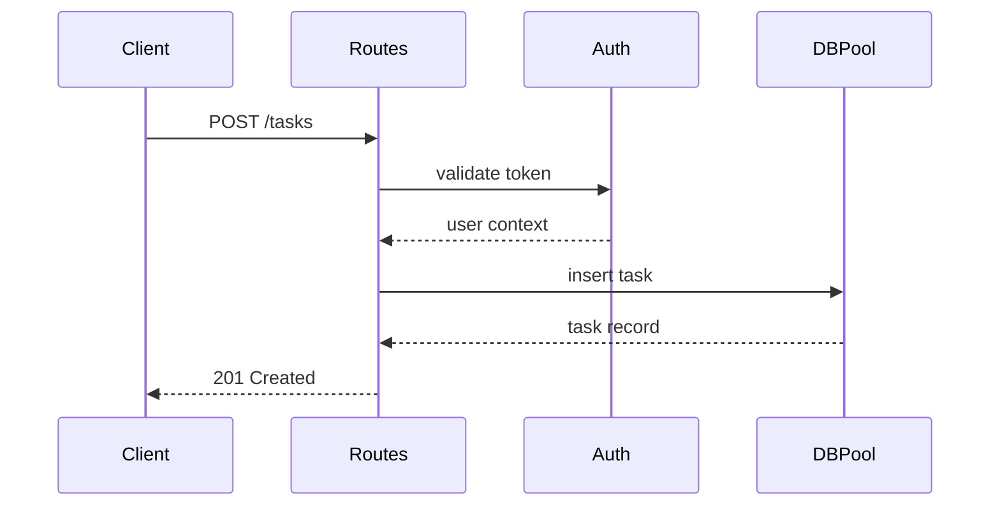

# [CON-001-backend] Backend Container (Code)

## Technology Stack {#con-001-stack}
- Runtime: Node.js 20
- Language: TypeScript 5.x
- Framework: Express 4.18

## Protocol Implementations {#con-001-protocols}
| Protocol (from CTX) | Implemented In |
|---------------------|----------------|
| SQL to Postgres | [COM-002-db-pool#com-002-behavior](../components/backend/COM-002-db-pool.md#com-002-behavior) |

## Component Relationships {#con-001-relationships}

## Data Flow {#con-001-data-flow}

## Container Cross-Cutting {#con-001-cross-cutting}
- Authentication: token verification handled in [COM-001-rest-routes#com-001-behavior](../components/backend/COM-001-rest-routes.md#com-001-behavior)
- Logging: structured JSON with correlation IDs from [COM-003-logger#com-003-behavior](../components/backend/COM-003-logger.md#com-003-behavior)
- Error handling: standardized error responses from [COM-003-logger#com-003-errors](../components/backend/COM-003-logger.md#com-003-errors)

## Components {#con-001-components}
| Component | Nature | Responsibility |
|-----------|--------|----------------|
| [COM-001-rest-routes](../components/backend/COM-001-rest-routes.md) | Entrypoint | HTTP routing and auth handoff |
| [COM-002-db-pool](../components/backend/COM-002-db-pool.md) | Resource | Connection pooling and queries |
| [COM-003-logger](../components/backend/COM-003-logger.md) | Cross-cutting | Request logging and error formatting |

## Related {#con-001-related}
- [CTX-001: System Overview](../CTX-001-system-overview.md)
- Downstream infra: [CON-003-postgres](./CON-003-postgres.md)
