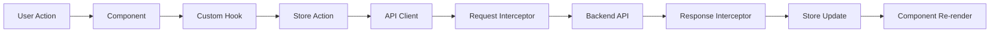
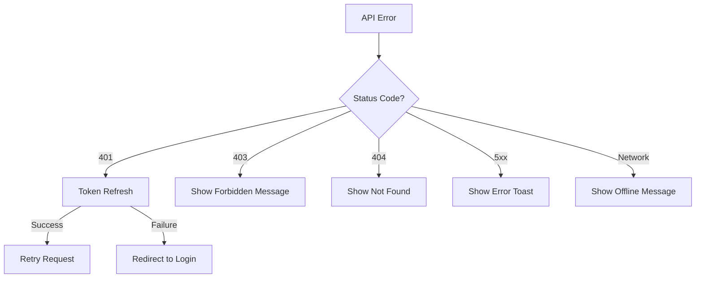
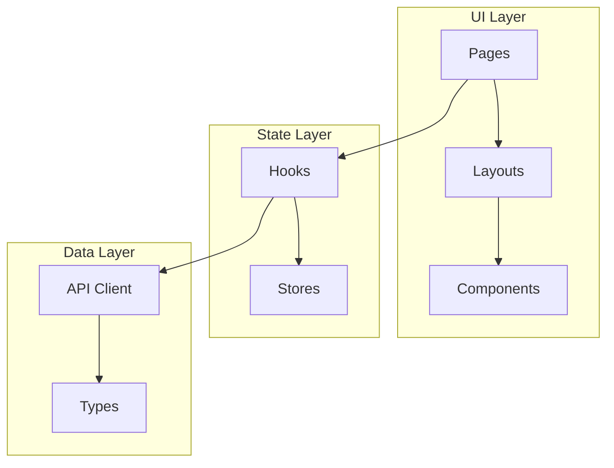
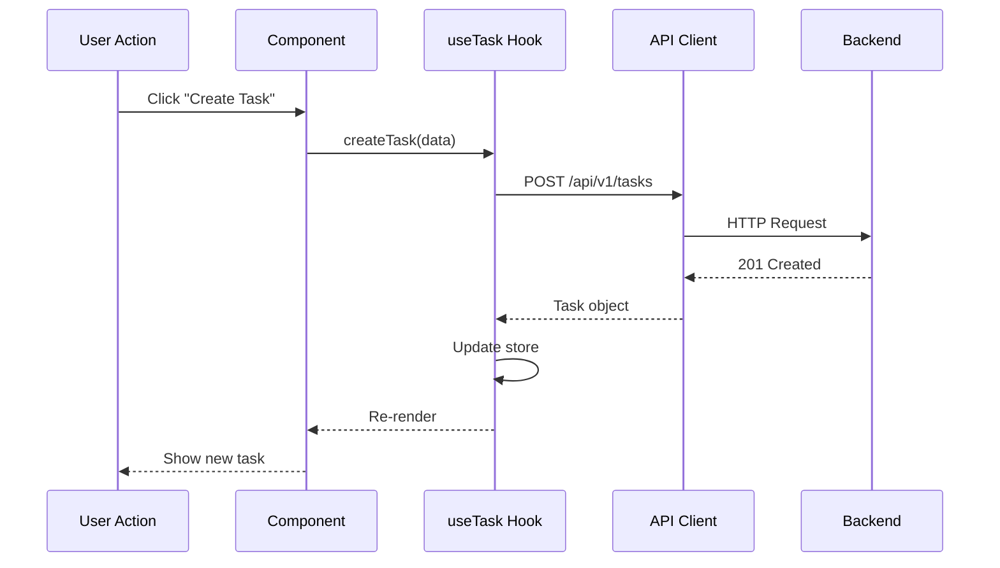

# [CON-002-frontend] Web Frontend Container

::: info Context
This container is part of [CTX-001: System Overview](../CTX-001-system-overview.md).
:::

## Overview {#con-002-overview}
<!--
High-level description of container purpose and responsibilities.
-->

The Web Frontend container provides the user interface for TaskFlow. It handles all user interactions, renders task data, and communicates with the backend via REST API.

**Responsibilities:**
- User interface rendering
- Form handling and validation
- State management for user session and tasks
- API communication with backend
- Responsive design for multiple screen sizes

## Technology Stack {#con-002-technology-stack}
<!--
Lists languages, frameworks, and key libraries used. Read to understand
the technical foundation.
-->

| Category | Technology | Version | Purpose |
|----------|-----------|---------|---------|
| Language | TypeScript | 5.3 | Type-safe development |
| Framework | React | 18.x | UI component framework |
| Build Tool | Vite | 5.x | Fast dev/build tooling |
| State | Zustand | 4.x | Lightweight state management |
| Routing | React Router | 6.x | Client-side routing |
| Forms | React Hook Form | 7.x | Form handling |
| Styling | Tailwind CSS | 3.x | Utility-first CSS |
| HTTP Client | Axios | 1.x | API requests |
| Testing | Vitest + RTL | - | Unit/component tests |

## Middleware Pipeline {#con-002-middleware}
<!--
Describes the request/response processing pipeline for frontend data flow.
Read this to understand how data flows through the application layers.
-->



### Data Flow Pipeline

1. **User Action**: Click, form submit, navigation
2. **Component**: React component handles event
3. **Custom Hook**: `useTasks`, `useAuth` orchestrate logic
4. **Store Action**: Zustand store mutation
5. **API Client**: Axios request preparation
6. **Request Interceptor**: Add auth token, correlation ID
7. **Backend API**: Network request
8. **Response Interceptor**: Handle errors, transform data
9. **Store Update**: Update local state
10. **Component Re-render**: UI updates

### Error Handling Pipeline



## Component Organization {#con-002-components}
<!--
Shows how components are structured inside the container.
-->



**Layers:**
- **UI Layer**: Pages, layouts, reusable components
- **State Layer**: Zustand stores, custom hooks
- **Data Layer**: API client, TypeScript types

### Directory Structure

```
src/
  pages/           # Route-level components
    Dashboard.tsx
    TaskList.tsx
    TaskDetail.tsx
    Login.tsx
  layouts/         # Page layouts
    MainLayout.tsx
    AuthLayout.tsx
  components/      # Reusable UI components
    Task/
    Form/
    Common/
  hooks/           # Custom React hooks
    useAuth.ts
    useTasks.ts
  stores/          # Zustand stores
    authStore.ts
    taskStore.ts
  api/             # API client
    client.ts
    tasks.ts
    auth.ts
  types/           # TypeScript types
    task.ts
    user.ts
```

### Key Components

| Component | Location | Description |
|-----------|----------|-------------|
| [COM-004-api-client](../components/frontend/COM-004-api-client.md) | `src/api/client.ts` | Axios-based API client |
| TaskCard | `src/components/Task/` | Task display component |
| TaskForm | `src/components/Form/` | Task creation/editing |
| AuthProvider | `src/hooks/useAuth.ts` | Authentication context |

## API Endpoints {#con-002-api-endpoints}
<!--
Documents the API endpoints consumed by this container.
-->

### Tasks API (consumed)

| Method | Endpoint | Description |
|--------|----------|-------------|
| GET | `/api/v1/tasks` | List user's tasks |
| POST | `/api/v1/tasks` | Create new task |
| GET | `/api/v1/tasks/:id` | Get task by ID |
| PUT | `/api/v1/tasks/:id` | Update task |
| DELETE | `/api/v1/tasks/:id` | Delete task |

### Auth API (consumed)

| Method | Endpoint | Description |
|--------|----------|-------------|
| POST | `/api/v1/auth/login` | User login |
| POST | `/api/v1/auth/register` | User registration |
| POST | `/api/v1/auth/refresh` | Refresh tokens |
| POST | `/api/v1/auth/logout` | User logout |

## Communication Patterns {#con-002-communication}
<!--
How this container communicates with backend.
-->

### To Backend {#con-002-to-backend}

- **Protocol**: REST API over HTTPS
- **Client**: Axios via [COM-004-api-client](../components/frontend/COM-004-api-client.md)
- **Authentication**: JWT in Authorization header



### Error Handling

API errors are caught and transformed:

```typescript
// Centralized error handling
api.interceptors.response.use(
  response => response,
  error => {
    if (error.response?.status === 401) {
      useAuthStore.getState().logout();
      window.location.href = '/login';
    }
    return Promise.reject(error);
  }
);
```

## Data Responsibilities {#con-002-data}
<!--
What data this container owns and manages.
-->

**Owns (client-side):**
- UI state (sidebar, theme, modals)
- Form draft data (before submission)
- Optimistic updates (pending confirmation)

**Caches (from backend):**
- Task list (via React Query/store)
- User profile
- Authentication tokens

**Does NOT own:**
- Persistent task data (owned by backend)
- User credentials (verified by backend)
- Business rules (enforced by backend)

## Configuration {#con-002-configuration}
<!--
Environment-based configuration for this container.
-->

| Variable | Dev Default | Production | Description |
|----------|-------------|------------|-------------|
| `VITE_API_URL` | `http://localhost:3000` | `https://api.taskflow.app` | Backend API URL |
| `VITE_APP_NAME` | `TaskFlow Dev` | `TaskFlow` | Application name |
| `VITE_ENABLE_DEVTOOLS` | `true` | `false` | React DevTools |

## Deployment {#con-002-deployment}
<!--
Container-specific deployment characteristics.
-->

**Build Output:**
- Static assets (HTML, CSS, JS)
- Deployed to CDN or static hosting
- No server runtime required

**Build Process:**
```bash
npm run build
# Outputs to dist/
```

**Deployment Options:**
- Vercel (recommended for simplicity)
- CloudFront + S3
- Nginx static serving

**Characteristics:**
- Asset hashing for cache busting
- Gzip compression
- Lazy loading for routes

## Related {#con-002-related}

- [CTX-001: System Overview](../CTX-001-system-overview.md)
- [CON-001: Backend Container](./CON-001-backend.md)
- [COM-004: API Client](../components/frontend/COM-004-api-client.md)
