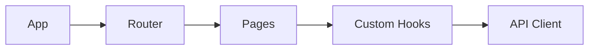

# [CON-002-frontend] Frontend Container (Code)

## Technology Stack {#con-002-stack}
- Runtime: Browser
- Framework: React 18
- Language: TypeScript 5.x
- Build: Vite

## Protocol Implementations {#con-002-protocols}
| Protocol (from CTX) | Implemented In |
|---------------------|----------------|
| REST/HTTPS to Backend | [COM-004-api-client#com-004-behavior](../components/frontend/COM-004-api-client.md#com-004-behavior) |

## Component Relationships {#con-002-relationships}

## Container Cross-Cutting {#con-002-cross-cutting}

### Auth Handling {#con-002-auth-handling}
- JWT token storage in httpOnly cookies
- Automatic token refresh on 401
- Auth context provider for components

### Logging {#con-002-logging}
- Console logging in development
- Correlation ID forwarding to backend
- Error boundary for uncaught errors

### Error Handling {#con-002-error-handling}
- Toast notifications for user errors
- Error boundaries for component failures
- Retry UI for network errors

## API Calls {#con-002-api-calls}
- Fetch wrapper injects auth header, parses JSON, normalizes errors

## Components {#con-002-components}
| Component | Nature | Responsibility |
|-----------|--------|----------------|
| [COM-004-api-client](../components/frontend/COM-004-api-client.md) | Resource | Backend communication with auth + error normalization |

## Related {#con-002-related}
- [CTX-001: System Overview](../CTX-001-system-overview.md)
- Backend provider: [CON-001-backend](./CON-001-backend.md)
