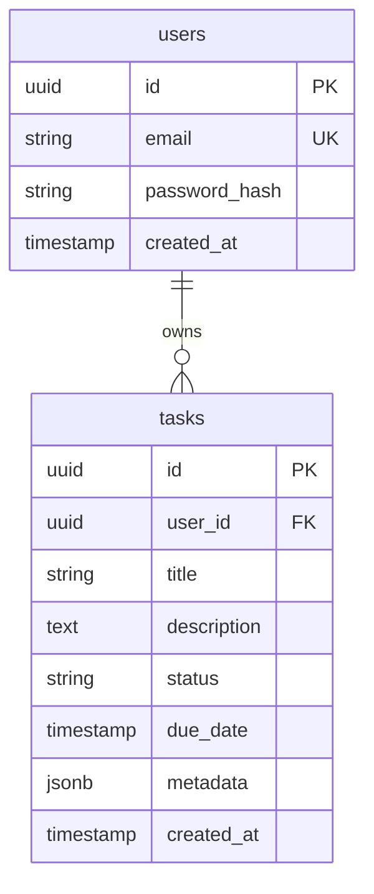

# [CON-003-postgres] PostgreSQL Container (Infrastructure)

## Engine {#con-003-engine}

PostgreSQL 15 (managed service)

**Why PostgreSQL:**
- Strong ACID compliance for data integrity
- Rich query capabilities (JSON, full-text search)
- Mature ecosystem and tooling
- Excellent performance for relational workloads

See [ADR-002: PostgreSQL Choice](../adr/ADR-002-postgresql.md) for decision rationale.

## Configuration {#con-003-config}

| Setting | Value | Why |
|---------|-------|-----|
| `max_connections` | 100 | Support pooling from backend (50) + headroom |
| `shared_buffers` | 256MB | 25% of container memory |
| `work_mem` | 4MB | Per-operation memory for sorting |
| `maintenance_work_mem` | 64MB | For VACUUM, CREATE INDEX |
| `wal_level` | logical | Enable event streaming (future) |
| `log_statement` | ddl | Log schema changes |
| `log_min_duration_statement` | 1000 | Log slow queries (>1s) |

### Development vs Production {#con-003-dev-vs-prod}

| Setting | Development | Production |
|---------|-------------|------------|
| `max_connections` | 20 | 100 |
| `shared_buffers` | 128MB | 256MB |
| `log_statement` | all | ddl |
| `ssl` | off | on |

## Features Provided {#con-003-features}

| Feature | Used By | Purpose |
|---------|---------|---------|
| Connection pooling support | [CON-001-backend](./CON-001-backend.md#con-001-db-access) → [COM-001-db-pool](../components/backend/COM-001-db-pool.md) | Efficient connection reuse |
| LISTEN/NOTIFY | [CON-001-backend](./CON-001-backend.md#con-001-db-access) → [COM-001-db-pool](../components/backend/COM-001-db-pool.md) | Real-time event notifications |
| JSON/JSONB columns | [CON-001-backend](./CON-001-backend.md#con-001-components) → [COM-003-task-service](../components/backend/COM-003-task-service.md) | Flexible task metadata |
| Full-text search | [CON-001-backend](./CON-001-backend.md#con-001-components) → [COM-003-task-service](../components/backend/COM-003-task-service.md) | Task search functionality |
| WAL logical replication | Future: Event streaming | CDC for external systems |

## Schema Overview {#con-003-schema}



## Backup & Recovery {#con-003-backup}

| Aspect | Strategy |
|--------|----------|
| Full backup | Daily pg_dump at 02:00 UTC |
| Point-in-time | WAL archiving to S3 |
| Retention | 7 days full, 30 days WAL |
| RTO | < 1 hour |
| RPO | < 5 minutes |

## Health Checks {#con-003-health}

```sql
-- Liveness check
SELECT 1;

-- Readiness check (connections available)
SELECT count(*) < 90 AS ready
FROM pg_stat_activity
WHERE state != 'idle';
```

## Deployment {#con-003-deployment}

**Docker image:** `postgres:15-alpine`

**Resource limits:**
- Memory: 1GB
- CPU: 1 core
- Storage: 10GB (SSD)

**Persistence:**
- Data volume: `/var/lib/postgresql/data`
- Named volume in docker-compose
- EBS/Persistent disk in cloud

## Related {#con-003-related}

- [CTX-001: System Overview](../CTX-001-system-overview.md#ctx-001-database-protocol)
- [CON-001: Backend](./CON-001-backend.md#con-001-db-access) - Primary consumer
- [ADR-002: PostgreSQL Choice](../adr/ADR-002-postgresql.md)
