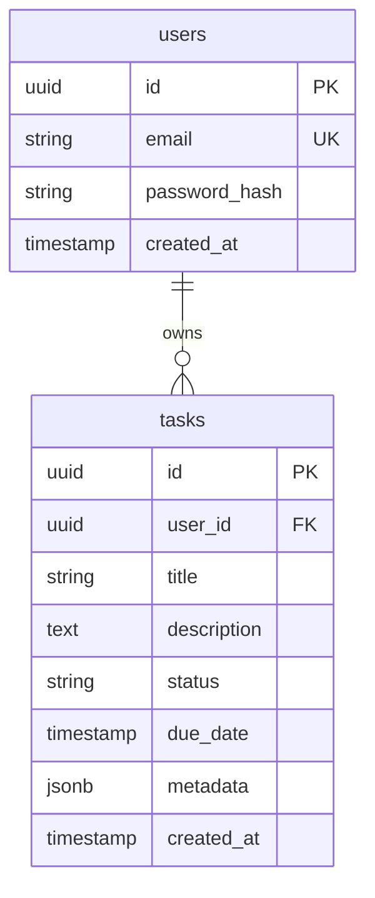

# [CON-003-postgres] Postgres (Infrastructure)

## Engine {#con-003-engine}
- PostgreSQL 15 (managed service)

## Configuration {#con-003-config}
| Setting | Value | Why |
|---------|-------|-----|
| max_connections | 200 | Support pooled connections from backend |
| wal_level | logical | Enable change streaming if needed |
| shared_buffers | 2GB | Baseline for moderate workloads |

## Features Provided {#con-003-features}
| Feature | Consumed By |
|---------|-------------|
| SQL data store | [CON-001-backend#con-001-components](./CON-001-backend.md#con-001-components) → [COM-002-db-pool](../components/backend/COM-002-db-pool.md) |
| JSON support, indexing | [CON-001-backend#con-001-components](./CON-001-backend.md#con-001-components) → [COM-001-rest-routes](../components/backend/COM-001-rest-routes.md) |

## Schema Overview {#con-003-schema}

## Backup & Recovery {#con-003-backup}
- Daily full snapshot with 7-day retention
- PITR with 7-day WAL retention
- Restore test monthly in lower environment

## Health Checks {#con-003-health}
| Check | Probe | Expected | Purpose |
|-------|-------|----------|---------|
| Liveness | `SELECT 1` | < 1s | Basic availability |
| Readiness | `SELECT 1; CHECKPOINT;` (managed equivalent) | < 2s | Gate backend startup |
| Replication lag (if replicas) | `pg_last_wal_receive_lsn` | < 1s | Ensure up-to-date reads |
