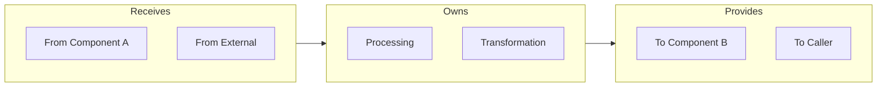

# Component (c3-NNN) Quality Criteria

## Purpose

c3-NNN is the implementation layer:
- One doc per part
- One aspect per doc
- HOW the component implements its contract

## Required Sections

1. **Frontmatter** (id, c3-version, title, type: component, parent, summary)
2. **Contract** - from parent Container (what Container says about this component)
3. **Interface** - Mermaid diagram REQUIRED (IN → Processing → OUT)
4. **Hand-offs** - table: Direction | What | To/From
5. **Conventions** - table of rules consumers must follow
6. **Edge Cases & Errors** - table of failure modes

## Optional Sections

Include only if relevant:
- Additional diagrams (Sequence, State, Organization)
- Configuration - if significant config surface
- Dependencies - if external dependencies matter
- Invariants - key guarantees
- Performance - if throughput/latency matters

## Diagram Requirement

**Interface diagram REQUIRED** showing boundary and hand-offs:



## ⛔ NO CODE Rule

**Component docs describe HOW things work, NOT actual implementation.**

| Prohibited | Write Instead |
|------------|---------------|
| `function handle() {...}` | Flow diagram |
| `interface User {...}` | Table: Field \| Type \| Purpose |
| `{ "port": 3000 }` | Table: Setting \| Default \| Purpose |
| `SELECT * FROM...` | Access pattern description |
| JSON/YAML schemas | Table with Field \| Type \| Example |

**Rule:** If it could be parsed by JSON/YAML parser → use table instead.

**Exception:** Mermaid diagrams are allowed (architectural, not implementation).

## When to Create Component Doc

| Create Doc | Don't Create |
|------------|--------------|
| Has unique business logic | Just "we use X library" |
| Clear IN/OUT interface | Generic utilities |
| Specific conventions for consumers | Technology choice with no conventions |
| Coordinates multiple concerns | |

**Litmus test:** "Would I want this context loaded together?"

## When to Split

| Signal | Decision |
|--------|----------|
| Would someone working on X need to understand Y? | If NO → separate docs |
| Do X and Y change for the same reason? | If NO → separate docs |
| Would loading together save navigation? | If YES and related → group |

## Include / Exclude

| Include | Exclude |
|---------|---------|
| Interface (IN → OUT) | WHAT component does (Container) |
| Internal organization | Component relationships (Container) |
| Conventions & rules | WHY patterns chosen (ADR) |
| Edge cases & errors | Code snippets |

**Litmus test:** "Is this about HOW this component implements its contract?"

## Verification

```bash
# Check Interface diagram exists
grep -c '```mermaid' .c3/c3-{N}-*/c3-{N}{NN}-*.md  # Should be >= 1

# Check NO non-mermaid code blocks
grep -E '```[a-z]+' .c3/c3-{N}-*/c3-{N}{NN}-*.md | grep -v mermaid
# Should return nothing

# Check required sections
grep -E "^## (Contract|Interface|Hand-offs|Conventions)" .c3/c3-{N}-*/c3-{N}{NN}-*.md
```

## Common Mistakes

| Mistake | Fix |
|---------|-----|
| Including code blocks | Use tables: Field \| Type \| Purpose |
| Skipping Interface diagram | REQUIRED. Shows IN → Processing → OUT |
| Text-heavy without diagrams | Lead with diagrams, text supports |
| Describing WHAT not HOW | WHAT is Container's job |
| Missing Hand-offs table | REQUIRED. Shows what exchanges with whom |
| Documenting tech choice as component | Logger, config → Container tech stack |
| One doc per code file | Group by context need, not file structure |
