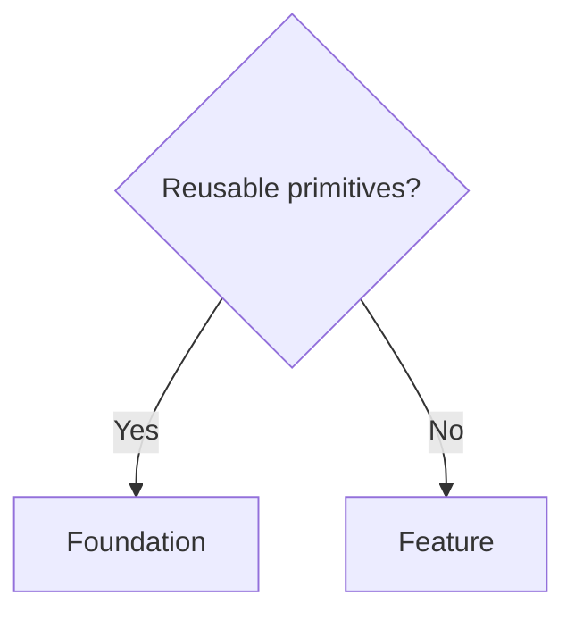
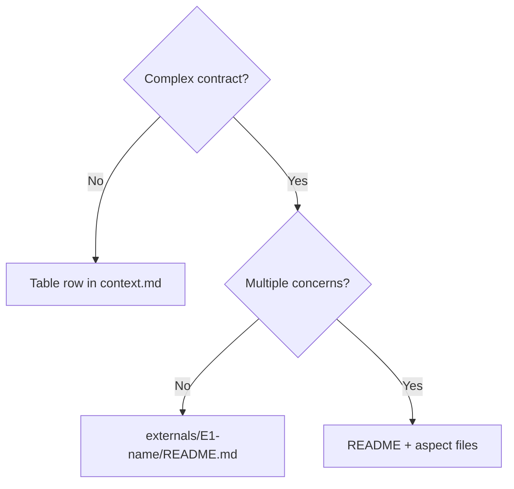

# Component & Container Types

Types organize elements by role. Complexity determines documentation depth.

---

# Container Types

Use type-specific templates as **starting points**. Discover and adapt.

## Container Selection

| Container Type | Use For | Template |
|----------------|---------|----------|
| service | APIs, backends, code apps | `container-service.md` |
| database | Databases, data stores | `container-database.md` |
| queue | Message queues, event buses | `container-queue.md` |
| generic | Anything else | `container.md` |

## Complexity-First Documentation

**Assess complexity BEFORE documenting aspects.**

See `skill-harness.md` for:
- Complexity levels (trivial → critical)
- Documentation depth rules
- Discovery-over-checklist requirements

Templates include type-specific **discovery prompts** - signals to scan for when assessing complexity.

---

# Component Types

Two categories organize components by role and impact.

## Quick Selection



| Ask | If Yes → | If No → |
|-----|----------|---------|
| Is this a reusable primitive? | Foundation | Feature |
| Does this deliver user-facing value? | Feature | Foundation |

## Foundation

**What:** Core primitives that others build on. High impact when changed. May cite refs for conventions.

**Examples:**
- Layout, Button, Input (UI primitives)
- Router, AuthProvider (infrastructure)
- DataStore, EventBus (shared state)
- Logger, ConfigLoader (utilities)

**Characteristics:**
- Changes ripple to many dependents
- Stable API surface
- Minimal external dependencies
- Well-tested edge cases

**Template:** `templates/component-foundation.md`

## Feature

**What:** Domain-specific. Delivers user value. Uses Foundation + cites refs.

**Examples:**
- ProductCard, CheckoutFlow (e-commerce)
- UserProfile, SettingsPage (user management)
- OrderHistory, InvoiceGenerator (transactions)
- Dashboard, ReportViewer (analytics)

**Characteristics:**
- Not reusable outside context
- Combines Foundation + refs
- User-facing behavior
- Domain-specific logic

**Template:** `templates/component-feature.md`

---

## References (.c3/refs/)

References are system-wide patterns and conventions cited by components at any level.

**What belongs in refs:**
- Design patterns (strategy choices)
- Coding conventions
- Data flow patterns
- External standards references

**Refs are NOT components** - they don't have code references or implementations.
Components cite refs; refs explain patterns.

**Template:** `templates/ref.md`

---

# External Systems

Externals follow container → aspect pattern when complex enough.

## When to Expand



| Complexity | Documentation | Example |
|------------|---------------|---------|
| Simple | Table row only | Redis cache, simple API |
| Moderate | README.md | Database with schema we control |
| Complex | README + aspects | Postgres with complex schema, OAuth provider |

## Common Aspect Types

| Aspect | When | Captures |
|--------|------|----------|
| schema | Database, queue | Data model, constraints, relationships |
| access-patterns | Database | Queries, indexes, performance notes |
| lifecycle | Queue, storage | Retention, archival, cleanup |
| workarounds | Any | Quirks, known issues, compensations |
| versioning | API | Version history, migration notes |
| auth-flow | Auth provider | OAuth sequence, token handling |

## Templates

- `templates/external.md` - External system overview
- `templates/external-aspect.md` - Aspect detail file

---

## Dependency Direction

```
Feature
   │
   └──→ Foundation

Features cite ref-* for conventions.
```

**Rules:**
- Feature depends on Foundation (allowed)
- Feature cites refs for conventions (allowed)
- Foundation never depends on Feature (violation)

## Common Mistakes

| Mistake | Why Wrong | Fix |
|---------|-----------|-----|
| Feature marked Foundation | Not reusable, domain-specific | Reclassify as Feature |
| Conventions in component | Conventions belong in refs | Move to refs/ |
| Config as Feature | Config is infrastructure | Move to Foundation |

## Migration Guide

When reclassifying components:

1. Check dependents (who uses this?)
2. Check dependencies (what does this use?)
3. Apply selection flowchart
4. Update component's `category` in frontmatter
5. Move file if needed (path reflects category)
6. Update container inventory
