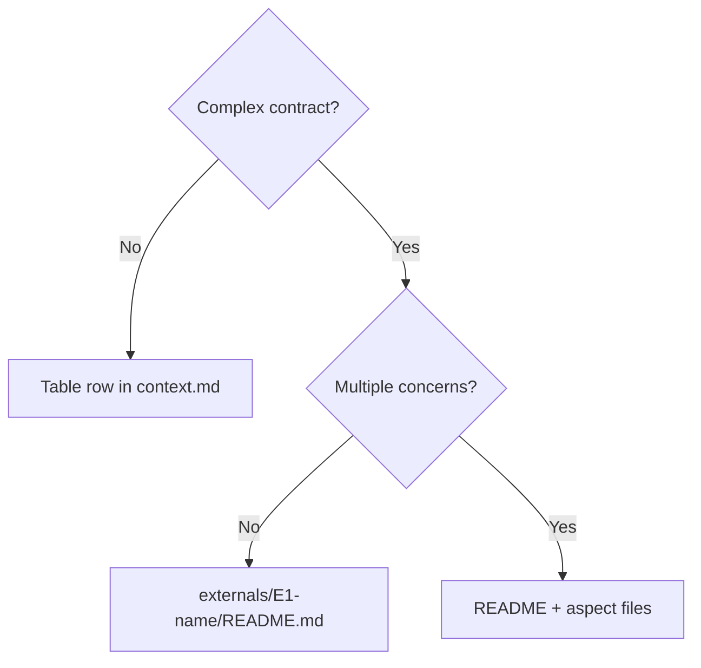

# Component & Container Types

Types organize elements by role. Complexity determines documentation depth.

## Contents

- [Container Types](#container-types)
  - Container Selection
  - Complexity-First Documentation
- [Component Types](#component-types)
  - Foundation
  - Feature
  - References
- [External Systems](#external-systems)
- [Dependency Direction](#dependency-direction)
- [Common Mistakes](#common-mistakes)
- [Migration Guide](#migration-guide)

---

# Container Types

Use type-specific templates as **starting points**. Discover and adapt.

## Container Selection

| Container Type | Use For | Template |
|----------------|---------|----------|
| service | APIs, backends, code apps | `container-service.md` |
| database | Databases, data stores | `container-database.md` |
| queue | Message queues, event buses | `container-queue.md` |
| generic | Anything else | `container.md` |

## Complexity-First Documentation

**Assess complexity BEFORE documenting aspects.**

See `skill-harness.md` for:
- Complexity levels (trivial → critical)
- Documentation depth rules
- Discovery-over-checklist requirements

Templates include type-specific **discovery prompts** - signals to scan for when assessing complexity.

---

# Component Types

Three categories organize elements by role. **Strict separation required.**

## The Hierarchy

```
┌─────────────────────────────────────────────────────────────┐
│  FEATURE (composition layer)                                │
│  - Glues things together                                    │
│  - Business logic, non-reusable                             │
│  - Uses Foundation + cites Refs                             │
├─────────────────────────────────────────────────────────────┤
│  FOUNDATION (implementation layer)         │  REF (guidance)│
│  - Actual concrete code                    │  - NO code     │
│  - Logger, Hono routes, DB client          │  - Style/how-to│
│  - Other components DEPEND on these        │  - Cited by all│
└─────────────────────────────────────────────────────────────┘
```

## The Three-Way Split (Strict)

You must choose ONE. Use the test below.

| Question | If Yes | Category |
|----------|--------|----------|
| Can you name a concrete code file that implements it (e.g., `logger.ts`)? | Yes | **FOUNDATION** |
| Is it only rules/conventions about how/when to use code? | Yes | **REF** |
| Is it domain logic that composes Foundation + follows Refs? | Yes | **FEATURE** |

**Non-negotiable rule:** Refs contain NO `## Code References` section.

**Hard test:** If you cannot name a concrete file, you are not allowed to create a component doc.

## Foundation (Implementation)

**What:** Actual code that other components import. **You can point to a real file path.**

**The Test:** Can you name a concrete code file (e.g., `logger.ts`)?

**Examples:**
- `logger.ts` — the logging implementation itself
- `db-client.ts` — database connection code
- `hono-routes.ts` — HTTP framework integration
- `auth-provider.ts` — authentication implementation
- `event-bus.ts` — event system code

**Characteristics:**
- **Contains executable code** that others import
- You can point to the file: `src/lib/logger.ts`
- Changes ripple to many dependents
- Foundation of the system

**In .c3 docs:** Component file with `## Code References` pointing to actual files.

**Template:** `templates/component.md`

## Feature

**What:** Business logic composition. **Glues Foundation + Refs together.**

**The Test:** Is this domain-specific, non-reusable business logic?

**Examples:**
- `checkout-flow.ts` - uses PaymentService (foundation) + follows ref-error-handling
- `user-registration.ts` - uses AuthProvider (foundation) + follows ref-validation
- `order-processor.ts` - uses DB, EventBus (foundation) + follows ref-data-flow

**Characteristics:**
- **Composes** Foundation components
- **Cites** Refs for conventions
- Not reusable outside its context
- Delivers user-facing value
- Domain-specific, business-driven

**In .c3 docs:** Component file describes the business flow, what it composes.

**Template:** `templates/component.md`

## Refs (Patterns)

**What:** Guidance only, no code. **You can only describe "how/when/why".**

**The Test:** If you can only describe rules, not point to a file → it's a Ref.

**Examples:**
- `ref-logging.md` — when to log, levels, message conventions
  (but the logger implementation lives in `logger.ts` → that's Foundation)
- `ref-error-handling.md` — response shape and throw/return rules
  (but error classes live in code → that's Foundation)
- `ref-ui-composition.md` — how to compose components, naming conventions
- `ref-data-flow.md` — how data moves through the system

**Characteristics:**
- **NO executable code** - only guidance
- **NO `## Code References` section** - if it needs one, it's not a Ref
- Describes patterns/conventions
- Cited by both Foundation and Feature components

**In .c3 docs:** Ref file in `refs/` directory. NO Code References.

**Template:** `templates/ref.md`

---

## CRITICAL: The Separation Rule

```
┌──────────────────────────────────────────────────────────────┐
│  WRONG: Creating component for a pattern                     │
│  ✗ c3-105-logging-patterns.md (no code, just conventions)    │
│  ✗ c3-106-error-handling-conventions.md                      │
│  ✗ c3-107-ui-composition-rules.md                            │
├──────────────────────────────────────────────────────────────┤
│  RIGHT: Split implementation from guidance                   │
│  ✓ c3-105-logger.md (Foundation: actual logger code)         │
│  ✓ ref-logging.md (Ref: when/how to use logger)              │
│                                                              │
│  ✓ c3-106-error-handler.md (Foundation: error classes)       │
│  ✓ ref-error-handling.md (Ref: error conventions)            │
└──────────────────────────────────────────────────────────────┘
```

**Audit trigger:** If a component doc has no `## Code References`, it is misclassified. Move it to `refs/` and remove the component ID.

---

## References (.c3/refs/)

References are system-wide patterns and conventions cited by components at any level.

**What belongs in refs:**
- Design patterns (strategy choices)
- Coding conventions
- Data flow patterns
- Information architecture
- User flows
- Design systems
- UI patterns
- Error handling conventions
- Form patterns
- Query patterns
- External standards references

**Refs are NOT components** - they don't have code references or implementations.
Components cite refs; refs explain patterns.

**CRITICAL: Never create component files for conventions.**

| Wrong | Right |
|-------|-------|
| `c3-131-information-architecture.md` | `ref-information-architecture.md` |
| `c3-132-user-flows.md` | `ref-user-flows.md` |
| `c3-133-design-system.md` | `ref-design-system.md` |

**Template:** `templates/ref.md`

---

# External Systems

Externals follow container → aspect pattern when complex enough.

## When to Expand


```mermaid
graph TD
    Q1{Complex contract?}
    Q1 -->|No| Inline[Table row in context.md]
    Q1 -->|Yes| Q2{Multiple concerns?}
    Q2 -->|No| README[externals/E1-name/README.md]
    Q2 -->|Yes| Aspects[README + aspect files]
```

| Complexity | Documentation | Example |
|------------|---------------|---------|
| Simple | Table row only | Redis cache, simple API |
| Moderate | README.md | Database with schema we control |
| Complex | README + aspects | Postgres with complex schema, OAuth provider |

## Common Aspect Types

| Aspect | When | Captures |
|--------|------|----------|
| schema | Database, queue | Data model, constraints, relationships |
| access-patterns | Database | Queries, indexes, performance notes |
| lifecycle | Queue, storage | Retention, archival, cleanup |
| workarounds | Any | Quirks, known issues, compensations |
| versioning | API | Version history, migration notes |
| auth-flow | Auth provider | OAuth sequence, token handling |

## Templates

- `templates/external.md` - External system overview
- `templates/external-aspect.md` - Aspect detail file

---

## Dependency Direction

```
Feature
   │
   └──→ Foundation

Features cite ref-* for conventions.
```

**Rules:**
- Feature depends on Foundation (allowed)
- Feature cites refs for conventions (allowed)
- Foundation never depends on Feature (violation)

## Common Mistakes

| Mistake | Why Wrong | Fix |
|---------|-----------|-----|
| Feature marked Foundation | Not reusable, domain-specific | Reclassify as Feature |
| Conventions in component | Conventions belong in refs | Move to refs/ |
| Config as Feature | Config is infrastructure | Move to Foundation |

## Migration Guide

When reclassifying components:

1. Check dependents (who uses this?)
2. Check dependencies (what does this use?)
3. Apply selection flowchart
4. Update component's `category` in frontmatter
5. Move file if needed (path reflects category)
6. Update container inventory
