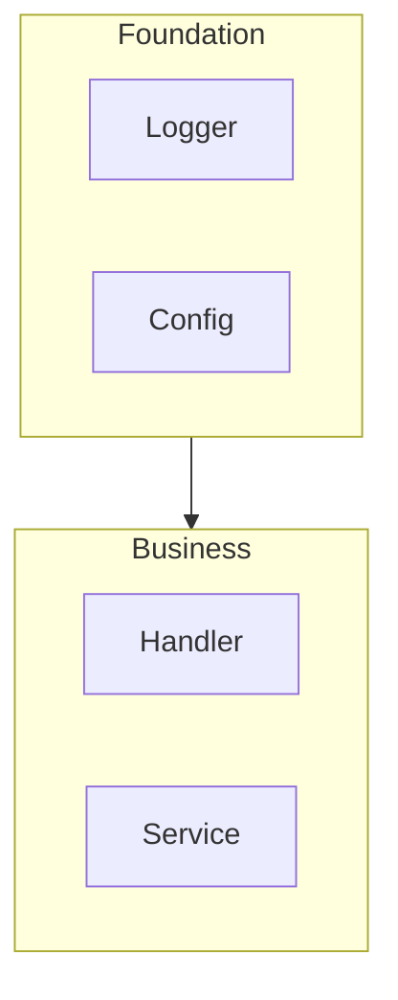

# Container (c3-N) Quality Criteria

## Purpose

c3-N is the orchestration layer:
- Parts and how they relate
- Tech choices that shape organization
- Each part listed becomes a c3-NNN

## Required Sections

1. **Frontmatter** (id, c3-version, title, type: container, parent, summary)
2. **Inherited From Context** - what this container inherits
3. **Overview** - container purpose
4. **Technology Stack** - tech choices with rationale
5. **Architecture - External Relationships** - diagram REQUIRED
6. **Architecture - Internal Structure** - diagram REQUIRED
7. **Components** - table: ID | Name | Layer | Responsibility
8. **Key Flows** - critical business flows

## Diagram Requirements

**TWO diagrams REQUIRED:**

1. **External Relationships** - connections to other containers/external systems
2. **Internal Structure** - how components relate, showing Foundation → Business layering



## Components vs Tech Stack

| Has conventions for consumers? | Decision |
|-------------------------------|----------|
| Yes - consumers must follow rules | → Component (list in table) |
| No - just "we use X library" | → Tech Stack row only |

**Examples:**
- Logger with structured field conventions → Component
- "We use pino" with no conventions → Tech Stack only

## When to Split Components

| Signal | Decision |
|--------|----------|
| Different developers work independently | Split |
| Changes for different reasons | Split |
| Always change together | Keep as one |
| Very little detail | Merge with related |

## Include / Exclude

| Include | Exclude |
|---------|---------|
| Component responsibilities | WHY container exists (Context) |
| Component relationships | HOW components work (Component) |
| Data flows between components | Code references |
| Business flows | File paths |
| Inner patterns | |

**Litmus test:** "Is this about WHAT components do and HOW they relate?"

## Verification

```bash
# Check both diagrams exist
mermaid_count=$(grep -c '```mermaid' .c3/c3-{N}-*/README.md)
echo "Diagrams: $mermaid_count (need >= 2)"

# Check required sections
grep -E "^## (Inherited|Overview|Technology|Architecture|Components)" .c3/c3-{N}-*/README.md

# Check frontmatter
grep -E "^id:|^type:|^parent:" .c3/c3-{N}-*/README.md
```

## Common Mistakes

| Mistake | Fix |
|---------|-----|
| Only one diagram | Need BOTH External + Internal |
| Missing "Inherited From Context" | Make inheritance explicit |
| Creating component for "we use X" | No conventions = Tech Stack only |
| Skipping layering rules | Show Foundation → Business |
| Not mapping interfaces to components | Add table: Interface \| Component \| Protocol |
