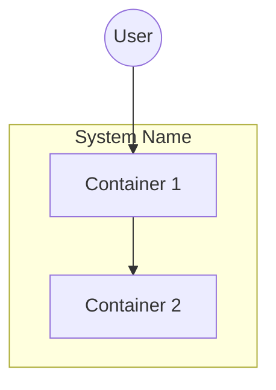

# Context (c3-0) Quality Criteria

## Purpose

c3-0 is the eagle-eye introduction:
- Actors (who uses the system)
- Container relationships (intentions, not details)
- High-level only

## Required Sections

1. **Frontmatter** (id: c3-0, c3-version, title, summary)
2. **Overview** - system purpose in 1-2 sentences
3. **System Architecture** - Mermaid diagram REQUIRED
4. **Actors** - table: Actor | Type | Interacts Via
5. **Containers** - table: Container | ID | Archetype | Responsibility
6. **Container Interactions** - table: From | To | Protocol | Purpose
7. **Cross-Cutting Concerns** - auth, logging, errors approach

## Diagram Requirement

**One Mermaid diagram REQUIRED** showing:
- Containers as boxes
- Actors as external entities
- Relationships with protocols labeled



## Include / Exclude

| Include | Exclude |
|---------|---------|
| Container responsibilities | Component details |
| Container relationships | Internal patterns |
| Connecting points (APIs/events) | Implementation |
| External actors | Code references |
| Cross-cutting concerns | File paths |

**Litmus test:** "Is this about WHY containers exist and HOW they relate?"

## Verification

```bash
# Check structure
grep -E "^## (Overview|System Architecture|Actors|Containers)" .c3/README.md

# Check diagram exists
grep -c '```mermaid' .c3/README.md  # Should be >= 1

# Check frontmatter
grep -E "^id:|^c3-version:" .c3/README.md
```

## Common Mistakes

| Mistake | Fix |
|---------|-----|
| Including component details | Push down to container docs |
| ASCII diagrams | Use Mermaid only |
| Missing interactions table | Document all container-to-container relationships |
| Too much detail | Keep high-level, intentions only |
