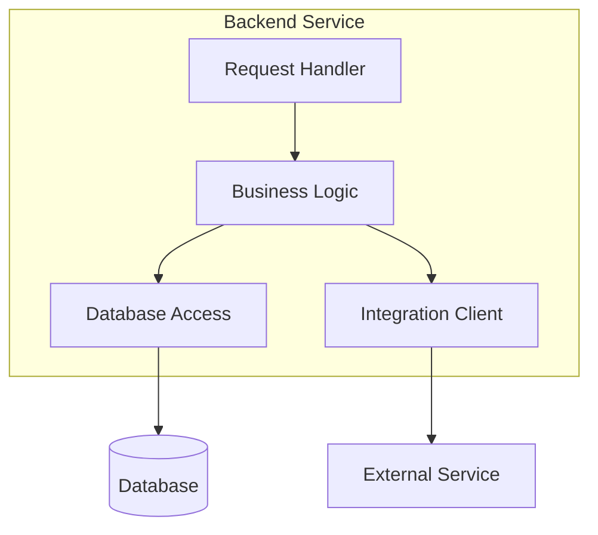
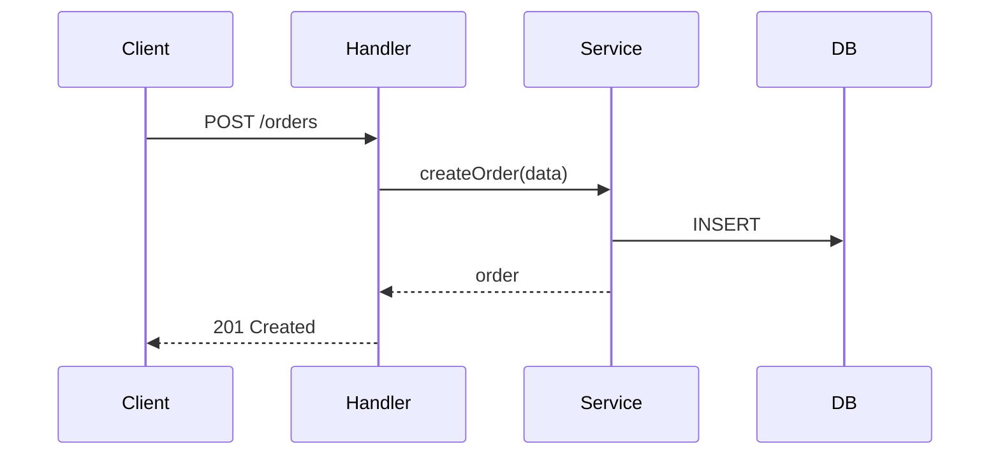
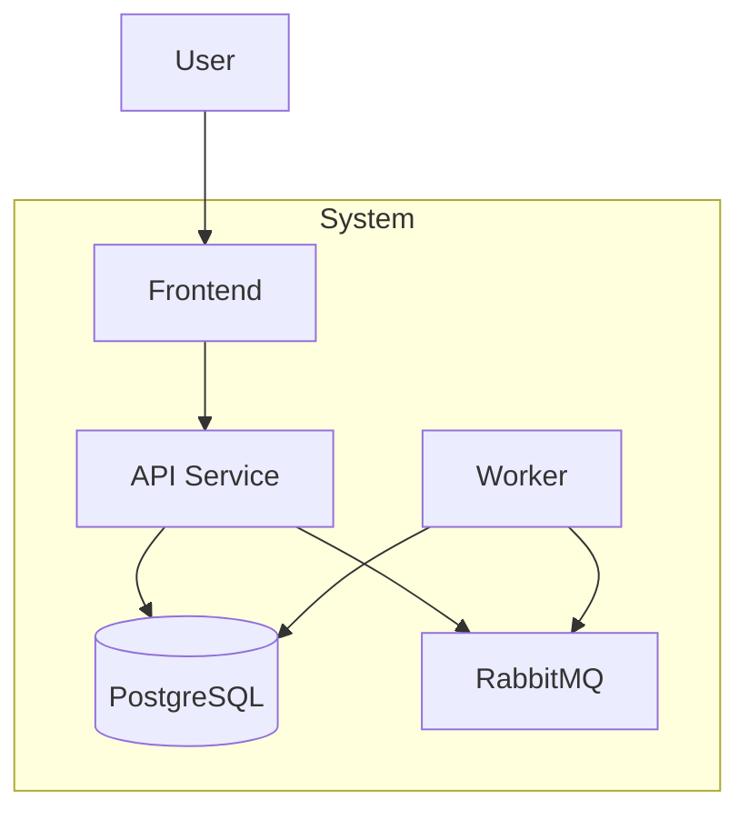
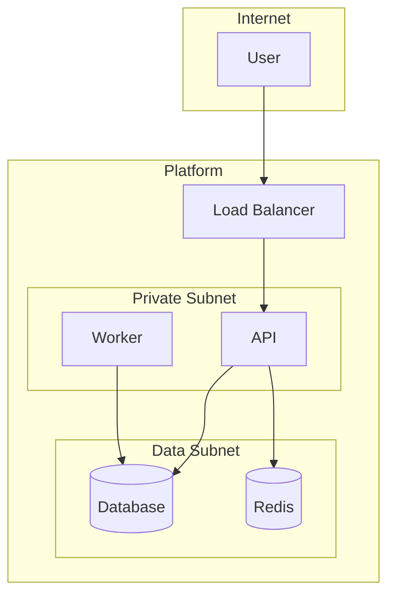
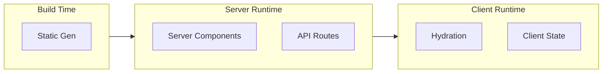
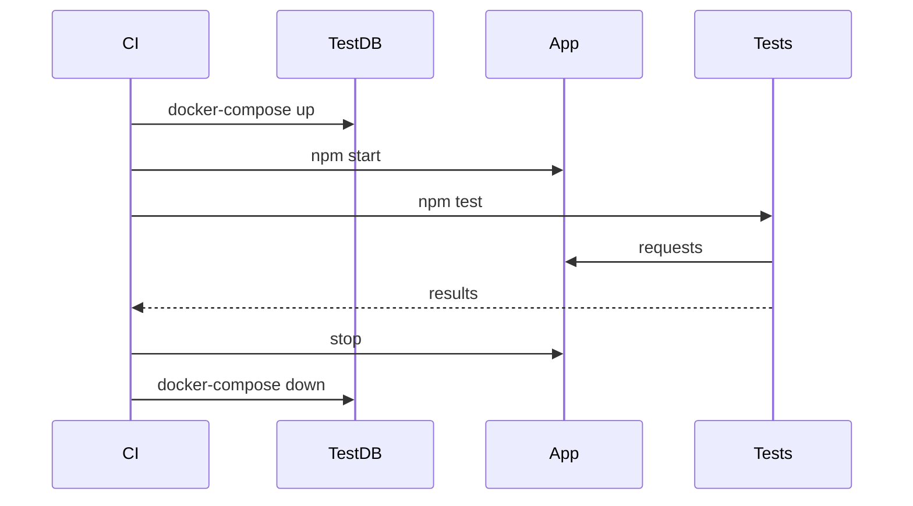
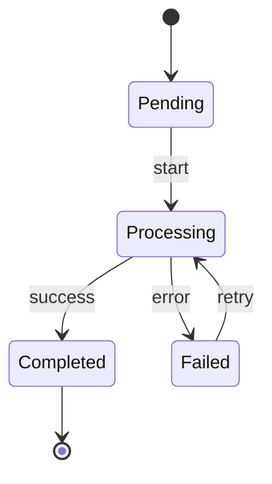

# Diagram Patterns

Diagrams should **clarify**, not mandate. Generate when helpful, skip when trivial.

---

## ⛔ MERMAID-ONLY ENFORCEMENT (MANDATORY)

**This is non-negotiable. ALL diagrams in C3 documentation MUST use Mermaid syntax.**

### What is Prohibited (NO EXCEPTIONS)

| Prohibited | Example | Why Prohibited |
|------------|---------|----------------|
| ASCII art diagrams | `+---+ → +---+` boxes | Not renderable, poor accessibility |
| Text-based flowcharts | `A --> B --> C` plain text | Not a diagram, just text |
| Unicode box drawing | `┌──┐ │ │ └──┘` | Platform-dependent rendering |
| Indented hierarchies | Tree structures with `├──` | Use Mermaid `graph TD` instead |
| Any non-Mermaid visual | Anything not in ` ```mermaid ` block | Inconsistent, not interactive |

### Why Mermaid is Required

1. **Renderable** - GitHub, GitLab, and most markdown viewers render Mermaid natively
2. **Accessible** - Screen readers can parse structure
3. **Maintainable** - Standard syntax, easy to diff/review in PRs
4. **Consistent** - Single format across all documentation

### Validation Checklist (RUN BEFORE FINALIZING)

Before completing any C3 document with diagrams, verify:

- [ ] **All diagrams use ` ```mermaid ` code blocks**
- [ ] **No ASCII art or Unicode box drawing anywhere**
- [ ] **No plain-text "diagrams" that should be visual**

### Red Flags - STOP and Rewrite If You See

🚩 `+---+` or `|   |` box drawing characters
🚩 `───>` or `-->` arrows outside Mermaid blocks
🚩 `├──` or `└──` tree characters
🚩 Indentation-based hierarchies meant to show structure
🚩 "Here's the flow: A then B then C" without a mermaid diagram

---

## When to Use Diagrams

**Use a diagram when:**
- Relationships are non-obvious
- Data flow has multiple steps
- Test orchestration is complex
- Architecture overview aids understanding

**Skip diagrams when:**
- Relationships are trivial (A calls B)
- Text description is clearer
- Diagram would just repeat prose

## Component Relationships (Container Level)

Show how components within a container interact.



**When to use:** Container has 3+ components with non-trivial relationships.

## Data Flow (Sequence)

Show how a request flows through the system.



**When to use:** Request involves multiple components/services, error handling branches, or async steps.

## Container Overview (Context Level)

Show all containers and their relationships.



**When to use:** System has 3+ containers.

## Platform Topology

Show infrastructure layout.



**When to use:** Documenting platform/networking.

## Execution Context (Meta-Frameworks)

Show server vs client code paths.



**When to use:** Documenting Next.js, Nuxt, SvelteKit applications.

## Test Orchestration

Show test setup and teardown.



**When to use:** Integration tests with external dependencies.

## State Machine (Complex Business Logic)

Show state transitions for workflows.



**When to use:** Component manages state transitions (orders, workflows, sagas).

## Anti-Patterns

**Don't:**
- Generate diagrams for every component (noise)
- Create diagrams that just mirror the prose
- Use complex diagram types when simple flowchart works
- Force diagrams where text is clearer

**Do:**
- Ask "does this diagram add clarity?"
- Keep diagrams focused (5-10 nodes max)
- Use consistent naming with documentation
- Update diagrams when code changes
