# C3 Hierarchy Model

The C3 hierarchy (Context-Container-Component) is a **zoom hierarchy**. Each layer is a different zoom level into the system. The purpose is **understanding how things work**, not documenting code.

## Core Principle: Zoom Levels

```mermaid
flowchart TB
    subgraph zoom["Zoom Hierarchy"]
        direction TB
        C["🔭 Context<br/>Bird's-eye view"]
        CO["🔍 Container<br/>Inside view"]
        CP["🔬 Component<br/>Close-up view"]
        C -->|"zoom in"| CO
        CO -->|"zoom in"| CP
    end

    C -.- W1["WHY containers exist<br/>Relationships between them"]
    CO -.- W2["WHAT components do<br/>How they relate"]
    CP -.- W3["HOW it works<br/>Flows, dependencies, edge cases"]
```

> Code lives in the codebase, not in C3 documents.
> C3 documents enable UNDERSTANDING before making changes.

## The Three Layers

```mermaid
flowchart TB
    subgraph CTX["CONTEXT (c3-0) - Bird's-eye View"]
        direction LR
        ctx_desc["See the system from very far"]
        ctx_list["• WHY each container exists<br/>• Relationships between containers<br/>• Connecting points (interfaces)<br/>• External actors"]
    end

    subgraph CON["CONTAINER (c3-N) - Inside View"]
        direction LR
        con_desc["See the structure inside one container"]
        con_list["• WHAT each component does<br/>• Relationships between components<br/>• Data flows across components<br/>• Business flows (workflows)<br/>• Inner patterns (logging, config)"]
    end

    subgraph CMP["COMPONENT (c3-NNN) - Close-up View"]
        direction LR
        cmp_desc["See HOW one component implements its contract"]
        cmp_list["• Flows (step-by-step processing)<br/>• Dependencies (what it calls)<br/>• Decision points<br/>• Edge cases and error handling"]
    end

    CTX -->|"zoom in"| CON
    CON -->|"zoom in"| CMP
```

## The Contract Chain

Each layer defines a contract that the next layer implements:

| Layer | Defines | Implemented By |
|-------|---------|----------------|
| **Context** | WHY containers exist, their relationships | Container |
| **Container** | WHAT components do, their relationships | Component |
| **Component** | HOW it works (the implementation) | (Code in codebase) |

## Example: Backend System

## Layer Responsibilities

### Context (c3-0) - BIRD'S-EYE VIEW

See the system from very far. Document WHY and relationships.

| Documents | Example |
|-----------|---------|
| WHY containers exist | "Backend handles business logic" |
| Container relationships | "Backend calls DB for persistence" |
| Connecting points | "REST API between Frontend and Backend" |
| External actors | "Users, Admin, External Payment API" |

**Does NOT document:** What's inside containers

### Container (c3-N) - INSIDE VIEW

Zoom into one container. Document WHAT components do.

| Documents | Example |
|-----------|---------|
| Component responsibilities | "UserService handles user operations" |
| Component relationships | "UserService calls DBAdapter" |
| Data flows | "Request → Handler → Service → DB" |
| Business flows | "Registration flow across components" |
| Inner patterns | "How logging/config/errors work here" |

**Does NOT document:** How each component works internally

### Component (c3-NNN) - CLOSE-UP VIEW

Zoom into one component. Document HOW it implements its contract.

| Documents | Example |
|-----------|---------|
| Flows | Step-by-step: validate → check exists → create → notify |
| Dependencies | "Calls DBAdapter, EmailService" |
| Decision points | "Skip email in test environment" |
| Edge cases | "Duplicate email returns specific error" |
| Error handling | "DB timeout → retry 3x with backoff" |

**Does NOT document:** Code (that's in the codebase)

## Impact Propagation Rules

### Upstream Discovery (scope may be bigger)

| Finding | Signal | Action |
|---------|--------|--------|
| Impact at Context | Higher-level change | Escalate, revisit hypothesis |
| Impact at Container (from Component) | Parent change | Escalate to container-design |
| Impact on siblings | Horizontal expansion | Expand scope |

### Downstream Discovery (expected)

| Finding | Signal | Action |
|---------|--------|--------|
| Impact on child Containers | Normal propagation | Document, delegate to container-design |
| Impact on child Components | Normal propagation | Document, delegate to component-design |
| No further impact | Contained change | Proceed with documentation |

## Escalation Triggers

Changes should escalate UP when they would break inherited contracts:

| Level | Escalate If... |
|-------|----------------|
| **Component → Container** | Violates technology/patterns/interface contract |
| **Container → Context** | Violates boundary/protocol/cross-cutting contract |
| **Any → Context** | Affects system boundary or adds new actors |

## Verification Questions

Before documenting, verify you're at the right zoom level:

### "Is this Context level?" (Bird's-eye)
- Is it about WHY a container exists?
- Is it about how containers relate to each other?
- Is it about external actors or connecting points?

→ If yes, document in Context

### "Is this Container level?" (Inside view)
- Is it about WHAT a component does?
- Is it about how components relate within this container?
- Is it about data flows or business flows?

→ If yes, document in Container

### "Is this Component level?" (Close-up)
- Is it about HOW a component works internally?
- Is it about flows, dependencies, or edge cases?
- Does it implement the contract from Container?

→ If yes, document in Component
