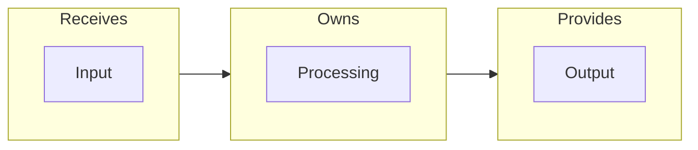

# C3 Implementation Guide

Reference for Component level documentation.

## Contents

- [When to Create a Component Doc](#when-to-create-a-component-doc)
- [NO CODE Enforcement](#no-code-enforcement)
- [Required Sections](#required-sections)
- [Optional Sections](#optional-sections)
- [Foundation vs Business Components](#foundation-vs-business-components)
- [Quick Verification](#quick-verification)

---

## When to Create a Component Doc

**Inventory-First:** Component must be in Container inventory BEFORE creating a doc.

| Has conventions for consumers? | Action |
|-------------------------------|--------|
| Yes - rules consumers must follow | Create component doc |
| No - just "we use X library" | Inventory entry only |

**Conventions include:** Hand-off patterns, error handling rules, configuration expectations, usage constraints.

**No doc needed for:** Standard library usage, framework defaults, single-consumer internal details.

**No stubs.** Either a full doc exists or it doesn't.

---

## NO CODE Enforcement

**Component docs describe HOW, not actual implementation.**

| Prohibited | Use Instead |
|------------|-------------|
| `function foo() {}` | Flow diagram |
| `interface X {}` | Table: Field, Type, Purpose |
| JSON/YAML examples | Table with dot notation |
| Config snippets | Settings table |
| SQL queries | Access pattern description |

**Why:** Code changes cause doc drift. Tables are scannable. Diagrams show flow without syntax.

**Mermaid exception:** Mermaid = visual architecture. If a JSON/YAML parser could parse it, use a table instead.

---

## Required Sections

### 1. Contract

What Container says about this component.

Format: `From c3-{N} ([Container Name]): "[responsibility from inventory]"`

### 2. Interface Diagram

Shows boundary and hand-offs. Use Mermaid with IN/PROCESS/OUT subgraphs.

### 3. Hand-offs Table

| Direction | What | To/From |
|-----------|------|---------|
| IN | Credentials | Request Handler |
| OUT | Auth Result | Calling Service |

### 4. Conventions Table

| Rule | Why |
|------|-----|
| Always validate before processing | Security |
| Return structured errors | Consistency |

### 5. Edge Cases & Errors

| Scenario | Behavior |
|----------|----------|
| Invalid credentials | Return 401, log attempt |
| Expired token | Return 401, prompt refresh |

---

## Optional Sections

| Section | When to Include |
|---------|-----------------|
| Configuration | Significant config surface |
| Dependencies | External dependencies matter |
| State/Lifecycle | Component has states |
| Performance | Throughput/latency matters |

---

## Foundation vs Business Components

| Type | Doc Focus |
|------|-----------|
| **Foundation** | What it PROVIDES to consumers, interface conventions |
| **Business** | Processing flow, domain rules, edge cases |

**Foundation example (Logger):** Interface it provides, structured field conventions, what consumers receive.

**Business example (Auth Service):** Validation flow, domain rules (password requirements), edge cases (lockout after N failures).

---

## Quick Verification

Before completing component doc:
- [ ] Component IS in parent Container inventory
- [ ] Interface diagram present (IN/PROCESS/OUT)
- [ ] Hand-offs table present
- [ ] Conventions table present
- [ ] NO code blocks (Mermaid only exception)

---

## Related

- `v3-structure.md` - Full structure reference with frontmatter
- `component-types.md` - Component categorization
- `container-patterns.md` - Container component patterns
