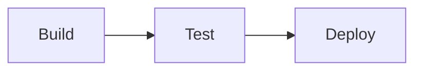

# Platform Documentation Patterns

Platform concerns are part of Context conceptually, split into separate files for manageability.

## Structure

```
.c3/
├── README.md              # Context (c3-0) - links to platform/
├── platform/              # Context-level platform docs
│   ├── deployment.md      # c3-0-deployment
│   ├── networking.md      # c3-0-networking
│   ├── secrets.md         # c3-0-secrets
│   └── ci-cd.md           # c3-0-cicd
```

Platform docs use `c3-0-*` IDs to indicate they're Context-level.

## Deployment Documentation

```markdown
---
id: c3-0-deployment
c3-version: 3
title: Deployment
---

# Deployment

## Strategy {#c3-0-deployment-strategy}
[Blue-green, canary, rolling, etc.]

## Orchestrator {#c3-0-deployment-orchestrator}
[Kubernetes, ECS, etc. with version]

## Container Registry {#c3-0-deployment-registry}
[Where images are stored]

## Rollback {#c3-0-deployment-rollback}
[How to rollback, RTO expectations]

## Per-Container Deployment
| Container | Strategy | Health Check | Replicas |
|-----------|----------|--------------|----------|
```

## Networking Documentation

```markdown
---
id: c3-0-networking
c3-version: 3
title: Networking
---

# Networking

## Topology {#c3-0-networking-topology}
[Mermaid diagram of network layout]

## Ingress {#c3-0-networking-ingress}
| Source | Destination | Port | Protocol |
|--------|-------------|------|----------|

## Service Discovery {#c3-0-networking-discovery}
[DNS, service mesh, etc.]

## Service Mesh {#c3-0-networking-mesh}
[If applicable: Istio, Linkerd, etc.]
```

## Secrets Documentation

```markdown
---
id: c3-0-secrets
c3-version: 3
title: Secrets Management
---

# Secrets Management

## Storage {#c3-0-secrets-storage}
[Vault, AWS Secrets Manager, etc.]

## Injection Method {#c3-0-secrets-injection}
[Env vars, mounted volumes, CSI driver]

## Rotation {#c3-0-secrets-rotation}
[Policy, automation]

## Per-Container Secrets
| Container | Secrets Required | Injection |
|-----------|------------------|-----------|
```

## CI/CD Documentation

```markdown
---
id: c3-0-cicd
c3-version: 3
title: CI/CD Pipeline
---

# CI/CD Pipeline

## Pipeline Tool {#c3-0-cicd-tool}
[GitHub Actions, GitLab CI, Jenkins, etc.]

## Stages {#c3-0-cicd-stages}


## Triggers {#c3-0-cicd-triggers}
| Event | Action |
|-------|--------|
| Push to main | Deploy to staging |
| Tag v*.*.* | Deploy to production |

## Approval Gates {#c3-0-cicd-gates}
[Manual approvals, automated checks]

## Artifacts {#c3-0-cicd-artifacts}
[Where build outputs are stored]
```

## Linking from Context

In `.c3/README.md` (Context document), add:

```markdown
## Platform {#c3-0-platform}

Platform infrastructure documentation:
- [Deployment](platform/deployment.md)
- [Networking](platform/networking.md)
- [Secrets Management](platform/secrets.md)
- [CI/CD Pipeline](platform/ci-cd.md)
```

## Discovery Approach

Platform documentation is **optional**. During c3-adopt:

1. Ask: "Do you want to document platform concerns (deployment, networking, secrets, CI/CD)?"
2. If yes, create platform/ directory and scaffold files
3. Use discovery questions from discovery-questions.md
4. Accept TBD for unknown areas
