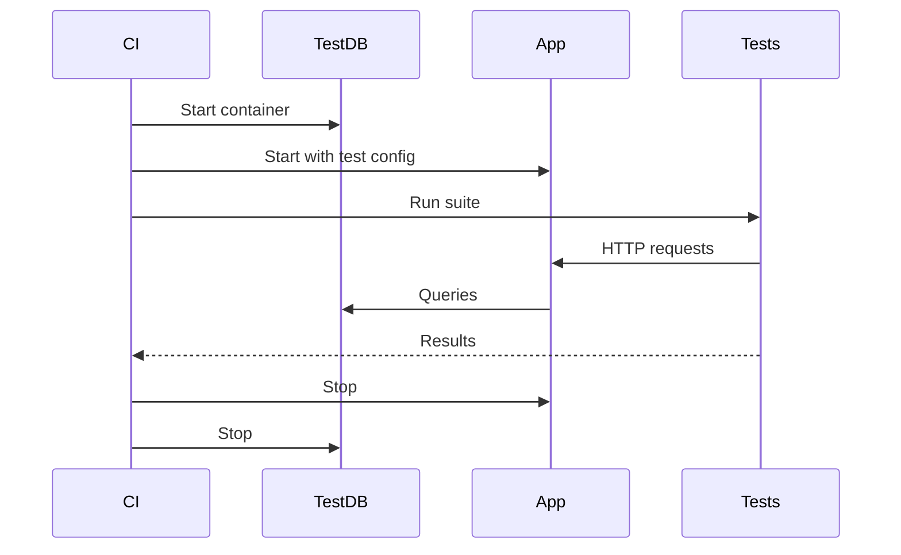

# Testing Discovery

Document what exists, not what should exist. Accept "we don't test this" as valid.

## Philosophy

1. **Discover, don't prescribe** - find existing tests, don't mandate new ones
2. **Accept gaps** - document TBD, suggest improvements as optional
3. **Level-appropriate** - unit at component, integration at container, system at context
4. **No enforcement** - user decides what's worth documenting

## Discovery by Level

### Component Level

**Questions:**
- "Are there tests for this component?"
- "Where do they live?"
- "How do you run them?"

**If tests exist, document:**
```markdown
## Testing {#c3-nnn-testing}
- Location: `src/__tests__/componentName.test.ts`
- Run: `npm test -- componentName`
- Coverage: [if known]
```

**If no tests:**
```markdown
## Testing {#c3-nnn-testing}
TBD - no tests currently
```

### Container Level

**Questions:**
- "How do you test this container as a whole?"
- "Any integration tests?"
- "Contract tests with other services?"
- "What runs in CI?"

**If tests exist, document:**
```markdown
## Testing Strategy {#c3-n-testing}

### Integration Tests
- Location: `tests/integration/`
- Run: `npm run test:integration`
- Dependencies: [what needs to be running]

### Contract Tests
- Location: `tests/contracts/`
- Pact broker: [URL if applicable]
```

**If partial:**
```markdown
## Testing Strategy {#c3-n-testing}

### Integration Tests
- Location: `tests/integration/`
- Run: `npm run test:integration`

### Contract Tests
TBD - not yet implemented
```

### Context Level

**Questions:**
- "Any end-to-end tests?"
- "System tests across containers?"
- "Chaos/resilience testing?"
- "Where does this run (staging, prod)?"

**Document in Context or platform/:**
```markdown
## System Testing {#c3-0-testing}

### End-to-End
- Location: `e2e/` (or separate repo)
- Environment: staging
- Run: `npm run e2e`

### Chaos Testing
TBD - not yet implemented
```

## Test Orchestration Diagram

When cross-component or cross-container testing involves complex setup, offer a diagram:



Only generate if it **helps clarify**. Trivial setups don't need diagrams.

## Suggesting Improvements

After documenting what exists, you MAY suggest improvements:

```markdown
## Testing {#c3-nnn-testing}
- Location: `src/__tests__/`
- Coverage: ~40%

> **Suggestion:** Consider adding tests for error paths in `handlePayment()`.
```

Suggestions are:
- Clearly marked as optional
- Specific and actionable
- Not blocking documentation completion
