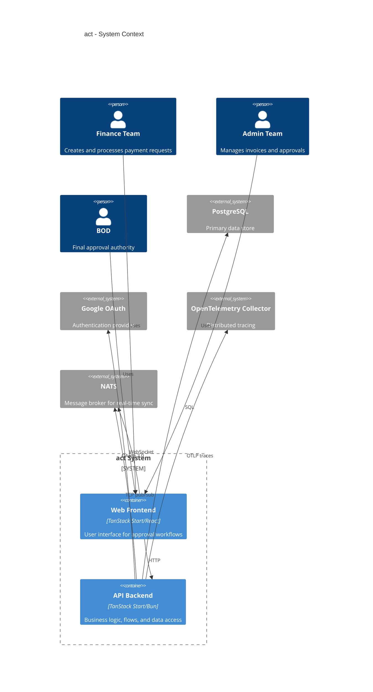

# act

## Goal

Enable Finance, Admin, and BOD teams to collaborate on approval workflows with real-time sync and audit trails.

## System Context

## Containers

| ID | Name | Responsibility |
| --- | --- | --- |
| c3-1 | Web Frontend | React UI for approval workflows, real-time sync via NATS |
| c3-2 | API Backend | Business logic via flow(), Drizzle ORM, auth |
| c3-4 | NATS Server | Real-time messaging with JWT auth |

## Abstract Constraints

| Constraint | Rationale | Affected Containers |
| --- | --- | --- |
| All business mutations must be auditable. | Compliance and debugging require reconstructable change history. | c3-1, c3-2 |
| UI state must converge via server-published real-time events. | Prevent stale client state after concurrent mutations. | c3-1, c3-2, c3-4 |
| Access must be identity- and capability-scoped. | Protect admin and operational actions by role/team policies. | c3-1, c3-2 |

## Wiring

| From | To | Protocol | What |
| --- | --- | --- | --- |
| Teams | c3-1 | HTTPS | Web access |
| c3-1 | c3-2 | HTTP | API calls |
| c3-1 | c3-4 | WSS | Real-time sync |
| c3-2 | c3-4 | TCP | Publish events |
| c3-2 | PostgreSQL | TCP/SQL | Data persistence |
| c3-2 | Google OAuth | HTTPS | Authentication |
| c3-2 | OpenTelemetry | OTLP/HTTP | Tracing |

## Deployment

Single unit (`apps/start`) with logical separation:

- `/src/routes/` → Frontend routes
- `/src/server/` → Flows & API routes
- `/src/components/`, `/src/screens/` → React UI
