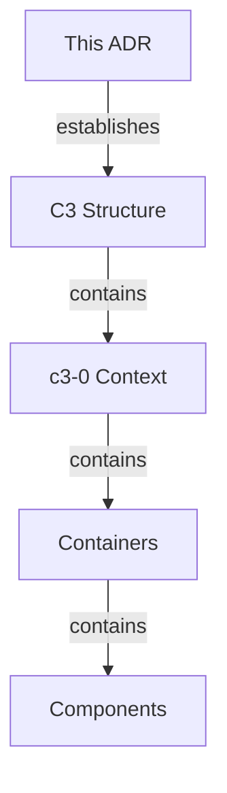

# C3 Architecture Documentation Adoption

## Goal

Document and implement the architectural decision: C3 Architecture Documentation Adoption.

## Overview

## Status

**Implemented** - 2026-01-09

## Problem

| Situation | Impact |
| --- | --- |
| No architecture docs | Onboarding takes weeks |
| Knowledge in heads | Bus factor risk |
| Ad-hoc decisions | Inconsistent patterns |

## Decision Drivers

## Decision

Adopt C3 (Context-Container-Component) methodology for architecture documentation.

## Structure Created

| Level | ID | Name | Purpose |
| --- | --- | --- | --- |
| Context | c3-0 | act | System overview |
| Container | c3-1 | Web Frontend | React SPA, TanStack Router, real-time sync |
| Container | c3-2 | API Backend | Business logic via flow(), Drizzle ORM |
| Container | c3-3 | E2E Tests | Playwright with testcontainers |

## Rationale

| Consideration | C3 Approach |
| --- | --- |
| Layered abstraction | Context → Container → Component |
| Change isolation | Strategic vs tactical separation |
| Growth-ready | Structure exists before content |
| Decision tracking | ADRs capture evolution |

## Consequences

### Positive

- Architecture visible and navigable
- Onboarding accelerated
- Decisions documented with reasoning

### Negative

- Maintenance overhead (docs can drift)
- Initial time investment

## Verification

- [x] `.c3/README.md` exists (c3-0)
- [x] All containers have `README.md`
- [x] Diagrams use consistent IDs
- [x] Linkages have reasoning

## Adoption Progress

| Level | Category | Status | Documented | Remaining |
| --- | --- | --- | --- | --- |
| Context | - | Complete | 1 | 0 |
| Containers | - | Complete | 3 | 0 |
| Refs | - | Complete | 3 | 0 |
| Components | Foundation | Complete | 5 | 2 |
| Components | Feature | Complete | 3 | 4 |

## Audit Record

| Phase | Date | Notes |
| --- | --- | --- |
| Adopted | 2026-01-09 | Initial C3 structure created |
| Populated | 2026-01-09 | Context, containers, refs, key components documented |

## Context

N.A - historical ADR; original context is captured in the git log around the ADR date and in the current code that implements the decision.

## Work Breakdown

| Area | Detail | Evidence |
| --- | --- | --- |
| N.A - historical | Shipped via git commits; the c3 topology and code-map reflect the resulting structure. | c3x list --include-adr and git log around the ADR date |

## Underlay C3 Changes

| Underlay area | Exact C3 change | Verification evidence |
| --- | --- | --- |
| N.A - historical | Current .c3 entities, refs, and code-map are the post-change state. | c3x verify and c3x check |

## Enforcement Surfaces

| Surface | Behavior | Evidence |
| --- | --- | --- |
| N.A - historical | Enforcement is implicit in the currently linked components and refs. | c3x graph and cited ref ids on the relevant components |

## Alternatives Considered

| Alternative | Rejected because |
| --- | --- |
| N.A - historical | Alternatives were considered at decision time; rationale is preserved in the original commit message or branch discussion. |

## Risks

| Risk | Mitigation | Verification |
| --- | --- | --- |
| N.A - historical | Risks were assessed pre-merge; the decision has since shipped without outstanding incidents tied to this ADR. | git log and project test suite |
