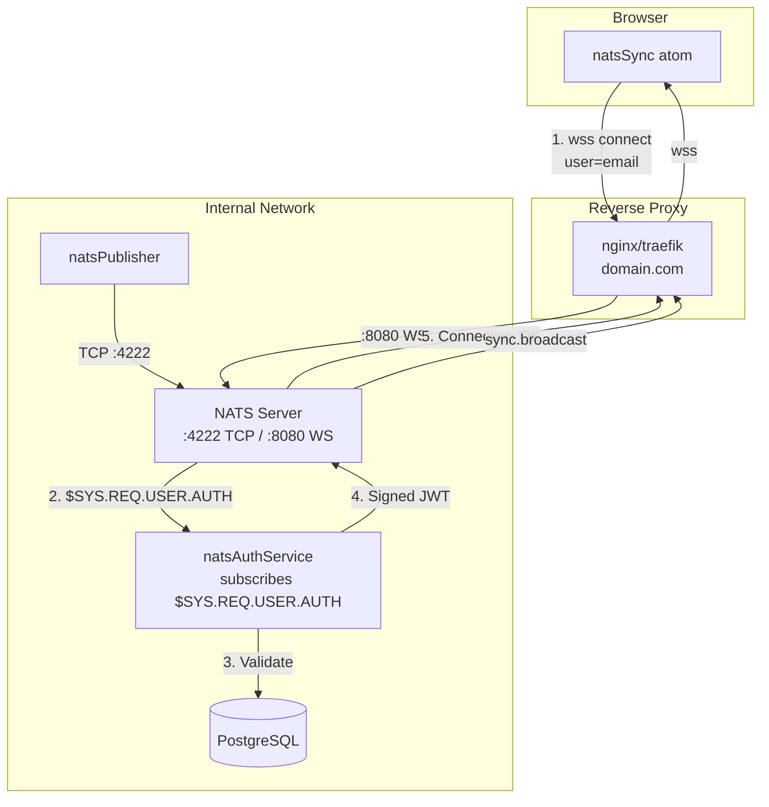

# Implement NATS Auth Callout for WebSocket Connections

## Goal

Document and implement the architectural decision: Implement NATS Auth Callout for WebSocket Connections.

## Status

**Superseded** - 2026-01-13

Replaced by JWT resolver approach. See adr-20260113-nats-jwt-resolver.

## Problem

NATS WebSocket connections are currently open (no authentication). Any client with the WebSocket URL can connect and subscribe to sync messages, bypassing the application's auth layer. The original NATS sync ADR (adr-20260112-nats-websocket-sync) planned for auth callout but it was not implemented.

## Decision

Implement NATS auth callout to secure WebSocket connections using NATS 2.10+ auth callout feature:

1. **NATS auth service** - A server-side service subscribing to `$SYS.REQ.USER.AUTH` subject
2. **NKey signing** - Generate operator NKeys for signing authorization JWTs
3. **User email as credential** - Browser passes email, auth service validates against database
4. **Subscribe-only permissions** - Authenticated users can subscribe to `sync.broadcast`, no publish

**How NATS Auth Callout Works:**

```
Client connects with user=email → NATS publishes to $SYS.REQ.USER.AUTH
→ Auth service validates email against PostgreSQL
→ Auth service signs JWT with NKey → Returns to NATS
→ NATS grants/denies connection based on JWT claims
```

## Rationale

| Considered | Rejected Because |
| --- | --- |
| HTTP callback auth | NATS auth callout uses NATS messaging, not HTTP |
| Proxy-only auth | Less isolation, doesn't block at NATS level |
| No auth (current) | Anyone with URL can connect |
| Static passwords | No per-user permissions, shared secret |

NATS auth service approach:

- Production-grade security using NATS official auth mechanism
- Per-user validation against existing database
- Proper JWT-based permissions
- Runs in same process as app (shared scope)

## Affected Layers

| Layer | Document | Change |
| --- | --- | --- |
| Context | c3-0 | Update E4 linkage to note "with auth callout" |
| Container | c3-1 | Pass user cookie as NATS connect user credential |
| Container | c3-2 | Add /api/nats-auth endpoint, update Overview diagram |
| Reference | ref-sync | Add auth callout section |
| Container | c3-4 | External NATS server documentation |
| Infrastructure | new | Add infra/nats.conf with auth callout settings |

## Code Changes

### Add (Server)

- `apps/start/src/server/resources/natsAuthService.ts` - Auth callout NATS service
`apps/start/src/server/resources/natsAuthService.ts` - Auth callout NATS service
Subscribes to `$SYS.REQ.USER.AUTH` subject

Validates user email against database (reuses userQueries)

Signs authorization JWT with NKey

Returns permissions: subscribe `sync.broadcast` only

- `infra/nkeys/` - NKey files (gitignored, generated at setup)
`infra/nkeys/` - NKey files (gitignored, generated at setup)
`issuer.nk` - Issuer signing key

`issuer.pub` - Issuer public key (referenced in nats.conf)

### Modify (Client)

- `apps/start/src/lib/pumped/atoms/natsSync.ts`
Pass `user: currentUser.email` when connecting

### Add (Infrastructure)

- `infra/nats.conf` - NATS server configuration with:
WebSocket port 8080

Auth callout configured with issuer public key

AUTH account for auth service user

APP account for clients

### Add (Docs)

- `.c3/c3-4-nats-server/README.md` - NATS server container documentation
JWT authentication flow

Permission model

Expected configuration

### Modify (Docs)

- `.c3/README.md` - Update E4 linkage, add ref link
- `.c3/c3-2-api-backend/README.md` - Add auth endpoint to diagram, add ref link
- `.c3/refs/ref-sync.md` - Link to auth callout reference

## Deployment Topology

See [NATS Server](../c3-4-nats-server/README.md) for detailed deployment documentation.

### Production Architecture



### Network Topology

| Environment | Client WebSocket URL | NATS TCP | Auth Service |
| --- | --- | --- | --- |
| Production | wss://domain.com/nats (via proxy) | Internal only | Same process, NATS messaging |
| Local Dev | ws://localhost:8080 | localhost:4222 | Same process, NATS messaging |

### Key Points

- **Single domain**: Browser connects to NATS WebSocket through reverse proxy
- **No exposed ports**: NATS ports (4222, 8080) not directly exposed to internet
- **NATS messaging auth**: Auth service subscribes to `$SYS.REQ.USER.AUTH`, not HTTP
- **NKey signing**: Authorization responses signed with issuer NKey

## Verification

- [ ] NATS server starts with auth callout config
- [ ] Unauthenticated connection rejected by NATS
- [ ] Authenticated browser connects successfully
- [ ] Browser receives sync.broadcast messages
- [ ] Server can still publish (internal credentials)
- [ ] E2E tests pass
- [ ] C3 audit passes

## Context

N.A - historical ADR; original context is captured in the git log around the ADR date and in the current code that implements the decision.

## Work Breakdown

| Area | Detail | Evidence |
| --- | --- | --- |
| N.A - historical | Shipped via git commits; the c3 topology and code-map reflect the resulting structure. | c3x list --include-adr and git log around the ADR date |

## Underlay C3 Changes

| Underlay area | Exact C3 change | Verification evidence |
| --- | --- | --- |
| N.A - historical | Current .c3 entities, refs, and code-map are the post-change state. | c3x verify and c3x check |

## Enforcement Surfaces

| Surface | Behavior | Evidence |
| --- | --- | --- |
| N.A - historical | Enforcement is implicit in the currently linked components and refs. | c3x graph and cited ref ids on the relevant components |

## Alternatives Considered

| Alternative | Rejected because |
| --- | --- |
| N.A - historical | Alternatives were considered at decision time; rationale is preserved in the original commit message or branch discussion. |

## Risks

| Risk | Mitigation | Verification |
| --- | --- | --- |
| N.A - historical | Risks were assessed pre-merge; the decision has since shipped without outstanding incidents tied to this ADR. | git log and project test suite |
