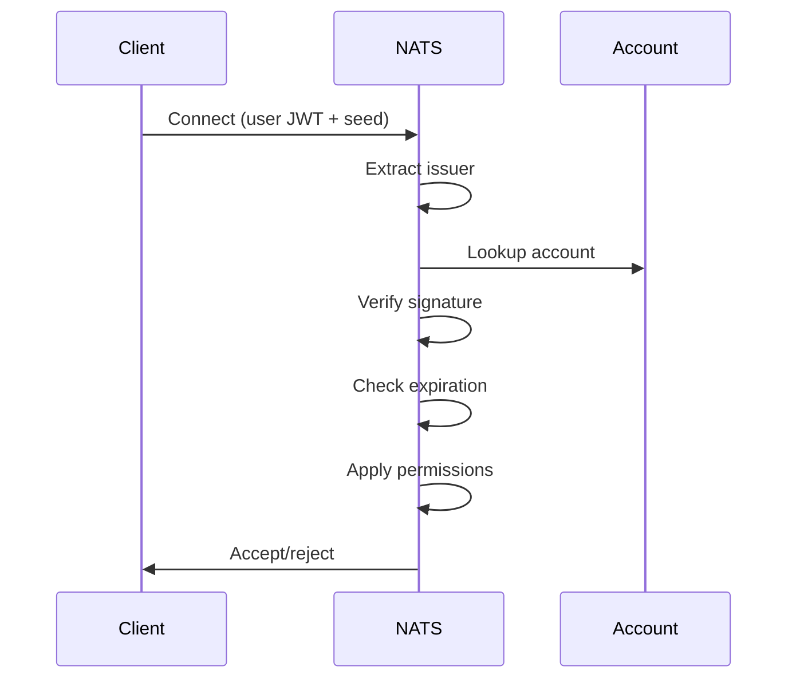

# NATS Server (External)

## Goal

Message broker for real-time sync between backend and browser clients via WebSocket. JWT-authenticated, JetStream for notifications.

## Components

N.A — c3-4 is an external service (NATS Core Broker + JetStream) with no internal sub-components.

## Wiring

| From | To | Protocol | What |
| --- | --- | --- | --- |
| c3-2 (Backend) | NATS | TCP 4222 | Publish {prefix}.> messages |
| c3-1 (Browser) | NATS | WSS 8080 | Subscribe to {prefix}.broadcast + {prefix}.user.{escaped_email} |
| NATS | Account JWT resolver | Internal | Validate user JWT signatures + enforce subject permissions (no external auth callout) |

## Responsibilities

- **JWT Authentication** — Validate user JWTs signed by account key
- **WebSocket Gateway** — Accept browser connections (WSS port 8080)
- **Message Routing** — Route `{prefix}.>` messages to subscribed clients
- **Permission Enforcement** — Enforce pub/sub permissions from JWT
- **JetStream** — Durable notification delivery with persistent storage

## Integration

```
Backend (Publisher)      NATS Server           Browser (Subscriber)
      │                      │                      │
      ├──TCP 4222 ──────────▶│  JWT Resolver       │
      │  {prefix}.broadcast  │  JetStream          │
      │                      │◀──WSS 8080──────────┤
      │                      │  {prefix}.broadcast │
      │                      │  {prefix}.user.*    │
```

## Ports

| Port | Protocol | Purpose |
| --- | --- | --- |
| 4222 | TCP | Internal NATS |
| 8080 | WSS | Browser WebSocket |
| 8222 | HTTP | Monitoring |

## Configuration

### Environment Variables

| Variable | Purpose |
| --- | --- |
| OPERATOR_JWT | Trust chain root |
| APP_ACCOUNT_JWT | Account with permissions |
| APP_ACCOUNT_PUBLIC_KEY | Verify user JWTs |
| SYS_ACCOUNT_JWT | System account |
| SYS_ACCOUNT_PUBLIC_KEY | System verify key |

### Required Permissions

APP account must have:

```
pub: ["$JS.API.>", "_INBOX.>", "{prefix}.>"]   # default prefix: sync
sub: ["$JS.API.>", "_INBOX.>", "{prefix}.>"]   # default prefix: sync
```

| Permission | Purpose |
| --- | --- |
| sync.> | Real-time sync messages |
| $JS.API.> | JetStream streams, consumers, ack |
| _INBOX.> | Request-reply inboxes |

### JetStream

```
store_dir: /data/jetstream
max_mem: 256MB
max_file: 1GB
```

NOTIFICATIONS stream: File-based, persistent across restarts.

## Permission Model

| Type | Subscribe | Publish |
| --- | --- | --- |
| Backend | {prefix}.>, $JS.API.>, _INBOX.> | {prefix}.>, $JS.API.>, _INBOX.> |
| Browser | {prefix}.broadcast, {prefix}.user.{escaped_email}, _INBOX.> | _INBOX.> |

Browser is read-only; backend controls all publications.

## Authentication Flow



## Health Check

```bash
curl http://nats-server:8222/healthz
```
