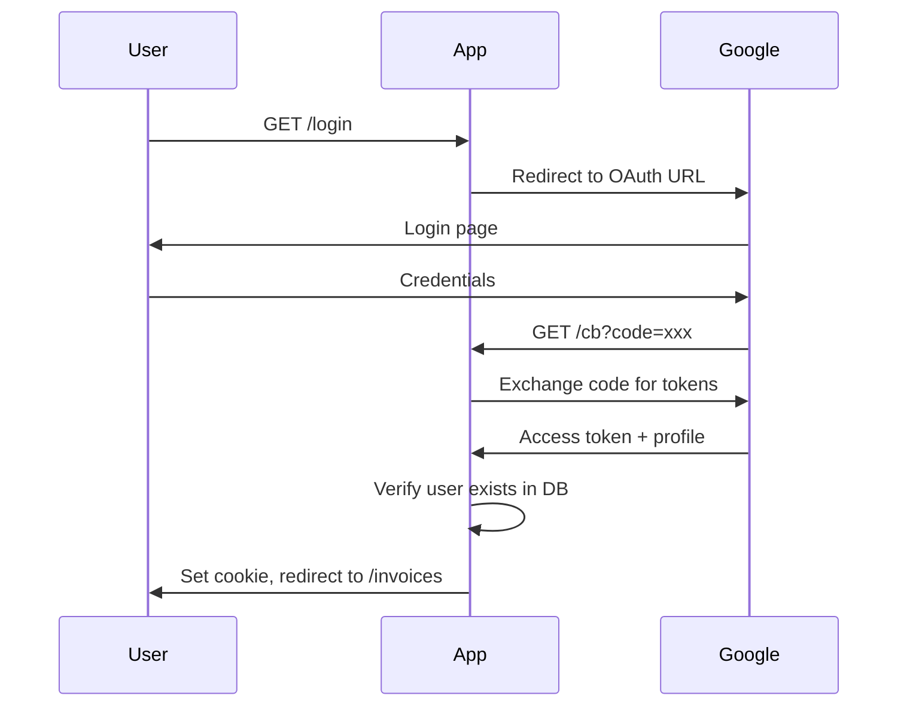

# Authentication Pattern

## Goal

Authenticate users via Google OAuth or test tokens, establishing session via cookie.

## Choice

- Google OAuth for production, test token bypass for E2E
- Cookie-based session with Base64-encoded email, HttpOnly flag
- User must already exist in database; OAuth alone does not grant access

## Why

- Cookie session is stateless (no server-side session store) and simple to implement
- Requiring pre-existing user prevents unauthorized access from valid Google accounts
- Separate test token path avoids polluting production auth with test concerns

## Authentication Methods

| Method | Use Case | Flow |
| --- | --- | --- |
| Google OAuth | Production | OAuth redirect flow |
| Test Token | E2E tests | Direct URL with token |

## Google OAuth Flow



## Routes

| Route | Purpose | Handler |
| --- | --- | --- |
| /login | Start OAuth flow | Redirect to index |
| /auth.google.url | Generate OAuth URL | Return URL |
| /cb | OAuth callback | Process tokens, set cookie |
| /test-login | Test authentication | Verify token, set cookie |
| /logout | Clear session | Clear cookie |

## Cookie-Based Session

```typescript
// Set cookie on successful auth
const cookieValue = Buffer.from(user.email).toString('base64');
headers.append('Set-Cookie', `user=${cookieValue}; Path=/; HttpOnly`);
```

| Cookie | Value | Flags |
| --- | --- | --- |
| user | Base64(email) | HttpOnly, Path=/ |

## Google OAuth Service

```typescript
export const gauthSvc = atom({
  factory: () => ({
    generateOfflineUrl: () => {
      return client.generateAuthUrl({
        access_type: 'offline',
        prompt: 'consent',
        scope: ['email', 'https://www.googleapis.com/auth/userinfo.profile'],
      });
    },
    getToken: async (code: string) => {
      return await client.getToken(code);
    },
    getProfile: async (credentials: Credentials) => {
      return await oauth2.userinfo.get();
    },
  }),
});
```

## Authentication Flow

```typescript
export const authenticateWithGoogle = flow({
  deps: { gauthSvc, initUserActor },
  factory: async (ctx, { gauthSvc, initUserActor }) => {
    const profile = await gauthSvc.getProfile(ctx.input.credentials);

    if (!profile.data.email) {
      return { success: false, reason: 'NO_CREDENTIALS' };
    }

    // Verify user exists in database
    const user = await initUserActor(ctx, profile.data.email, {
      avatar: profile.data.picture,
      displayName: profile.data.name,
      name: profile.data.given_name,
    });

    return { success: true, user };
  }
});
```

## Test Token Authentication

For E2E tests only:

```typescript
// URL format
/test-login?token=${TEST_TOKEN}&user=${email}

// Flow
export const authenticateWithTestToken = flow({
  deps: { appConfig, initUserActor },
  factory: async (ctx, { appConfig, initUserActor }) => {
    if (!appConfig.enableTestToken || ctx.input.token !== appConfig.testToken) {
      return { success: false, reason: 'INVALID_TOKEN' };
    }

    const user = await initUserActor(ctx, ctx.input.email, {
      displayName: `[TEST] ${ctx.input.email}`,
    });

    return { success: true, user };
  }
});
```

## Environment Variables

| Variable | Purpose | Required |
| --- | --- | --- |
| GOOGLE_CLIENT_ID | OAuth client ID | Production |
| GOOGLE_CLIENT_SECRET | OAuth secret | Production |
| GOOGLE_REDIRECT_URI | Callback URL | Production |
| ENABLE_TEST_TOKEN | Enable test auth | E2E only |
| TEST_TOKEN | Shared secret | E2E only |

## Result Types

```typescript
type AuthResult =
  | { success: true; user: UserActor }
  | { success: false; reason: 'NO_CREDENTIALS' }
  | { success: false; reason: 'INVALID_TOKEN' }
  | { success: false; reason: 'USER_NOT_FOUND'; email: string };
```

## Security Notes

1. **User must exist** - OAuth alone doesn't grant access; user must be in database
2. **Cookie is HttpOnly** - Prevents XSS access
3. **Test token disabled by default** - Only enable for E2E testing
4. **No refresh tokens stored** - Stateless session via cookie

## Cited By

- c3-2-api (Authentication)
