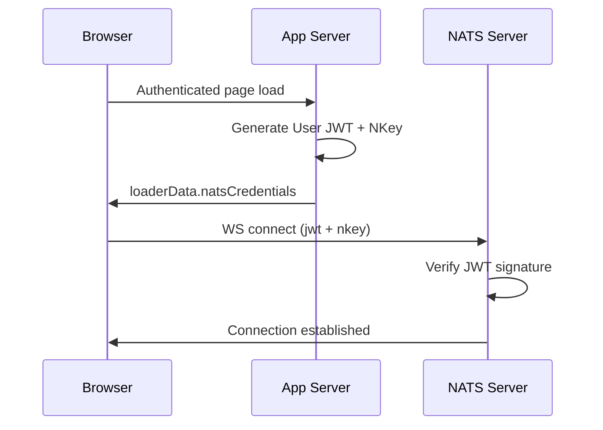

# NATS JWT Resolver Authentication

## Goal

Secure NATS WebSocket connections using JWT resolver pattern. The server generates user JWT credentials at page load, which NATS validates directly using a configured account public key - no auth callout service needed.

## Choice

- JWT resolver with MEMORY preload — server generates user JWTs signed by account NKey, NATS validates signatures directly without an auth callout service
- Browser clients get subscribe-only permissions on `sync.broadcast` via WebSocket; server uses full TCP access
- Credentials generated at page load in the loader, passed to client via `loaderData.natsCredentials`, with 1-hour expiration

## Why

- JWT resolver eliminates an external auth service dependency — NATS validates tokens itself using the configured account public key
- Subscribe-only WebSocket permissions minimize the attack surface — compromised client credentials cannot publish or access internal subjects
- Generating credentials at page load keeps the flow simple (no separate auth endpoint) and 1-hour expiry limits credential reuse

## How It Works



## Credential Flow

### 1. Credential Generation (Loader)

Server generates signed User JWT and NKey when user loads authenticated page:

```typescript
// _authed.tsx loader
const credGen = await scope.resolve(natsCredentialGenerator)
const natsCredentials = await credGen.generate(currentUser.email, 3600)
```

**Credentials returned:**

- `jwt` - Signed User JWT with permissions
- `nkey` - User NKey seed for connection signing

### 2. Client Connection

Browser connects with JWT credentials:

```typescript
// natsSync.ts
nc = await connect({
  servers: natsWsUrl,
  authenticator: jwtAuthenticator(jwt, nkeySeed),
})
```

### 3. NATS Validation

NATS server validates JWT signature using configured resolver:

- Verifies JWT signed by trusted account key
- Checks JWT expiration
- Applies embedded permissions

## Permissions Model

| Role | Subscribe | Publish | Connection Type |
| --- | --- | --- | --- |
| Browser client | sync.broadcast | None | WebSocket only |
| Server (internal) | All | All | TCP |

## Configuration

### Environment Variables

| Variable | Purpose | Example |
| --- | --- | --- |
| NATS_ACCOUNT_SEED | Account NKey seed for signing user JWTs | SA... |
| NATS_ACCOUNT_PUBLIC_KEY | Account public key (for NATS resolver config) | A... |
| NATS_OPERATOR_PUBLIC_KEY | Operator public key | O... |

### Generating NKeys

```bash
# Install nsc
brew install nats-io/nats-tools/nsc

# Generate operator nkey
nsc generate nkey --operator

# Generate account nkey
nsc generate nkey --account

# Output:
# Public Key: AXXXX...
# Seed: SAXXXX...
```

- Use **account public key** (`A...`) in resolver config
- Use **account seed** (`SA...`) in `NATS_ACCOUNT_SEED` env var

### NATS Server Config

```conf
# infra/nats.conf
operator: /etc/nats/jwt/operator.jwt

resolver: MEMORY

resolver_preload: {
  # Account public key: JWT string
  AAMTLN4XNF4Y3IOQSFVJAPKQ4HMKVRJUYZ27LP6G2MWI2OBJ45WEXSQ6: <APP_ACCOUNT_JWT>
  AAPKFJUH3T4FTP2D4IWK254KASCJX2UYITFDWBQ3R6HMZZSBA6NYGKUS: <SYS_ACCOUNT_JWT>
}

system_account: <SYS_ACCOUNT_PUBLIC_KEY>
```

Use `MEMORY` resolver with `resolver_preload` for simpler configuration.

## Security Considerations

1. **JWT expiration**: User JWTs expire after 1h (configurable)
2. **Account key security**: Account seed must be protected
3. **No publish**: Clients cannot publish to NATS subjects
4. **WebSocket only**: Clients restricted to WebSocket connections
5. **No auth service**: Simpler architecture, fewer moving parts

## Troubleshooting

### Client connection fails

1. Check credentials are passed correctly to authenticator
2. Verify JWT hasn't expired
3. Check NATS resolver configuration

### Invalid JWT signature

1. Verify `NATS_ACCOUNT_SEED` matches resolver config
2. Check JWT format is valid

### Connection rejected

1. Verify account public key in resolver matches signing key
2. Check JWT permissions allow requested operations
