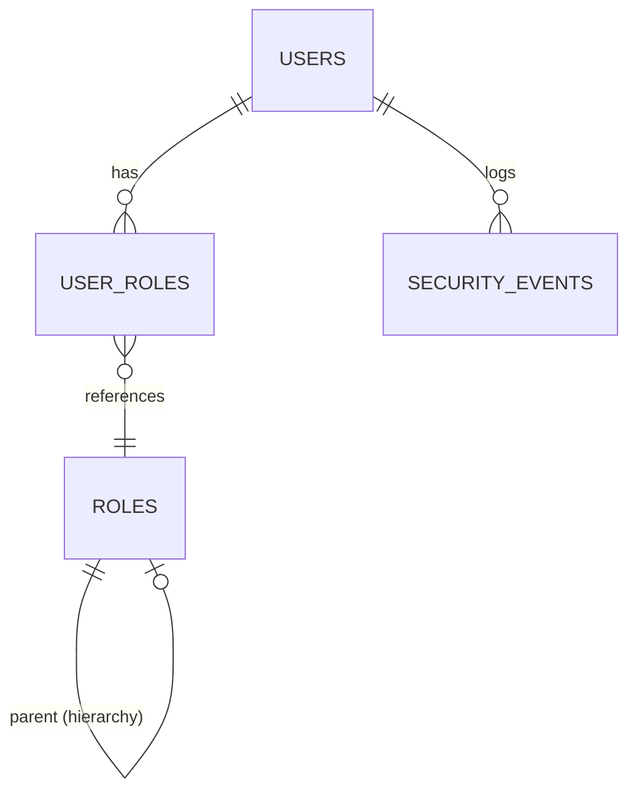

# RBAC Pattern

## Goal

Implement role-based access control with hierarchical permissions and owner privileges.

## Choice

- JSON-based permissions stored per role, with parent role inheritance for hierarchy
- Special `owner` role grants full admin access; checked via `rbacQueries.isOwner`
- All RBAC mutations logged to `security_events` table

## Why

- JSON permissions are flexible and schema-free, avoiding a separate permissions table
- Dedicated owner check simplifies admin guards without scanning permission trees
- Security event logging provides an audit trail independent of the general audit system

## Data Model



## Tables

| Table | Purpose |
| --- | --- |
| roles | Role definitions with permissions |
| user_roles | User-role assignments |
| security_events | Audit log for security actions |
| api_keys | API key management (optional) |

## Role Structure

```typescript
interface Role {
  id: number;
  name: string;
  description: string | null;
  permissions: Record<string, unknown>;
  parent_role_id: number | null;
  created_by: string | null;
  created_at: Date;
  updated_at: Date;
}
```

## Permission Model

Permissions are stored as JSON objects:

```json
{
  "pr": { "create": true, "approve": true },
  "invoice": { "view": true, "link": true },
  "payment": { "create": true, "delete": false }
}
```

## Key Queries

| Query | Purpose | Returns |
| --- | --- | --- |
| isOwner | Check if user is owner | { isOwner: boolean } |
| getUserRoles | Get roles for user | Role[] |
| getRolePermissions | Get effective permissions | permissions |
| assignUserRole | Grant role to user | void |
| revokeUserRole | Remove role from user | void |

## Owner Check

The owner role is special - grants full admin access:

```typescript
isOwner: async (execCtx, args: { user_email: string }) => {
  const tx = execCtx.data.seekTag(transactionTag);
  const executor = tx ?? db;

  const [result] = await executor
    .select({ isOwner: sql<boolean>`EXISTS(...)` })
    .from(userRoles)
    .innerJoin(roles, eq(userRoles.roleId, roles.id))
    .where(and(
      eq(userRoles.userEmail, args.user_email),
      eq(roles.name, 'owner')
    ));

  return { isOwner: result?.isOwner ?? false };
}
```

## Usage in Flows

```typescript
export const listUsers = flow({
  deps: { userQueries, rbacQueries },
  factory: async (ctx, { rbacQueries }) => {
    const currentUser = ctx.data.seekTag(currentUserTag);

    // Check owner permission
    const { isOwner } = await ctx.exec({
      fn: rbacQueries.isOwner,
      params: [{ user_email: currentUser.email }]
    });

    if (!isOwner) {
      return { success: false, reason: 'NOT_OWNER' };
    }

    // Proceed with admin operation
  }
});
```

## Admin Flow Guard (Owner-Only)

```typescript
export const updateTeam = flow({
  deps: { rbacQueries, teamQueries },
  factory: async (ctx, { rbacQueries }) => {
    const currentUser = ctx.data.seekTag(currentUserTag);

    if (!currentUser) {
      return { success: false, reason: 'USER_NOT_FOUND' };
    }

    const { isOwner } = await ctx.exec({
      fn: rbacQueries.isOwner,
      params: [{ user_email: currentUser.email }]
    });

    if (!isOwner) {
      return { success: false, reason: 'NOT_OWNER' };
    }

    // owner-only operation...
  }
});
```

## User-Role Assignment

```typescript
// Assign role
await rbacQueries.assignUserRole(ctx, {
  user_email: 'user@example.com',
  role_id: 1,
  assigned_by: currentUser.email,
  expires_at: null  // or ISO date string
});

// Revoke role
await rbacQueries.revokeUserRole(ctx, {
  user_email: 'user@example.com',
  role_id: 1
});
```

## Permission Hierarchy

Roles can inherit from parent roles:

```typescript
interface Role {
  parent_role_id: number | null;  // If set, inherits parent permissions
}
```

Effective permissions = parent permissions merged with role permissions.

## Security Events

All RBAC changes are logged:

```typescript
await rbacQueries.logSecurityEvent(ctx, {
  user_email: currentUser.email,
  event_type: 'ROLE_ASSIGNED',
  ip_address: request.headers.get('x-forwarded-for'),
  details: { role_id: 1, target_user: 'user@example.com' }
});
```

## Built-in Roles

| Role | Purpose | Key Permissions |
| --- | --- | --- |
| owner | Full admin access | All permissions |
| finance | Finance team | PR create, approve |
| admin | Admin team | Invoice management |
| bod | Board of Directors | Final approvals |

## Edge Cases

| Scenario | Behavior |
| --- | --- |
| No roles assigned | User has no permissions |
| Role expires | Treated as unassigned |
| Delete owner role | Should be prevented |
| Self role removal | Should be prevented for last owner |

## Cited By

- c3-2-api (RBAC)
