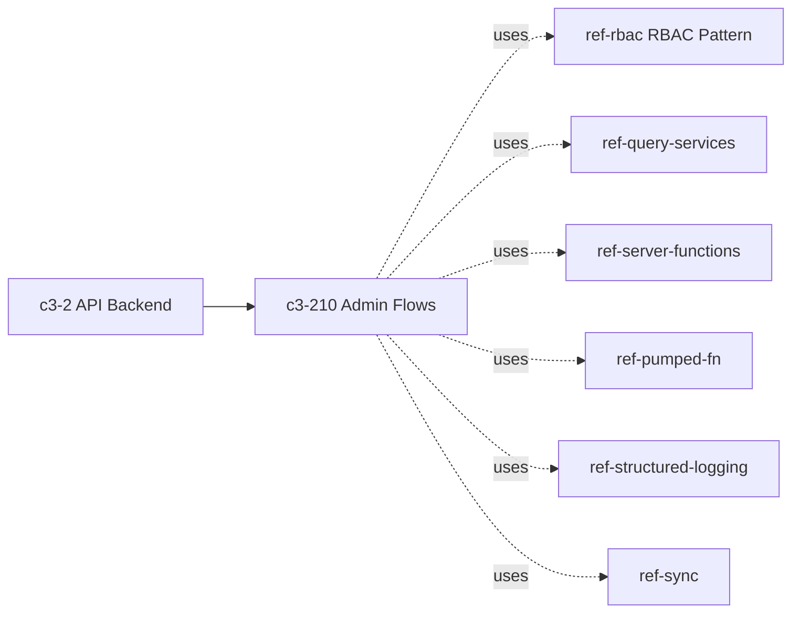
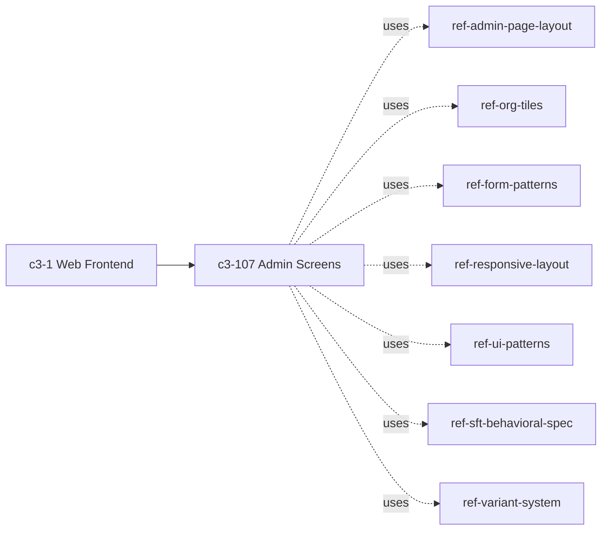

# ADMIN-1: What owns administrator features for users, teams, audit, and approval configuration?

## Evidence Commands

```bash
c3 search "administrator features users teams audit approval configuration admin ownership"
c3 read c3-107 --full
c3 read c3-210 --full
c3 read c3-1
c3 read c3-2
c3 read ref-rbac
c3 graph c3-107 --format mermaid
c3 graph c3-210 --format mermaid
c3 read adr-20260121-admin-management-features
c3 read adr-20260123-admin-features-docs
c3 lookup 'src/server/functions/admin*'
c3 lookup 'src/**/admin/**'
c3 read c3-208
```

## Answer

**Layer:** ownership is split across two paired feature components, one per container, plus a third backend component for audit data:

| Concern | UI owner | Backend owner |
| --- | --- | --- |
| Users (CRUD, roles, ownership transfer) | **c3-107 Admin Screens** (c3-1 Web Frontend) | **c3-210 Admin Flows** (c3-2 API Backend) |
| Teams (CRUD, capabilities, member guard) | c3-107 | c3-210 |
| Approval configuration (multi-step flows, anyof/allof, toggle active) | c3-107 (ApprovalConfigScreen) | c3-210 (Approval Config Operations) |
| Audit | c3-107 (AuditLogScreen, viewing) | **c3-208 Audit Flows** (querying/export/statistics); c3-210 writes explicit audit entries for its own team/role/approval mutations via `auditQueries` |

**Causal chain (action -> mutation -> enforcement -> record -> failure boundary):**

1. **Action owner — c3-107 Admin Screens** (parent c3-1). Six screens: UserManagementScreen, TeamManagementScreen, OrganizationScreen (tabbed users+teams tile view of the same data), ApprovalConfigScreen, AuditLogScreen, NotificationLogScreen. Screens use local `useState` (not shared atoms) and call admin server functions at `@/server/functions/admin` ("20+ functions": `adminCreateUser`, `adminAssignRole`, `adminCreateTeam`, `adminUpdateApprovalFlow`, `adminListAuditEntries`, ...). (c3-107 `## Screens`, `## Data Flow`, `## Key Wiring`.)
2. **State mutation owner — c3-210 Admin Flows** (parent c3-2). All operations use the Flow Pattern (`flow()` with namespace + Zod schema) and delegate to query services: `rbacQueries`, `teamQueries`, `userQueries`, `approvalConfigQueries`, `auditQueries`. Operation tables document guards: `deleteTeam` blocks `TEAM_HAS_USERS`; `updateRole`/`deleteRole` block the owner role (`CANNOT_MODIFY_OWNER_ROLE`, `ROLE_HAS_USERS`); `revokeRole`/`deleteUser`/`removeOwnership` protect the last owner (`CANNOT_REVOKE_LAST_OWNER`); `createRole` enforces unique name (`ROLE_EXISTS`). (c3-210 `## Uses`, operations tables.)
3. **Enforcement mechanism — ref-rbac (RBAC Pattern)**, cited by c3-210. Per c3-210 `## Authorization`: "Every admin flow: extract user from `currentUserTag` -> check `rbacQueries.isOwner` -> reject with `NOT_OWNER` if not." ref-rbac defines the special `owner` role granting full admin access via `rbacQueries.isOwner`, JSON permissions with parent-role hierarchy, and RBAC mutations logged to `security_events` — "an audit trail independent of the general audit system."
4. **Record/observer — audit split.** c3-210 writes explicit audit rows (create/update/delete on `teams`, `roles`, `approval_flows`, assign/revoke on `user_roles` — per its operation tables' Audit columns). c3-208 Audit Flows owns audit trail *querying* ("history lookup, paginated list, export, statistics"); c3-107's AuditLogScreen consumes it via `adminListAuditEntries` with server-side pagination and before/after JSON diffs.
5. **Emergent property:** authorization is server-side, not UI-side. c3-1's responsibilities say the frontend only "enforce[s] capability-aware UX boundaries for privileged/admin features", while c3-107 states "All screens require owner role -- server functions enforce via `rbacQueries.isOwner`" and c3-2's responsibilities include "Enforce authentication, authorization, and request-scoped execution context."
6. **Failure boundary:** a non-owner reaching an admin server function (UI gating bypassed or stale) is rejected with `NOT_OWNER` at the flow layer before any mutation (c3-210 Authorization). Guard violations fail with the named error codes above, so partial admin mutations don't ship without their documented audit row (each mutating row pairs Effect + Guards + Audit in c3-210's tables). What the docs do NOT state: behavior if the audit write itself fails mid-flow — c3-210 does not document whether audit writes are transactional with the mutation; that is a gap, not a guess.

**Graph (c3-210 Admin Flows — governing refs):**



**Graph (c3-107 Admin Screens — governing refs):**



**Code Map:** `@/server/functions/admin` — admin server functions (user/team/role CRUD, approval flow config, audit + notification queries, retry); `@/lib/capabilities` (`ALL_CAPABILITIES`) — team capability assignment. (Both from c3-107 `## Key Wiring`; see Caveats re: lookup coverage.)

**ADRs (cited, with status labels):**
- `adr-20260121-admin-management-features` — `status: implemented` -> **historical**. Origin of the feature set (user management UI, teams as table replacing hardcoded enum, audit UI over existing c3-208 backend, approval config replacing hardcoded `types.approvalConfig.ts`). Current mechanism is described by c3-107/c3-210 entity docs, not this ADR.
- `adr-20260123-admin-features-docs` — `status: implemented` -> **historical**. Records the deliberate ownership grouping: 5 screens as the single component c3-107 and team/role/user/approvalConfig flows as the single component c3-210 (rejected one-doc-per-screen as excessive granularity).

**Concrete checks for a change touching admin features:**
- Touch owners: `c3-107` (screens, c3-1) and/or `c3-210` (flows, c3-2); audit-query changes go to `c3-208`.
- Confirm authorization: every new/changed flow must keep the `currentUserTag` -> `rbacQueries.isOwner` -> `NOT_OWNER` gate (c3-210 Authorization) — verify with a non-owner request expecting `NOT_OWNER`.
- Confirm guards still hold: probe `deleteTeam` on a team with members (`TEAM_HAS_USERS`), `revokeRole` on the last owner (`CANNOT_REVOKE_LAST_OWNER`), `updateRole` on the owner role (`CANNOT_MODIFY_OWNER_ROLE`).
- Assert the audit observable: mutating team/role/approval flows must produce the documented audit row (Audit column in c3-210 tables), visible via `adminListAuditEntries` in AuditLogScreen; RBAC mutations additionally land in `security_events` (ref-rbac).
- UI changes: honor `ref-admin-page-layout` (the only ref in c3-107's Governance table) plus the cited layout/form refs; note the documented `window.confirm()` drift below before adding new delete flows.

## Grounding

| Claim | Source |
| --- | --- |
| c3-107 owns the six admin screens (users, teams, org, approval config, audit log, notification log); actions listed per screen | `c3 read c3-107 --full` — `## Goal`, `## Screens` |
| Screens use local state, call `@/server/functions/admin` (20+ functions), all gated by owner check | `c3 read c3-107 --full` — `## Data Flow`, `## Key Wiring` |
| "All screens require owner role -- server functions enforce via `rbacQueries.isOwner`" | `c3 read c3-107 --full` — `## Business Purpose` |
| c3-210 owns team/role/user/approval-config flows; per-operation Effect/Guards/Audit tables and named error codes | `c3 read c3-210 --full` — `## Uses`, Team/Role/User/Approval Config Operations tables |
| Every admin flow: `currentUserTag` -> `rbacQueries.isOwner` -> `NOT_OWNER` | `c3 read c3-210 --full` — `## Authorization` |
| Owner role grants full admin access; `security_events` log independent of general audit | `c3 read ref-rbac` — `## Choice`, `## Why`, `## Tables` |
| c3-107 in c3-1 components table ("Admin-only management and configuration"); frontend enforces capability-aware UX boundaries only | `c3 read c3-1` — `## Components`, `## Responsibilities` |
| c3-210 in c3-2 components table; backend enforces authentication/authorization | `c3 read c3-2` — `## Components`, `## Responsibilities` |
| c3-208 Audit Flows owns audit querying (history, paginated list, export, statistics), parent c3-2 | `c3 read c3-208` — frontmatter goal + `## Goal` |
| Audit backend pre-existed the admin UI ("Full backend exists (c3-208) ... but there is no UI") | `c3 read adr-20260121-admin-management-features` — `## Problem` |
| Ownership grouping decision (5 screens -> c3-107, 4 flow files -> c3-210) | `c3 read adr-20260123-admin-features-docs` — `## Decision`, `## Rationale` |
| Both ADRs `status: implemented` | frontmatter of both ADR reads |
| Governing refs per owner (mermaid edges) | `c3 graph c3-107 --format mermaid`, `c3 graph c3-210 --format mermaid` |
| c3-107/c3-210 ranked owners for the question; no `rule-*` candidates surfaced | `c3 search "administrator features users teams audit approval configuration admin ownership"` |

## Caveats

- **Codemap gap for admin file paths**: `c3 lookup 'src/server/functions/admin*'` and `c3 lookup 'src/**/admin/**'` both returned empty `files`/`components` with a "coverage gap" help hint — the `@/server/functions/admin` path from c3-107's Key Wiring could not be mapped to a component via lookup, so exact on-disk filenames are unverified here.
- **Documented UI drift**: c3-107 `## UI Pattern Notes (2026-02-26)` records "Known drift: delete confirmation still uses native `window.confirm()` in UserManagement, TeamManagement, and Organization screens (target pattern is `ConfirmModal`/`ConfirmDrawer`)."
- **Audit-write transactionality undocumented**: c3-210 pairs each mutation with an Audit column entry but does not state whether the audit write is atomic with the mutation; treat as a documentation gap.
- **No `rule-*` entities surfaced** for this question — the search output contained refs, recipes, components, containers, and ADRs only; governance over admin features is carried by refs (ref-rbac, ref-admin-page-layout, etc.), not coding rules.
- **Notification logs** are part of c3-107's screen set (NotificationLogScreen, `adminRetryNotification` republishes to JetStream per c3-107) but the question's four concerns don't include them; the backend notification owner (c3-211 Notification System, seen in c3-2's components table) was not read in depth.
